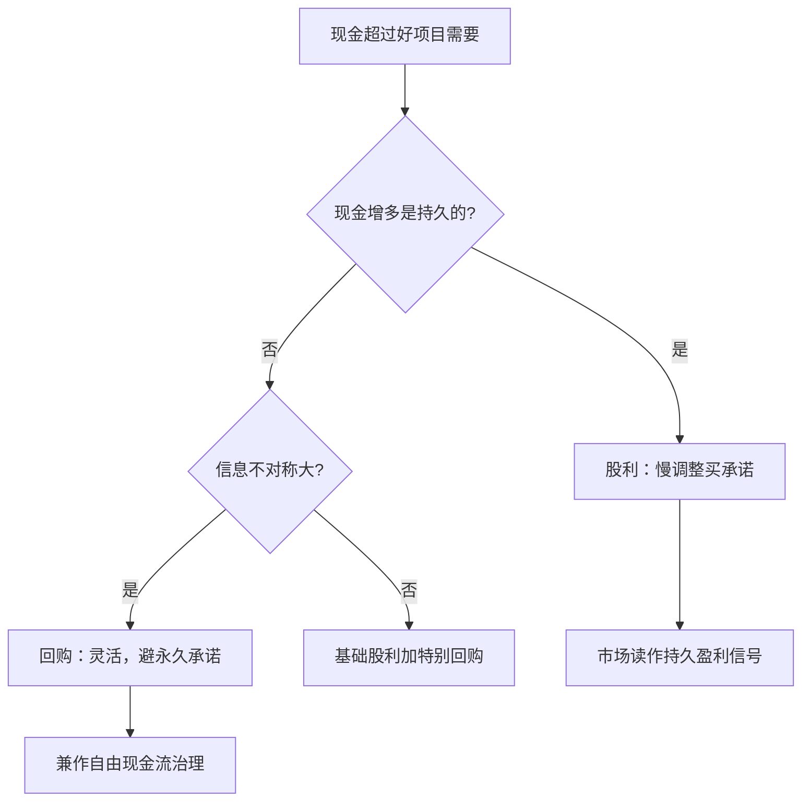

# 股利与回购

股利的粘性是承诺的影子，回购的灵活是没有承诺的代价；拿灵活的工具去做承诺的事，公司下一次过冬就没了信用。

<footer>—— 据 Lintner 1956 与 Baker–Wurgler 2002 整理</footer>

[上一课](/econ/cf-financing-constraints)把融资约束的度量钉住：约束是 MM 无关性失效后的残差，度量要把需求与供给两只手分开。约束的另一面是冗余——企业手里的钱超过好项目的需要时，问题从「怎么拿钱」变成「怎么还钱」。主干课已在[股利信号](/econ/dividend-signaling)、[股利与自由现金流](/econ/dividend-fcf)与[股票回购](/econ/share-repurchase)分别钉了三种解释，本课把两条支付管道放回同一张决策图：股利与回购各承接什么、为什么一个粘一个灵活、以及分配政策如何暴露上一课说的约束状态。

## 问题

Miller–Modigliani 1961 在无税无摩擦的世界里证明股利无关。现实的两个事实要一起解释：其一，股利极度粘性，削减罕见且常被市场重罚；其二，总量的支付方式持续从股利移向回购。粘性与灵活看似矛盾，其实是对同两组摩擦——承诺需求与信息不对称——的两种响应：前者买承诺，后者保留放弃承诺的自由。分错了对象，两条管道都会失效。

### 分工的判据

判据是现金增多的**持久性**。持久盈利上台阶，用股利：Lintner 1956 的访谈模型里，公司盯住目标派息率做部分调整，$\Delta D_t = a + s\,(r E_t - D_{t-1}) + \varepsilon_t$，每年只补齐目标缺口的一小部分——慢不是执行差，是故意买来的信誉资产。临时性现金，用回购：不抬高永续义务，情况变坏可以停。信息不对称越大，越该用回购，否则一项临时盈余会被市场读成永久承诺，日后削减变成信号灾难。

## 方法

再叠两层解释。代理层：Jensen 1986 的自由现金流论证——分钱本身就是治理工具，现金留在不受约束的经理手里会被投进负 NPV 项目；[自由现金流代理成本](/econ/agency-free-cash-flow)钉的正是这一条。市场层：Baker–Wurgler 2002 的迎合（catering）——股利溢价为正时公司开始派息，为负时停发，供给响应需求，说明派息决策不完全来自公司内部。两层解释共用一个可检验含义：股利的启动与停发，应在估值与投资者构成的变化处扎堆。

## 机制

为什么粘性是理性的：股利一旦成为信号载体，削减就是自证坏消息，所以启动要慢、目标要稳——Lintner 的调整系数小到每年只补约三分之一缺口。为什么回购的时机常与直觉相反：公司往往在估值高时回购更多（迎合与便利窗口），回购公告的异常收益也小于股利首次公告——市场知道回购随时可撤。为什么分配政策能暴露约束状态：接上一课，受约束的公司囤现金（[现金持有](/econ/cash-holdings)的动机之一），根本谈不到分配；开始分配本身就是「内部资金已越过投资需求」的显示。总量的迁移（Fama–French 2001 的股利消失与回购崛起）因而同时是税制、期权激励与迎合三股力的合成。

Lintner 1956 访谈 28 家美国公司的经理得出部分调整规则，调整速度系数大约在每年补齐目标缺口的四分之一到三分之一之间——粘性来自管理层自己承认的「不想回头的承诺」，不是数据噪声。

## 边界

税制改变均衡：投资者层面的税负差异决定股利折价还是溢价，各国不同，结论不可跨境直搬。不要把回购一律读成每股收益操纵：多数回购由现金冗余与股价判断驱动，操纵只是边际。迎合证据说明供给响应需求，不说明股利政策「由市场决定」——Lintner 的内部规则仍在。本课不展开回购与投资的挤出证据，那要接投资约束的识别设计。

## 小结

- 股利与回购的分工按现金持久性划界：持久的用股利买承诺，临时的用回购保灵活。
- 粘性是故意买来的信誉资产；Lintner 部分调整是它的机制化。
- Jensen 1986 把分配读成治理工具；Baker–Wurgler 2002 把供给读成对溢价的迎合。
- 分配政策的启动本身就是约束状态的显示，接上一课的度量框架。
- 出处：Miller–Modigliani 1961；Lintner 1956；Jensen 1986；Baker–Wurgler 2002；Fama–French 2001。
