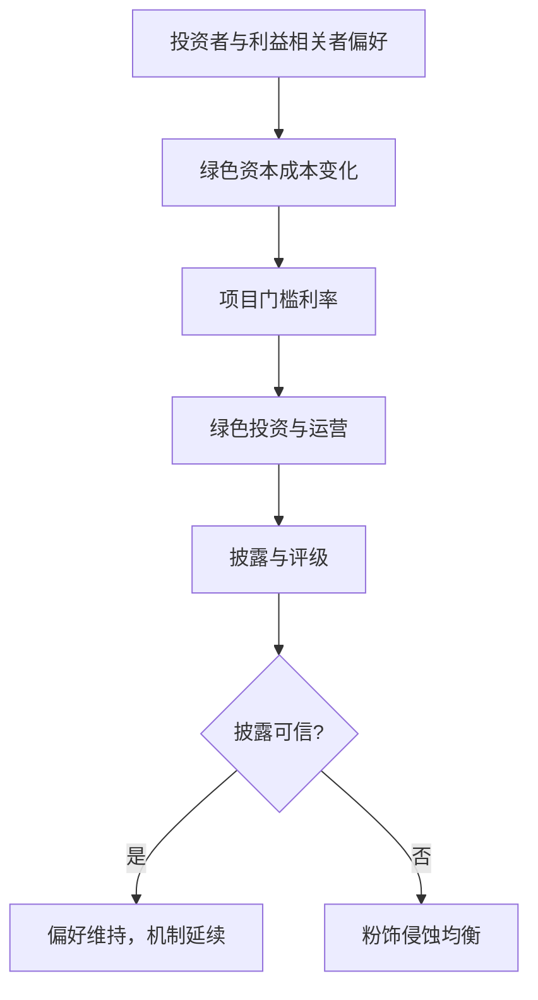
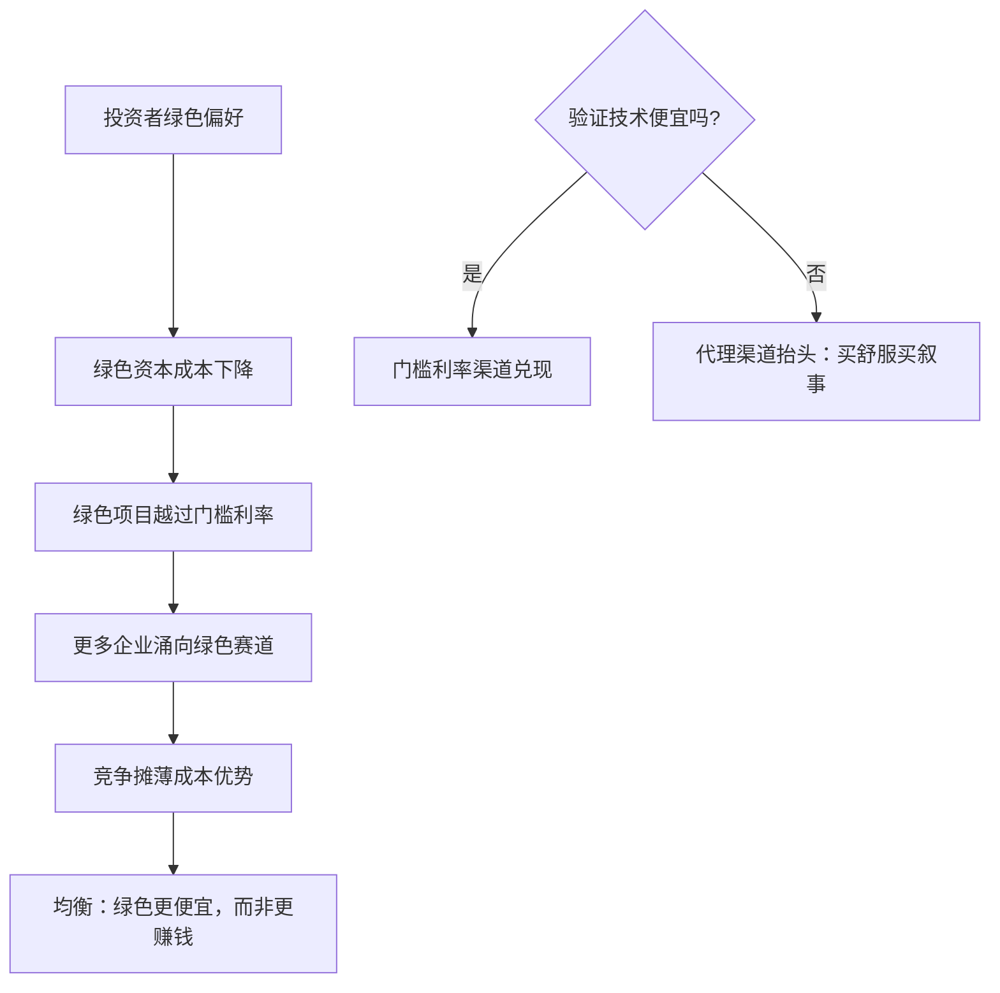

# ESG 的公司金融视角

ESG 首先改写的是公司的目标函数，其次才是它的资本成本；把顺序颠倒，绿色就只是一张卖给投资者的门票。

<footer>—— 据 Hart–Zingales 2017 与 Berg–Kölbel–Rigobon 2022 整理</footer>

[上一课](/econ/cf-governance-empirical-deep)把内部治理的识别钉住：设计先于回归，指数是筛选器。治理的默认目标是股东财富；本课问的是目标函数本身能不能改。[ESG 理论](/econ/esg-theory)已从定价侧钉了两条：ESG 首先改变谁的偏好进入目标，其次才可能改变 alpha；绿色资本成本下降是机制，不是免费午餐。本课把这两条翻译到企业决策侧：公司何时、为什么、以什么代价做 ESG。

## 问题

目标函数之争。Friedman 1970：经理的受托责任是股东价值，花股东的钱做善事是代理问题。Hart–Zingales 2017：当外部性大到市场不进入价格，股东福利不等于股东财富——股东也喝同样的水，此时经理应当在治理约束内响应股东福利。分歧不在「要不要做好事」，而在**决策权配置**：交给市场（消费者与投资者用脚投票）还是交给经理裁量。注意这与上一课的治理管道直接相连：目标函数的扩展等于改写经理的激励合同，改得越宽，监督越难——自由现金流问题（Jensen 1986）会换一身绿色外衣回来。

把两派分歧翻译成一句话：Friedman 说「经理是股东钱财的管家，只管赚钱」；Hart–Zingales 说「股东不只在乎钱，也在乎喝的水，经理应在股东授权下兼顾后者」。争的不是善不善，而是决策权——交给市场用脚投票，还是交给经理自由裁量。

### 企业侧的决策账

做 ESG 的三个理由各有可检验含义。门槛利率渠道：投资者绿色偏好压低绿色企业资本成本（Pástor–Stambaugh–Taylor 2021 的机制），好项目集合扩大——应看到绿色投资对折现率敏感。需求渠道：员工与顾客的偏好换成现金流——Edmans 2011 发现员工满意度高的公司组合长期跑赢，解释落在意外与需求侧。代理渠道：ESG 成为经理的舒适品或粉饰工具——应看到披露与实际脱钩。三个渠道方向不同，混在一起谈「ESG 有没有用」注定没有答案。

## 方法

度量是第一道闸。Berg–Kölbel–Rigobon 2022 汇总六家主流评级：两两相关只有约 0.5 上下，同期信用评级的相关约 0.99。任何用「评级上升」识别企业效应的设计，必须先声明用的是哪家的分数、为什么它的口径贴近你想测的渠道。识别上沿用上一课的纪律：把评级当筛选器，用外生的监管变化（披露规则、碳定价）推因果。企业侧报告的口径也应从分数转向行为：排放的实际路径、资本开支的绿色占比、劳资事件的记录——可验证的行为，而不是分数本身。

数字实例：两家评级机构给同一批公司的 ESG 分数，相关系数只有约 0.5——大致相当于「同一学生的语文和数学成绩」之间的相关，而信用评级的相关高达 0.99。所以引用「评级上调」当证据前，得先说明自己选了哪把尺、为什么这把尺贴近要测的渠道。

## 机制

把 [ESG 理论](/econ/esg-theory)的均衡翻译到企业侧：偏好推低绿色资本成本，门槛利率下降，绿色投资增加；若偏好持续，资本成本优势会被竞争摊薄，均衡落在「绿色更便宜」而不是「绿色更赚钱」——这正是定价课「不是免费午餐」的企业侧镜像。缺口在披露可信性：评级混乱与粉饰使投资者无法区分真投入与故事，承诺的价值因此取决于验证技术——审计、监管披露、第三方核查。验证越便宜，门槛利率渠道越能兑现；验证越贵，均衡越偏向代理渠道，经理买舒服、投资者买叙事。

常见误区：以为「ESG 做得好＝股票回报高」。均衡里绿色资本成本更低，意味着投资者事先接受了更低的期望收益——便宜是结果，不是奖赏。把「绿色更便宜」读成「绿色更赚钱」，等于把打折商品当成捡漏信号。

Berg–Kölbel–Rigobon 2022 的分解：评级分歧约五成半来自度量口径、近四成来自范围、其余来自权重——同一家的分数变化，可能只是换了个加权，而不是公司变了。

## 边界

ESG 不是 alpha 引擎：事后绿色收益依赖预期的实现路径，定价侧的结论照搬到企业侧会误事。披露不等于表现；评级相关低不等于评级都错——可能各自度量不同的东西。本课不写主权债与转型金融的定价细节，也不重复定价侧的均衡推导。企业侧最大的未决问题是治理化的目标函数：股东福利进合同后，谁来审计「福利」本身——这是上一课管道分析与本课目标的交集，留作开放问题。

## 小结

- ESG 先改目标函数，再谈资本成本：Friedman 与 Hart–Zingales 的分歧是决策权配置。
- 三条渠道（门槛利率、需求、代理）方向不同，必须分开检验。
- 评级相关性约 0.5 量级，度量是第一道闸；识别靠外生监管变化，分数只当筛选器。
- 均衡落在「绿色更便宜」而非「绿色更赚钱」；验证技术决定渠道走向。
- 出处：Friedman 1970；Jensen 1986；Hart–Zingales 2017；Edmans 2011；Pástor–Stambaugh–Taylor 2021；Berg–Kölbel–Rigobon 2022。
