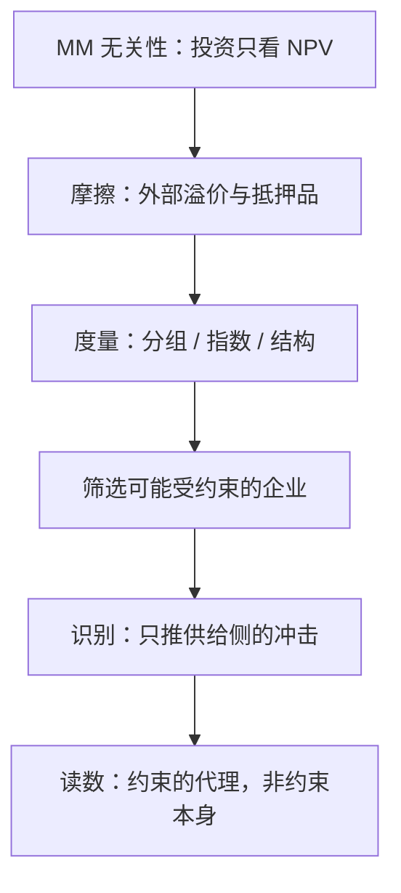
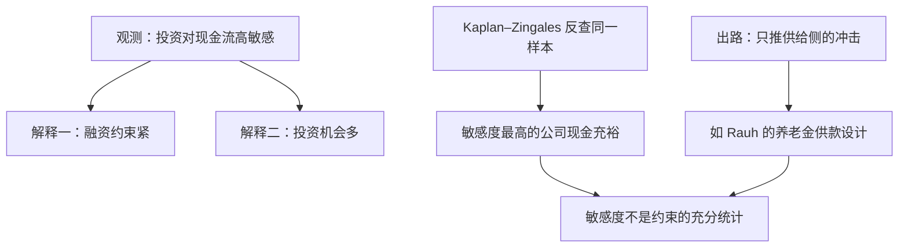

# 融资约束的度量

融资约束不是一个可以直读的变量：你观测到的每一条代理——现金流、杠杆、规模、年龄——同时被需求与供给两只手推动；度量的一半工作是先把它们分开。

<footer>—— 据 Fazzari–Hubbard–Petersen 1988 与 Kaplan–Zingales 1997 的分歧整理</footer>

[上一课](/econ/mt-map)把货币理论收在三张清单上：承诺、预期与实施必须同时成立，名义锚才钉得住。那是资金的**价格**如何被管理；本课程转向资金的需求方——企业。主干课的[优序融资](/econ/pecking-order)钉过定性结论：外部融资带逆向选择溢价，所以企业先用内部资金、再举债、最后发股（Myers–Majluf 1984 的逻辑）。缺口在定量一侧：溢价多深、约束多紧，得先能度量，后面的分配、发行、并购才谈得上「钱从哪来、往哪去」。本课程之后依次过股利与回购、IPO 与发行时机、并购浪潮、治理实证、ESG 与破产重整。后课默认已经读完本课。

## 问题

[莫迪利亚尼–米勒](/econ/modigliani-miller)把无关性讲清：完美市场里投资只看项目的 NPV，钱从内部还是外部来没有区别。融资约束是无关性失效后的残差：内外资金不等价，好项目可能因为拿不到钱而放弃。麻烦在「约束」不可直接观测——投资、现金流与资产负债表同时被需求侧与供给侧推动。现金流高，可能是机会多所以投资与现金流一起涨，也可能是钱容易拿。度量的第一件事就是把手分开。

融资约束可以翻译成「想借借不到、想发发不出」的差价：外部人怕被坑，要收一笔逆向选择溢价，约束紧不紧就是这笔溢价有多贵——贵到好项目算不过账来，企业只好放弃项目或囤现金。它是 MM 无关性被现实打破后留下的那道缝。

### 三族度量

分组法：先按事前特征分组（规模、年龄、是否派息），再比较组内投资对现金流的敏感度。Fazzari–Hubbard–Petersen 1988 用低派息组的高敏感度支持约束存在；Kaplan–Zingales 1997 对同一样本反查，发现敏感度最高的公司恰恰现金充裕——敏感度本身不是约束的充分统计。指数法：把财务变量压成一个标量，KZ 指数用现金流、杠杆、派息、现金、托宾 $Q$ 线性组合；SA 指数只留外生性强的两个变量 $\mathrm{SA}=-0.737\,\mathrm{Size}+0.043\,\mathrm{Size}^{2}-0.040\,\mathrm{Age}$（Hadlock–Pierce 2010），代价是丢掉信息含量。结构法：从投资的欧拉方程或动态模型反解摩擦参数，能做反事实，但要付分布假设的代价。

## 方法

正确姿势是把指数当**筛选器**而不是结论：SA 高的公司先被标记为「可能受约束」，再用设计去识别。识别语言来自[公司金融的实证识别](/econ/corporate-finance-identification)：现金流是需求代理，不能直接当约束读；要找只推供给侧的冲击。Rauh 2006 的设计是范例：养老金供款义务是法定支出，外生地抽走内部资金，其后的投资响应才读得出约束的松紧。敏感度还会随金融市场发展而衰减，横截面比较要控制制度环境。

直觉类比：SA 指数像体检的初筛指标——血压偏高只是把你标成「值得复查」，不等于确诊；确诊要靠后续有针对性的检查（识别设计）。把初筛读数直接当结论，等于把「该复查」当成「有病」。

## 机制

为什么 SA 指数坚持只用规模与年龄：指数的每个输入都是一个会内生波动的财务变量。杠杆在约束紧时本来就高，把它放进指数等于把结果放进定义；SA 的取舍是牺牲信息换输入的外生性。为什么分组法会错：组内敏感度混合了投资机会分布与融资成本分布，两组机会分布不同时，敏感度差读不出约束差。为什么约束对投资是非线性的：约束不紧时企业边际上用内部资金定价，约束紧到抵押品边界才跳变——线性回归平均掉的恰是最要紧的那一段。

数字实例：规模相同、年龄 20 年与 60 年的两家公司，SA 指数相差 $-0.040 \times 40 = -1.6$——越老指数越低，读作约束越松；反过来，小而年轻的公司落在指数最高处，与「初创企业最难借钱」的直觉一致。指数用年月与体量这些几乎不被企业操纵的变量，换来的就是这份外生性。

SA 指数的系数来自 Hadlock–Pierce 2010 的美国上市公司样本：规模每大一个对数单位约 $-0.737$，年龄每老一年约 $-0.040$，二次项 $0.043$ 防止指数在超大企业处掉头。把系数搬到非上市或新兴市场样本之前，必须重估。

## 边界

度量的是「约束的代理」，不是约束本身；SA 与 KZ 的排序相关性并不高，选哪个先想清楚愿意犯哪种错。指数有地域与时代的外推边界：系数是美国上市样本的产物，非上市企业与银行主导金融体系下的约束结构不同。结构法给反事实，但参数依赖分布假设，假设错了反事实就是修辞。本课不展开银行信贷供给如何放大约束，那是后续银行课程的领域。

## 小结

- 融资约束是 MM 无关性失效后的残差，混合了信息摩擦、代理问题与抵押品限制。
- 投资-现金流敏感度不是约束的充分统计：Kaplan–Zingales 对 Fazzari–Hubbard–Petersen 的反驳钉死这一条。
- 指数是筛选器不是结论；SA 指数用外生性换信息含量，系数出域要重估。
- 识别要找只推供给侧的冲击；现金流是需求代理，不能直接当约束读。
- 出处：Modigliani–Miller 1958；Myers–Majluf 1984；Fazzari–Hubbard–Petersen 1988；Kaplan–Zingales 1997；Hadlock–Pierce 2010。
