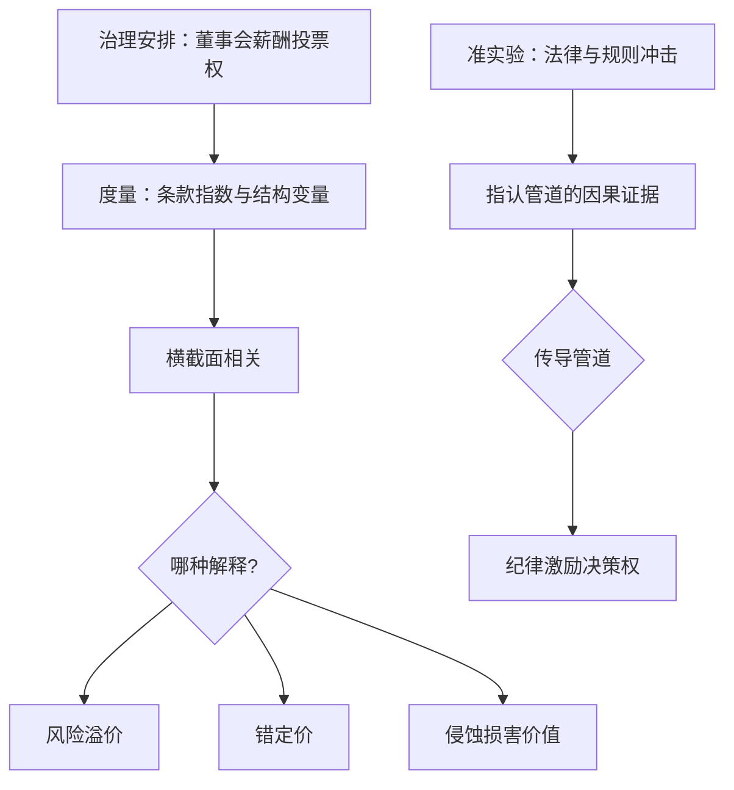

# 公司治理的实证深化

治理变量是公司自己选的，回归的每一行都带着选择的影子；识别治理效应之前，先问这组安排是怎么来的。

<footer>—— 据 Gompers–Ishii–Metrick 2003 与 Bertrand–Mullainathan 2003 整理</footer>

[上一课](/econ/cf-merger-waves)把接管写成外部治理：浪潮在控制权市场上替换低效管理层。可接管威胁只覆盖一部分企业——反收购条款、股权集中、双层股权都能把它挡在门外。本课写内部治理的实证：董事会、薪酬与投票权结构怎么度量、效应怎么识别。识别语言来自[公司金融的实证识别](/econ/corporate-finance-identification)：治理与业绩的横截面回归默认有反向因果——治理差的公司，可能正是治理差被均衡选出来的结果。

## 问题

度量与识别纠缠在一起。度量侧：Gompers–Ishii–Metrick 2003 把 24 条反收购条款加总成 G 指数；Bebchuk–Cohen–Ferrell 2009 收缩为六条「侵蚀条款」。识别侧：G 指数高低组合的年化收益差可达数个百分点——但这是风险溢价、错定价，还是防御条款本身在损害价值？三种解释共用同一观测，横截面回归分不开它们。机制上，治理传导到企业价值有三条管道：纪律（接管与解聘威胁）、激励（薪酬与持股）、决策权配置（董事会与投票结构）——任何一项实证设计都必须指认自己在测哪条管道，否则读数就是三条管道的混合物。

### 准实验优先

横截面不行，就把变化推回外生冲击。州际反收购法通过的时间差是经典设计：Bertrand–Mullainathan 2003 发现法律通过后，CEO 少关厂、少裁员、工资上涨——「享受清闲生活」。这证明接管威胁确实在纪律经理，而不是只在改变控制权归属；纪律管道是实打实的。董事会维度：Yermack 1996 用公司固定效应找出董事会规模与托宾 $Q$ 的负相关——规模与绩效在水平上互相决定，但公司内部的波动读得出边际。薪酬维度：Core–Holthausen–Larcker 1999 把薪酬-绩效敏感度低与随后的业绩差连起来，激励管道有了第一个量化锚。

## 方法

股权结构维度要升级而不是另起炉灶：[家族企业与金字塔](/econ/family-firms-pyramids)已把投票权与现金流权的分离钉为描述工具，治理实证把它升级为识别变量——用分离度预测掏空概率与价值折价，让结构变量去解释行为而不是只贴标签。指数的用法遵循第一课的分工：指数当筛选器（标记防御文化重的公司），设计当因果（法律、规则、CEO 突逝等外生变化）。写报告时三样缺一不可：条款清单、指数构造、以及「这一设计能挡住哪类反向因果」的声明。

## 机制

为什么横截面回归不识别：治理是均衡结果——好企业「买」好治理，还是好治理造就好企业，观测上不可分；只有让治理在外生冲击下变动，两种方向才被拉开。为什么指数有效又有限：等权加总捕捉的是「防御文化」这个一阶共同因子，机械但透明，便于他人复算；代价是条款边际效应不同的信息被抹平——所以 G 指数筛得出公司，分不开条款。为什么治理证据的解读要与上一课的并购连起来：反收购条款收窄了接管威胁，等于改变外部治理的价格——治理与控制权市场不是两门学问，是同一纪律的两个价格。

GIM 的 G 指数由 24 条条款构成，1990 年代样本里每多一条对应年化收益下降约 1% 的量级；BCF 2009 用六条侵蚀条款复现了大部分效应——等权加总虽机械，却让任何人都能从章程里重算一遍。

## 边界

美国证据外推受限：投资者保护弱的市场里，主要矛盾是金字塔与隧道（[家族企业与金字塔](/econ/family-firms-pyramids)的东亚样本），董事会细节退居其次。指数随治理实践老化，2000 年后公司普遍改良使旧条款的变异缩水。治理改革的因果证据仍然稀缺——很多「最佳实践」只是横截面相关穿了政策的外衣。本课不展开银行作为监督者的治理角色，那是后续银行课程的领域。

## 小结

- 度量与识别必须分开谈：条款指数是筛选器，因果靠准实验。
- Bertrand–Mullainathan 2003 证明接管威胁的纪律管道真实存在。
- 治理传导有三条管道——纪律、激励、决策权配置，设计必须指认测哪条。
- 股权结构变量要从描述升级为识别：分离度预测行为，而不是贴标签。
- 出处：Gompers–Ishii–Metrick 2003；Bertrand–Mullainathan 2003；Yermack 1996；Core–Holthausen–Larcker 1999；Bebchuk–Cohen–Ferrell 2009。
