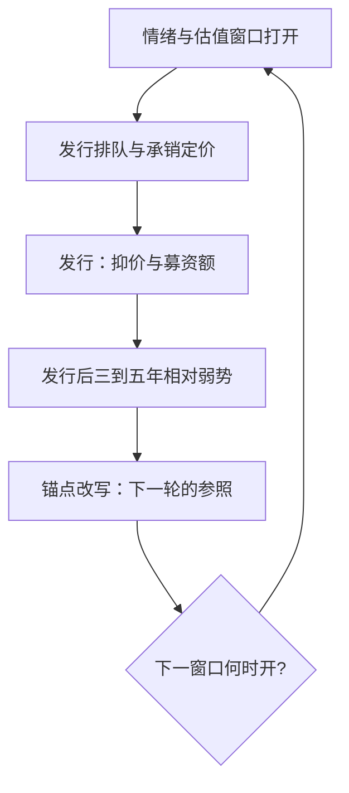
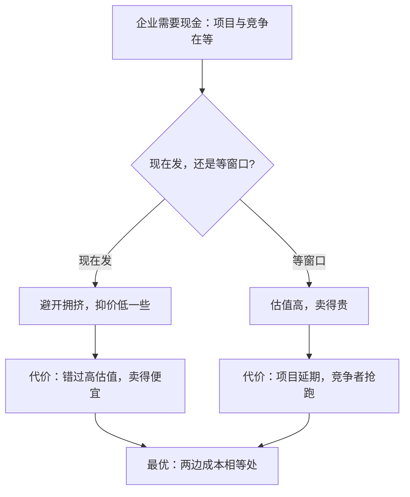

# IPO 与发行时机

发行时机是公司金融里少数「事后看得清、事前全是雾」的决策：窗口是市场给的，进不进、进多少，是企业自己排的队。

<footer>—— 据 Ritter 1991 与 Loughran–Ritter 2002 整理</footer>

[上一课](/econ/cf-dividends-buybacks)把分钱的管道钉住：持久现金用股利买承诺，临时现金用回购保灵活。本课转到收钱的一端——把股份卖给公众。主干课的[IPO 抑价作为理论](/econ/ipo-underpricing-theory)钉了定价侧：赢者诅咒、信号与信息瀑布解释发行价为什么低于首日价。缺口在时机侧：什么时候发、发多少、为什么热发行市场与发行后的长期弱势会同时出现。这是[市场择时理论](/econ/market-timing-theory)在企业决策上的正面战场。

## 问题

两个量必须分开。抑价是发行价与首日收盘价的差，是**定价**问题；时机是发行窗口的选择，是**配置**问题——发行便宜不等于发行时机好。经验事实有三条：IPO 在时间上扎堆（热市场）；发行公司集中在自身行业估值的高点发行；发行后三到五年相对收益系统性偏弱（Ritter 1991）。解释分两个方向：理性侧，公司对自身价值有私有信息，选需求最旺的窗口卖；行为侧，情绪高时投资者对增长故事的折现小，[噪声交易者风险 DSSW](/econ/noise-trader-risk) 所描述的环境恰好打开了窗口。

把两个量翻译开：抑价像「开业打折」——发行价定得低于首日收盘价，钱留在了桌上；时机像「挑开业的日子」——选在客人最多、最肯花钱的窗口。打折打得狠不代表日子挑得好：两者同源（信息不对称），却发生在定价与配置两个不同界面。

### 择时作为政策

Baker–Wurgler 2002 把择时从「一次性机会主义」升格为政策：市值账面比高时发股、低时回购，外部融资加权平均的市值账面比对杠杆有持久解释力——择时留下的不是快进快出的头寸，而是资本结构的结构性疤痕。这与上一课的分配政策互为镜像：回购与股利用现金换回被低估的股份，发行是反过来在被高估时卖。

直觉类比：「疤痕」像在房价高点买的房——成交那一刻不觉得，之后每个月的房贷都记着那次择时。估值高时发的股让公司此后多年维持更低杠杆，估值低时的回购则相反。择时不是快进快出的头寸，是改写了资产负债表的长期形状。

## 方法

检验择时要同时看量与质：发行量在估值窗口扎堆（量的证据）；发行公司的事后盈利与收益弱于配对样本（质的证据）。Loughran–Ritter 2002 补上行为侧的两块拼图：其一，管理层以发行前内部持股估值做锚，发行价翻倍仍觉得「没卖亏」，抑价的痛感被锚点吸收；其二，1990s 热窗口里发行的公司，IPO 后首年的分析师盈利预测相对实现的落差系统性为负——窗口里挤进来的恰是故事最经不起兑现的企业。两句合起来：热窗口既是企业主动择时的结果，也是市场筛选放行的结果。

## 机制

为什么热窗口能存在：情绪高时发行企业与投资者之间的信息不对称被「故事折价小」放大，承销商的定价能力与排队拥堵也集中在窗口内，两边一起把发行量推成尖峰。为什么企业不全等窗口：现金需求、产品市场的竞争时机、以及窗口本身不可预测——等下一班车的成本同样是成本，择时最优不等于等待免费。为什么事后弱势与理性择时兼容：在高点发行意味着以高折现率资本化乐观预期，只要均值回归发生，弱势就是择时成功的对称面，不必假设发行方全员非理性。

Ritter 的长期统计：美国 IPO 首日平均抑价 1980–1989 年约 7%，1990–1998 年约 15%，1999–2000 年约 65%，2001 年后回落到 10% 上下——热窗口的形状直接写在抑价分布的时间剖面上。

## 边界

择时证据是平均意义上的后验，对单个企业只是弱指导；窗口事前无法可靠识别。抑价与择时不可互替：发行便宜可以配合时机糟糕，两者同源（信息不对称）但发生在不同界面。监管与承销网络影响时机，估值不是唯一变量。本课不写询价与固定价格等一级市场机制设计，主干已覆盖。

常见误区：以为「等热窗口再发」稳赚。窗口事前无法可靠识别，而等下一班车的成本同样是成本——项目延期、竞争者抢跑、现金断档，任何一样都可能比估值损失更贵。择时是上千家公司平均出来的后验规律，落到一家企业头上只是弱指导。

## 小结

- IPO 的两个量要分开：抑价是定价问题，时机是配置问题。
- 择时是政策不是一次性机会主义：Baker–Wurgler 2002 的市值账面比疤痕持久存在。
- 热窗口是企业择时与市场筛选的合成：故事经不起兑现的企业恰在窗口内发行。
- 发行后弱势与理性择时兼容，是均值回归的对称面。
- 出处：Ritter 1991；Loughran–Ritter 2002；Baker–Wurgler 2002；Myers–Majluf 1984。
