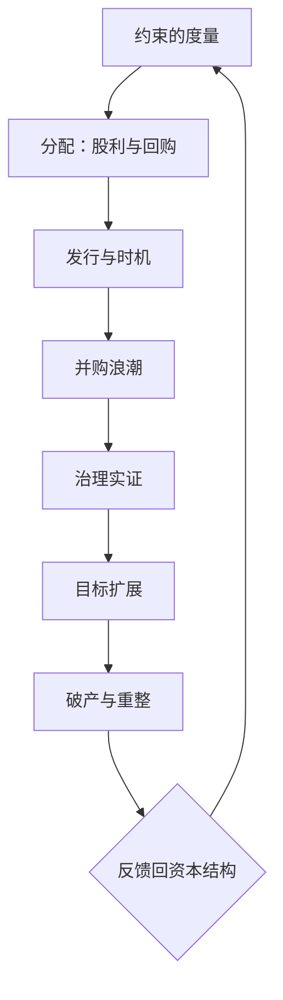

# 公司金融深化收束

这门课做的其实是同一件事：把主干里「假设没有」的东西一样样请回来——约束、时机、控制权、外部性、失败；每请回一样，工具箱就多一格。

<footer>—— 据 Modigliani–Miller 1958 与本课程各课整理</footer>

[上一课](/econ/cf-bankruptcy-restructuring)把破产与重整钉在程序与激励上，本课程到此收束。七课连起来读是一条单线：MM 1958 把摩擦全部拿走之后，公司金融只剩一条 NPV 规则（[NPV 与 IRR 的陷阱](/econ/npv-irr-pitfalls)守着它的用法）；本课程每次请回一种摩擦，就多出一种工具——融资约束的度量请回信息摩擦与抵押品，股利与回购请回承诺需求，IPO 与发行时机请回市场情绪，并购浪潮请回估值差与同时性冲击，治理实证请回选择的内生性，ESG 请回外部性与目标函数，破产重整请回谈判与程序。

## 问题

七课共有的约束是什么。每课的失效模式相同：把代理当结论，把相关当因果。融资约束课上，投资-现金流敏感度被当过约束本身；治理课上，条款指数的横截面差被当过侵蚀效应；ESG 课上，评级分数被当过企业表现。共同的后设教训是：公司金融的每个可观测变量都被需求与供给、选择与均衡同时推动，单独读一个都会错。

## 方法

方法是给七课的共识配一张定位协议：任何一篇公司金融实证文字，放上三张清单——度量、识别、机制——逐项查代理有没有双重身份、识别有没有可信的设计、结论走哪条管道。用法是先定位再评价：三张都过得去，关于结论的争论才有共同的桌面；过不去的格子本身，就是对该文最直接的批评。

### 三张清单

把任何一篇公司金融实证文字放上三张清单来定位。**度量清单**：代理有没有双重身份（现金流既是机会也是资金）、指数系数是否出域、评级口径是否声明。**识别清单**：有没有只推一侧的冲击（养老金供款推资金侧）、有没有法律时间差之类的准实验、固定效应能挡住哪类反向因果。**机制清单**：结论走哪条管道——门槛利率、承诺、纪律、控制权、程序，每条管道各有可检验含义。这与[公司金融的实证识别](/econ/corporate-finance-identification)的主张一脉相承：先有设计，再谈机制是哪一条。

## 机制

框架的生成力可以从未竟问题上看。其一，非上市企业与银行主导体系的融资约束度量——本课程的指数几乎全是上市样本，而约束最紧的恰是样本之外的企业。其二，双层股权与创始人控制对长期创新的影响：[家族企业与金字塔](/econ/family-firms-pyramids)给了结构工具，因果仍欠设计。其三，ESG 披露规则的均衡效应：验证技术变了，门槛利率渠道与代理渠道的相对价格会重排。文献骨架有五根柱子：Modigliani–Miller 1958 给无关性原点，Myers–Majluf 1984 给摩擦的形状，Jensen 1986 给代理问题，Baker–Wurgler 2002 给择时进入资本结构，Loughran–Ritter 2002 给发行的行为侧——课程顺序与文献顺序大体同构，这是学科的积累方式。

五篇骨架横跨 1958–2002：MM 给原点，Myers–Majluf 给摩擦，Jensen 给代理，Baker–Wurgler 与 Loughran–Ritter 给市场侧。每个十年回答上一层留下的「假设」——读新文献时先找它拆的是哪根柱子的哪块假设。

## 边界

本课程的边界要交代清楚。始终站在企业决策侧：资本成本只是外生输入，它的定价理论是资产定价课程的事；企业风险管理只以[公司对冲的理由](/econ/corporate-hedging-rationale)为界，没有展开。银行作为资金供给方与债权人的完整理论——挤兑、监管资本、救助决策——是下一课程「银行与中介深化」的领域；家庭金融与国际公司金融只在衔接处提及。收束不等于问题解决：这门课给的是定位新问题的坐标系与三张清单，不是答案的清单。

## 小结

- 七课一条线：度量、分配、发行、并购、治理、目标、程序，每课请回一种摩擦并给出对应工具。
- 共同骨架是信息不对称与代理问题的组合；共同失效模式是「代理当结论、相关当因果」。
- 三张清单（度量、识别、机制）用于定位任何公司金融实证文字。
- 与定价侧分工：本课程始终在企业决策侧，资本成本是外生输入。
- 文献骨架五篇钉五根柱子：Modigliani–Miller 1958；Myers–Majluf 1984；Jensen 1986；Baker–Wurgler 2002；Loughran–Ritter 2002。
