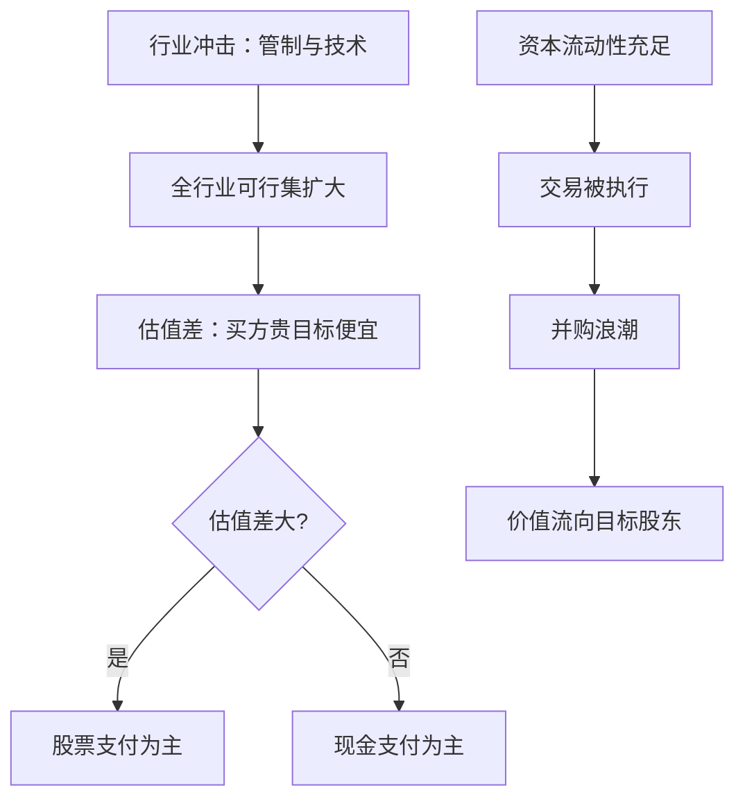

# 并购浪潮

并购浪潮不是贪婪的周期，而是行业冲击、估值差与资本流动性三样东西同时在场的窗口；少一样，同样的协同效应就只剩纸面。

<footer>—— 据 Mitchell–Mulherin 1996 与 Harford 2005 整理</footer>

[上一课](/econ/cf-ipo-timing)把发行时机钉在估值窗口上：企业在自己的股份贵时卖。并购把同一逻辑推到极端——不是发新股买项目，而是用股票或现金买现成的资产包；收购方的「发行窗口」，就是目标的估值低谷。单笔合并的价格效应由[合并模拟](/econ/merger-simulation)处理（内部化交叉弹性、UPP 筛查），本课钉时间维度：并购为什么在历史上一波一波到来，价值又在浪潮里流向谁。

## 问题

并购活动呈波状：1890 年代横向合并、1920 年代纵向整合、1960 年代混合集团、1980 年代杠杆与分拆、1990 年代战略并购与股票支付、此后私募资本与产业整合交替。要解释的不是「为什么并购」，而是**同时性**：协同机会为什么不来则已、来则成潮。Mitchell–Mulherin 1996 给出行业层面的起点：并购与重组活动对经济、监管和技术冲击的反应成簇，冲击在同一时间改变一个行业里所有企业的可行集。Harford 2005 补条件：行业冲击要叠上充足的资本流动性，才形成可观测的浪潮。Shleifer–Vishny 2003 再补一层动因：估值差本身可以是动机——被高估的公司用股票买相对便宜的资产，把高估值「变现」成规模。

## 方法

方法是把浪潮当行业层面的均衡现象来测，而不是逐笔交易的故事：在行业层对齐三条时间序列——冲击日程、融资条件的量、支付方式构成——再看浪潮起点落在哪个组合上。支付方式是框架里最锋利的读数：它把不可观测的估值差翻译成可观测的会计选择。三要素的拆法与拼法如下。

### 三要素框架

把浪潮拆成三要素再拼回去：同时性冲击（放松管制、技术变迁）扩大可行集；估值差（收购方与目标的相对估值）决定支付方式——差大用股票，差小用现金；资本流动性（信贷与私募资本的可得性）决定可行集能否被执行。检验在行业层面对齐三条时间序列：冲击时点、浪潮起点、支付方式构成。

## 机制

价值的分配不对称：目标股东获得正的公告异常收益，量级在两成上下；收购方平均近零甚至略负，股票支付时更差。这与估值差逻辑一致——用股票支付等于向市场承认自己贵。浪潮末端有共同特征：估值差收窄、协同声明的兑现率下降、反垄断审查收紧（[合并模拟](/econ/merger-simulation)的价格效应推到台前）。为什么事后看多数合并没给收购方创造价值，浪潮仍会发生：冲击同时激活了所有人的可行集与信念，个体的乐观、管理层帝国动机与「先例效应」在窗口内互相强化——每个参与者都在自己样本里理性，合起来是潮。

Andrade–Mitchell–Stafford 2001 的样本显示：目标公司公告日异常收益两成以上，收购方在零附近；1980 年代以现金支付为主，1990 年代股票支付占比大幅上升——支付方式是当时估值差的直接读数。

## 边界

浪潮只能事后认定，事前用估值与流动性指标识别，误报率高——「这一波不一样」是每次浪潮里最贵的一句话。协同效应的声明与实现落差大，声明不能当预期收益读。股票支付把并购与上一课的发行择时接在一起：用高估股份收购是把择时收益资本化，代价是事后弱势的股份沉淀在合并体内。杠杆侧的极端形态（收购与私募）另见[杠杆收购与私募股权](/econ/lbo-private-equity)，本课不重复。

## 小结

- 浪潮是三要素的交集：行业冲击扩大可行集，估值差定支付方式，资本流动性定可行性。
- 价值分配不对称：目标股东拿走公告收益，收购方近零，股票支付时更差。
- Shleifer–Vishny 2003：估值差本身就是动因，高估值公司用股票「变现」规模。
- 浪潮只能事后认定，协同声明不能当预期收益读。
- 出处：Mitchell–Mulherin 1996；Andrade–Mitchell–Stafford 2001；Shleifer–Vishny 2003；Harford 2005。
