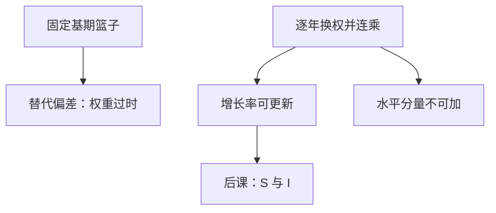

# 链式指数与替代偏差

固定某年篮子去加总物量，等于假定相对价格永远停在那一年；相对价格一变，数量会逃向变便宜的品种，旧篮子就把增长说高或说低。

<footer>—— 据 SNA 物量核算；Landefeld 对 BEA 链式指数的说明</footer>

[上一课](/econ/gdp-gni-nnp)把 GDP、GNI、NNP 分成国境、国民与净额，账户仍是当期价格。本课的缺口不是再改名字，而是：相邻两年的名义比如何拆成价格与物量，以及**固定基期篮子**为何会把替代锁进偏差。Boskin 委员会讨论的是生活成本 CPI，留给[CPI 与 PCE](/econ/cpi-vs-pce)；本课只钉产出物量。储蓄恒等下一课仍可在名义或已缩减的流量上写，但必须先承认指数选择。

## 问题

名义 GDP 的时间比混着 $p$ 与 $q$。若用某一固定年的价格去给所有年份的 $q$ 计价，相对价格变化时，数量会从相对变贵的品种转向相对变便宜的品种。固定旧价格（或旧数量权重）的指数把已经不再被选择的篮子当成「真实产出」的尺度，于是出现**替代偏差**。缺口是：SNA 为何改用逐年换权的链式物量，而不是再讲一遍三条算法。

固定篮子还有不可加性的孪生问题：长期用同一基年，远期权重严重过时；频繁换基年，历史增长率又会改写。链式把相邻两年的指数连乘，使增长率可更新权重，却失去「用某一固定年价格表示的水平」那种简单加总。

替代偏差在此指产出物量：相对价格下降的品种数量上升，旧权过重或过轻。Boskin 的「CPI 高估通胀」是消费者生活成本，篮子与福利基准都不同，本课不借走。

## 方法

相邻两年，用当年与上一年的价格（或数量）构造一对指数，再把环比连乘，得到链式物量指数。BEA 的实践是链式 Fisher 一类：Laspeyres 与 Paasche 的几何平均逐年链接。Landefeld 说明：这样长期增长率少受某一基年选择摆布，也减轻固定权的替代偏误。SNA 推荐物量用链式。

记环比物量因子为 $Q_{t,t-1}$，链式水平是 $Q_{t,0}=\prod_{s=1}^{t} Q_{s,s-1}$。这不是把所有年份的发票用 $p_0$ 重开一次。政策讨论里把链式实际 GDP 的分量加回去，会发现加总不等于总量——公式性质，不是统计事故。

本课不把 Laspeyres / Paasche 的理想检验整章搬进[价格指数](/econ/price-index-real)；那里会系统写 $P$ 与 $y$ 的分工。这里只要一句：国民账户的「实际 GDP 增长」在 SNA/BEA 里已经是链式物量，不是某一固定年价格的总产值。

### 固定权何时仍有用

短期、相对价格几乎不动时，固定篮子与链式接近。长期、IT 与能源相对价格大动时，固定 1990 年价格会把后期计算机的物量夸大到荒谬。换基年能救急，但每次换基改写历史；链式把换权变成常规。

## 机制

替代来自相对价格：价格下降的品种，数量份额上升。用旧期数量权价格（或旧期价格权数量），等于拒绝承认这份逃逸。链式每年用最近的两期构造因子，偏差被限制在「这一年的替代」而不是「三十年累计的过时篮子」。代价是：链式水平没有单一篮子解释，分量之和不等于总量，贡献度分解必须用专门的加性公式。

GNI、NNP 的物量不是自动等于 GDP 物量：跨境初次收入与折旧另有平减。本课不把三个名义口径各自的链式细节写完，只禁止把「实际 GNI」未经声明地当成实际 GDP。开放账户里的实际经常账户同样要声明平减，不能把名义 $NPI$ 的变动直接叫实际国民收入增长。

质量变化与新产品使 $q$ 的口径漂移：计算机「实际产出」很大一块是 hedonic，不是台数。SNA 允许这类调整，但那是测量约定。链式减轻的是**权重过时**，不自动解决质量。把 IT 繁荣的链式增长率全部读成已经识别了技术，会与[索洛残差](/econ/solow-residual)抢同一块剩余。

Landefeld 强调链式改善的是长期增长度量，不是把实际 GDP 变成福利。质量调整与 hedonic 仍是另一层约定，本课不把它写成已经估计了效用。

## 边界

不要在这里写 CIP 或汇率套利率；物量篮子不是外汇远期。Boskin、业主等值租金、核心通胀是 CPI 课的对象。本课也不把链式当成「唯一正确的增长」：不同指数回答不同问题，固定篮子在合同与短样本里仍可声明使用。量化栏的报价是微观价格，这里只借加总物量。

贡献度分解必须用专门的加性公式（如份额加权的环比），不能把链式分量当固定年价格产值去加减。GNI 与 NNP 的物量平减另声明，不默认等于 GDP 链式。储蓄恒等下一课仍可先用名义流量写；一旦谈「实际投资贡献了多少增长」，就要回到本课的指数。

固定基期在合同、税基与短窗比较里仍可声明使用，只要不把三十年的固定 1990 年价格产值当成 SNA 的增长。换基年会改写历史增长率；链式把换权变成常规，代价是水平不可加。这是本课与后课价格指数课的分工：这里钉国民账户物量实践，那里系统写 Laspeyres / Paasche / Fisher。

后课默认：谈到实际 GDP 增长率，默认是链式物量，并知道水平不可加。下一课回到账户：支出里的 $I$ 与未消费收入如何写成 $S$ 与 $I$ 的恒等。

## 小结

- 国境/国民口径仍是名义；比较年份必须声明物量指数。
- 固定篮子把过时权重锁进替代偏差；链式逐年换权并连乘。
- 链式增长率更稳，水平分量不可加是公式性质。
- Boskin 生活成本偏差留给 CPI，不在本课冒充产出指数。
- 质量调整是另一层约定，链式只处理权重过时。
- 出处：SNA 物量核算；Landefeld 对 BEA 链式指数的说明。
