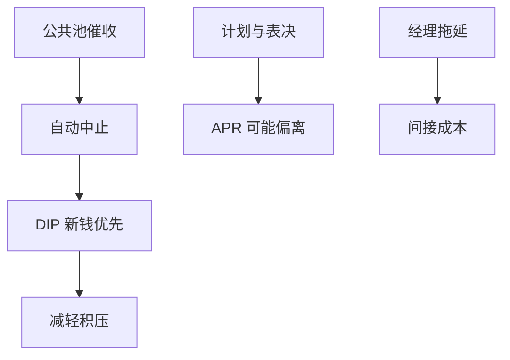

# 第 11 章破产

    
美国破产法第 11 章用自动中止和新融资优先权，把经营从债权人的个别催收里抢救出来；代价是偏离绝对优先、拖延，以及股权在钱里时的选择权。

    <footer>—— 据 Baird, The Elements of Bankruptcy；Franks and Torous, Journal of Finance 1989；Weiss, Journal of Financial Economics 1990</footer>

[上一课](/econ/financial-distress-restructuring)把私下重组与法庭对照。本课缺口是第 11 章作为制度：自动中止、DIP 融资、计划表决、绝对优先规则（APR）的偏离。不重写 Andrade–Kaplan 的成本分解，不把各国破产法做成比较表——只取这套规则如何移动 Leland 的边界。

## 问题

无法庭时，个别催收导致公共池：先到先得，资产被拆。第 11 章自动中止冻结催收，迫使集体谈判。DIP（debtor-in-possession）融资给予新钱超级优先，缓解积压（新投资不再只为旧债打工）。缺口是权衡：中止与 DIP 提高继续经营价值，也给现任经理与股权拖延的期权——Franks–Torous、Weiss 记录 APR 偏离（低级要求权得到不该得的）。事前，债权人要更高利息或更紧条款。

第 7 章是清算；第 11 章是重整。绝对优先：高优先级未全额前，低优先级为零。偏离来自表决规则、经理控制时间、以及需要股权配合确认计划。

## 方法

对资本结构的含义：有效 $\alpha$ 下降（减少无序清算），但拖延增加间接成本，APR 偏离把价值漏向股权与经理。最优杠杆取决于哪一块大。对期限：中止切断加速到期的个别执行，短债的催收威胁减弱，条款的法庭外硬度更重要。

对资本预算：进入第 11 章的期权对股东是价值（看跌的公共保险），对债权人是成本。项目若提高进入概率，APV 要用债的损失而不是股权的期权价值去站队——为谁估值要声明。

Tirole：破产法是不完全合同的残差控制权配置。第 11 章把相当控制留给债务人，是亲继续经营、亲现任的配置；亲债权人的规则把 $V_B$ 提高、杠杆降低。

## 机制

机制是集体行动的法律技术。自动中止把分散债权人变成必须表决的集体；DIP 是法庭强制的优先新钱，纠正 Myers 积压。偏离 APR 是因为表决要拉票、以及法官对「可行性」的裁量——股权的期权在重整里继续活着。这与 Merton/Leland 的「边界上股权为零」不同：法律让边界模糊、股权仍有正价值。

与关系银行：银行常是 DIP 提供者或先偿，法庭内监督替代法庭外关系。公开债分散，靠委员会。证券化隔离实体若被并入实质合并，OTD 的真实出售失败。

### 不是「破产就等于失败」

第 11 章可以是合同的执行阶段。事前杠杆与条款已经把进入概率定价。把进入本身当治理失败，会忽略故意靠近纪律边界的 LBO——后课私募股权。

Weiss（1990）测量直接成本与优先偏离。Franks–Torous 记录偏离的频率。机制课取方向：美国重整偏向继续经营与谈判，而不是瞬时 APR 清算。

## 边界

不要把本课写成程序时间表。下一课：即使有第 11 章，CDS 与分散持有仍使协调失败；空壳债权人可能投票反对有效重整。那是本单元收束。

后课默认：第 11 章降低无序清算、用 DIP 减积压，并以 APR 偏离与拖延为代价。Leland 的瞬时违约是近似；法律让股权在边界上仍有谈判价值。

本栏不讨论交易员如何买破产债权的微观结构。

## 小结

- 自动中止解决公共池；DIP 给新钱优先以减轻积压。
- APR 偏离与拖延是亲债务人重整的代价，事前进入债务价格。
- 破产法配置残差控制权，移动最优杠杆与 $V_B$。
- 出处：Franks and Torous, *JF* 1989；Weiss, *JFE* 1990；Baird。
