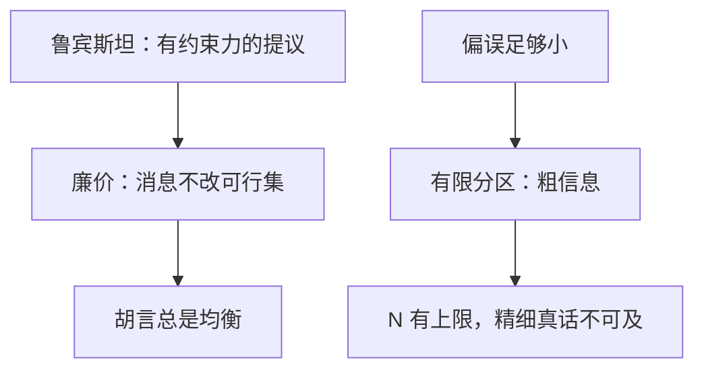

# 廉价交谈

无成本、无约束力的消息能传递信息，当且仅当发送者与接收者的利益足够靠近；偏误一大，均衡只剩胡言。

<footer>—— Crawford and Sobel, Strategic Information Transmission, Econometrica, 1982</footer>

[上一课](/econ/rubinstein-bargaining)的提议是有约束力的要约：接受则饼按该分割交割，拒绝则贴现再谈。缺口是许多话根本不改可行集——建议、暗示、廉价声明，说了不必兑现，听了可以当没听。此时「开口」本身没有贴现成本，信息能否过来，全靠双方目标是否对齐。本课钉 Crawford–Sobel 的分区均衡，不重写轮流出价的 $x^*=1/(1+\delta)$，也不把教育当信号的成本提前。

## 问题

发送者看见状态 $\theta\in[0,1]$，发出消息 $m$，接收者选行动 $a$。支付无消息项：话不花钱、也不直接进效用。接收者要 $a=\theta$，发送者要 $a=\theta+b$，$b\gt 0$ 是偏误。消息空间任意大也无妨——显示原理在这里只说「直接报分区」够用，不保证能报出真点。

胡言（babbling）永远是均衡：消息与 $\theta$ 独立，接收者选无条件最优，发送者懒得区分。有信息的均衡是区间分区：把 $[0,1]$ 切成 $N$ 段，每段发同一消息，接收者在段内取条件期望。偏误 $b$ 越大，最大可支撑的 $N$ 越小；$b$ 超过阈值，只剩胡言。

### 廉价不是「说话无用」

无成本只意味着不能靠烧钱分离。若利益完全一致（$b=0$），真话是均衡；若完全对立，话不改变行动。CS 钉的是中间：能传粗信息，不能传精细信息。这与[斯宾塞信号](/econ/spence-signaling)相反——那边分离靠的是类型依存的成本。

分区边界由发送者无差异条件钉住：在切点上，诱使接收者选左段行动与右段行动无差异。切得越细，相邻行动越近，无差异越难满足，故 $N$ 有上限。

## 方法

对象：一维状态、二次损失、常数偏误、共同先验。先猜 $N$ 段均衡，用无差异递推边界，再验证段内不想跳到邻段。比较静态：$b\downarrow$ 则最大 $N\uparrow$，接收者的剩余上升。多发送者、多维状态、廉价交谈加部分承诺，是后继，本课单发送者。

词表大小不提高 $N$：再多的同义词也只是同一分区的标签。能提高粒度的是把 $b$ 压下去，或把话变成有成本的信号、有约束力的要约。

对照完全信息讨价还价：那里延迟有成本，所以「永远拒绝」不可信。这里延迟不进支付，筛选只能靠「不同类型对接收者行动的偏好排序」——单交叉来自 $b$ 固定、理想点平移。

## 机制

接收者只对消息的后验下最优。发送者若能把 $\theta$ 精确告诉对方，对方选 $\theta$，自己却想要 $\theta+b$，故有激励夸大。均衡里夸大被预期到，消息只能编码「我在哪一段」，不能编码精确点。段数是激励相容的粒度：更细的字典会被边界上的人打破。

与显示原理的衔接：任何有信息的廉价机制，等价于「报自己所在分区」。设计者不能靠把消息空间造得更弯来提高 $N$——上限是偏好，不是词表。要把粒度提高，必须改 $b$（利益绑定、剩余分享），或改成有成本的信号、有约束力的合同。

福利随 $N$ 上升：更细的分区让接收者的行动更贴近 $\theta$，发送者虽然仍有偏误，期望损失也下降。故「有信息的均衡帕累托优于胡言」，但均衡选择不管这件事——胡言不会自己消失。组织里把发送者的报酬与接收者对齐（分成、共同股权），等于把 $b$ 压下去，最大 $N$ 上升：这是改支付，不是改话术。

### 多重均衡不是讨价还价的唯一 SPE

CS 通常有从胡言到最大 $N$ 的一串均衡。哪一个被选，理论不管；实验与「语言惯例」是另一层。Rubinstein 树把 SPE 削到一点，因为拒绝有贴现；廉价交谈没有那根钉子。

Farrell 的「可理解性」、Rabin 的「可信消息集」给廉价交谈加语义约束：某些话若按字面有利可图，均衡不能当它无意义。本课停在 CS 的分区，不引入自然语言公理。

## 边界

状态不是一维、偏误不是常数，分区结构会坏。接收者有自己的私型、双方同时说话，胡言之外还可以有「只在一致区说话」。也不要把廉价交谈写成限价簿的报价——报价改成交价，不是无成本消息。

多个发送者若偏误方向相反，接收者可以交叉验证，有效 $N$ 可以超过单人 CS 的上限。那是改博弈树，不是把一个人的词表加长。本课单发送者已经够接到下一课：一旦「不让步」开始烧钱，对象就从消息变成等待。

后课默认：无约束力的话最多传有限粒度的信息，粒度被偏误封顶；胡言始终在均衡集里。下一课把「耗时间」重新写成有成本的等待。

## 小结

- 轮流出价的话有约束力；廉价交谈不改可行集。
- 胡言总是均衡；有信息的均衡是偏误约束下的区间分区。
- 不能靠更大的词表恢复精细真话；要对齐利益或改成有成本信号。
- 多重分区与 Rubinstein 的唯一 SPE 不是同一类对象。
- 出处：Crawford and Sobel, *Econometrica*, 1982。
