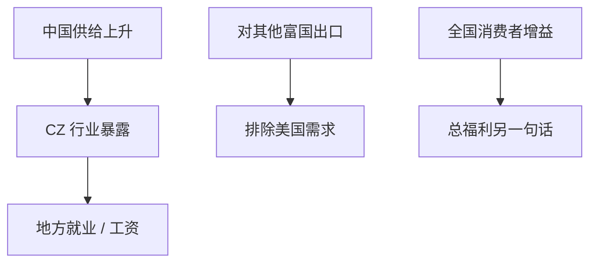

# China shock

中国出口供给的外生上升，通过通勤区的行业暴露变成美国地方劳动市场的就业与工资缺口；国家总增益与局部输家同时成立，SS 不再只是 $2\times2$ 黑板。

<footer>—— Autor, Dorn and Hanson, The China Syndrome, AER 2013</footer>

[上一课](/econ/global-value-chains)把贸易写成价值链会计。本课缺口是识别：1990 年代之后中国生产率与入世带来的出口供给冲击，如何落到美国（及其他进口国）的地方劳动市场。离岸任务下一课把理论从「行业」收到「任务」。本课钉 Autor–Dorn–Hanson（ADH）设计，不把结果写成贸易无增益。

## 问题

HO/SS 预测进口竞争伤害稀缺要素；美国现场是通勤区（CZ）高度专业化于不同行业。ADH：用 CZ 在基期的行业就业结构，对上中国对世界（或对其他高收入国）的出口增长，构造进口暴露。工具：中国对其他发达国家的出口，排除美国需求拉动。缺口是：这是[工具变量](/econ/iv-weak-instruments)加移位份额，估的是局部劳动市场 ATT 一类效应，不是美国总福利，也不是消费者价格增益。

移位份额（Bartik）的识别争论（Goldsmith-Pinkham 等、Borusyak 等）要声明：外生来自冲击侧还是份额侧。ADH 强调中国供给，用第三国出口当工具，是冲击侧故事。

## 方法

回归：CZ 就业、失业、劳动参与、工资、转移支付对进口暴露。标准误聚类到州或匹配的 CZ 组。稳健：把墨西哥、自动化、需求冲击放进对照。后续论文看选举、婚姻、死亡率——本课标边界，不写成卫生综述。总福利：Caliendo–Dvorkin–Parro 一类动态空间一般均衡把 ADH 矩与价格增益一起算，局部损失与全国增益可以并存。

与 Melitz：进口竞争淘汰低 $\varphi$，但美国 CZ 的调整摩擦（住房、技能、不流动）使再配置慢，损失集中。这是摩擦，不是 SS 符号错了。

## 机制

机制是区域特定要素。劳动短期内困在 CZ 与行业，进口价格下降伤害该地劳动需求。消费者全国享有更低价格与品种，空间上分散；生产者损失空间上集中——政治上「看见的输家」压过「看不见的买家」。转移支付部分吸收，但不使就业自动恢复（ADH 发现参与下降、残疾与转移上升）。

与[交错 DiD](/econ/staggered-did)：中国冲击是连续、渐进暴露，不是干净两期政策。移位份额有自己的假设，不要假装是随机化实验。

中国入世、改革、迁移到沿海是供给。美国需求繁荣会同时抬进口，用美国进口总额当处理会混需求。第三国工具就是为了切开。

## 边界

本课不把 ADH 点估计外推成 2020 年代或所有发展中出口国。中国也买美国产品、供应链中间品使部分 CZ 受益，后续文献在拆。自动化（Acemoglu–Restrepo）是并行冲击，要对照不是吞并。下一课任务：可离岸的是任务不是行业，暴露度量会改。不要用本课否证李嘉图增益；用本课否证「增益均匀分布」。

后课默认：中国供给冲击的地方劳动市场效应可用移位份额 + 第三国 IV 识别；那是局部、有摩擦的 ATT。全国福利要加消费者与出口企业。补偿在理论里可能，在观测里部分、延迟。

## 小结

- ADH：CZ 行业结构 × 中国供给 = 进口暴露。
- 第三国出口当工具，切开美国需求。
- 地方就业与工资受损与全国价格增益可以同时真。
- 调整摩擦使 SS 的输家在空间上持久。
- 出处：Autor, Dorn and Hanson, *AER* 2013；后续空间 GE 定量。
