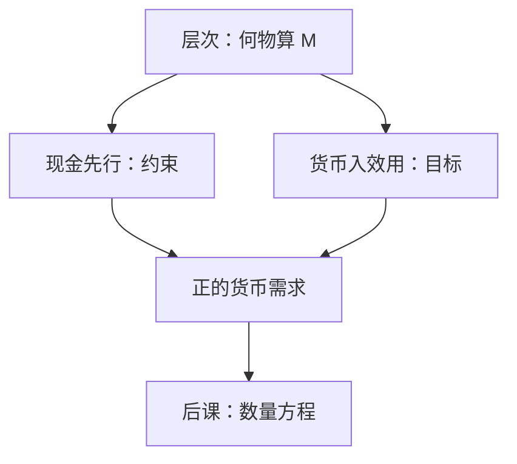

# 现金先行与货币入效用

要把货币放进一般均衡，要么买东西之前必须先持有现金，要么直接让实际余额进入效用；层次表并不给出其中任何一条。

<footer>—— Clower, A Reconsideration of the Microfoundations of Monetary Theory, 1967；Sidrauski, AER 1967</footer>

[上一课](/econ/money-as-medium)按支付功能把 $M0/M1/M2$ 分层，并声明速度与中性是后课。本课的缺口不是再画层次，而是：在已经分清支付手段之后，如何把 $M$ **放进约束或效用**，使家庭有理由持有不生息的货币。数量方程下一课把 $MV=Py$ 推进到中性；本课只给两种标准微观装置。

## 问题

瓦尔拉斯预算只约束现值，不要求某种特定商品充当支付。若货币与债券同样能结清，零利息的 $M$ 不会被持有。层次课已经说 $M$ 是被按面值接受的支付工具，但没有写出接受如何进入优化。缺口是两种写法：Clower 的现金先行（CIA）——购买消费品必须用预先持有的货币；Sidrauski 的货币入效用（MIU）——$u(c,m)$，$m=M/P$。两者都制造出正的货币需求，不必先写央行反应函数。

CIA 把货币放进约束；MIU 把货币放进目标。经验上两者在稳态附近常可校准出相似的货币需求，比较静态仍可能分叉——尤其在超中性与最优通胀上。

## 方法

CIA：$\,P_t c_t \le M_{t-1}$（或同期带现金的变体）。未持有足够现金就不能买 $c$，货币有交易服务。影子价格进入欧拉，名义利率成为持币的机会成本。MIU：预算仍是普通的资产约束，$m$ 直接提高效用（或降低交易痛苦）。一阶条件给出 $u_m/u_c$ 与名义利率对齐。

两种装置都可以接到 Ramsey 增长：Sidrauski 的著名结果是长期超中性——通胀不改稳态 $k$ 与 $c$，只改 $m$。CIA 往往打破超中性：现金约束使消费的有效价格含 $i$，通胀税扭曲实际变量。铸币税课将用到这条分叉；本课只点明装置选择不是无害的。

### 不是货币层次的复述

$M1$ 还是 $M2$ 是统计口径。CIA/MIU 是理论技术。可以把 CIA 的「现金」理解成 $M1$，但层次漂移（基金、支付账户）不会自动改写 Clower 约束。本课禁止用 M2 定义表替代微观约束。

## 机制

CIA：买卖不同步被写成硬约束，货币周转受约束松紧限制，速度有上限。通胀升高，$i$ 升高，持币更贵，约束更痛，消费被扭曲——货币不是面纱。MIU：持币像持有一种服务流，$i$ 升则 $m$ 下降，交易服务减少；若 $u$ 可分且劳动供给等满足特定条件，实物稳态可独立于通胀（Sidrauski 超中性）。最优货币量在 MIU 里常指向 Friedman 规则 $i=0$；CIA 下规则的形式取决于约束何时绑定。

两种写法都把货币与信贷分开：债券付息，货币不付息（或少付），利差是持币成本。内部货币作为银行负债时，谁的约束绑定要重新声明——那是银行课，本课用外生的外生货币当练习。

CIA 的「先行」可以是上期现金，也可以是同期信贷额度；后者已经接近中介。本课保持最简单的 Clower 约束，以免把支付手段写成银行贷款创造。MIU 的 $u(c,m)$ 可分与否决定劳动供给是否随通胀而变：可分时 Sidrauski 超中性更易成立。这两种技术都不是对货币层次的改进，层次边界仍随制度漂移。

数量方程的 $V$ 在 CIA 里受约束松紧限制，在 MIU 里是需求的倒数。下一课从会计 $MV\equiv Py$ 出发时，要记得 $V$ 已经可能是行为而不只是定义。

搜寻与匹配（Kiyotaki–Wright 一类）是第三条微观，本课不展开。主干只要：层次给出口径，CIA/MIU 给出持有理由，数量论给出 $P$ 的长期锚。

## 边界

本课不校准货币需求弹性，不把 CIA 写成支付系统工程。开放经济的外汇现金约束与 CIP 实证不在本栏，见[利率平价](/quant/irp)。也不要把 MIU 的 $m$ 当成福利度量的全部：它是为了关闭持币，不是已经测量了流动性服务。数量方程的会计形式下一课才写；$V$ 在 CIA 里更像约束的反映，在 MIU 里更像需求的倒数。

Friedman 的最优货币量（名义利率为零）在 MIU 里最干净：持币的私人成本应对齐社会成本。CIA 下约束何时绑定会改规则形式。本课不宣布最优通胀，只禁止用层次表替代这两种一阶条件。内部货币与准备金课会改「谁的现金先行」；这里先用外生货币把装置钉住。

两种装置都可以接到费雪：$i$ 出现在 CIA 的影子价格或 MIU 的 $u_m$ 条件里。数量论下一课用这个 $i$ 当持币成本，再谈 $V$。没有 CIA/MIU，层次课的 $M$ 只是统计口径，进不了家庭问题。

后课默认：需要货币需求的微观时，声明用的是约束还是效用。下一课把 $M$ 接到 $P$ 与 $y$：数量方程与长期中性。

## 小结

- 层次课回答何物算 $M$；本课回答为何持有不生息的 $M$。
- CIA 把货币放进购买约束；MIU 把实际余额放进效用。
- Sidrauski 常得超中性；CIA 更容易让通胀扭曲实物。
- 装置选择影响铸币税与最优通胀，不是记号游戏。
- $i$ 是持币机会成本，费雪分解下一课再拆。
- 出处：Clower, 1967；Sidrauski, AER 1967。
