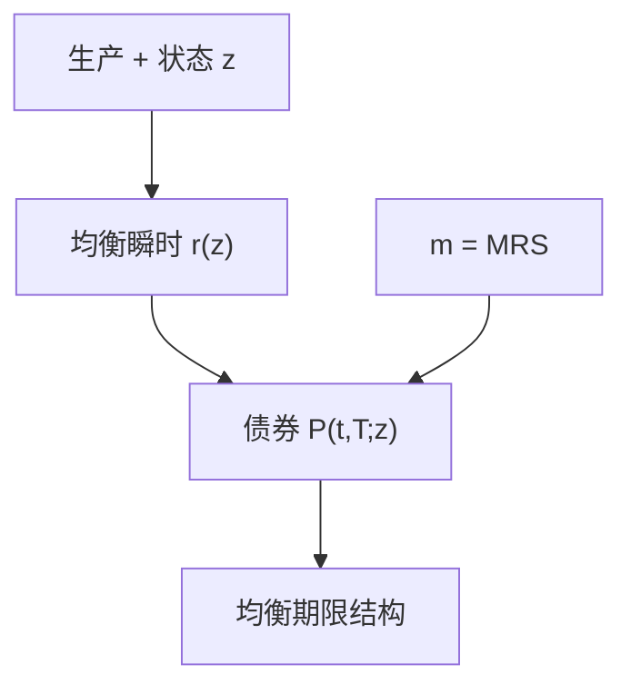

# CIR 一般均衡利率

短期利率是均衡里资本的边际与消费的边际对齐之后的过程；平方根扩散保证正利率，波动随水平升。

<footer>—— Cox, Ingersoll and Ross, An Intertemporal General Equilibrium Model of Asset Prices, Econometrica, 1985；A Theory of the Term Structure of Interest Rates, Econometrica, 1985</footer>

[上一课](/econ/continuous-time-capm)把 $r$ 当参数，给资产标瞬时 beta。本课缺口是**利率从哪来**：生产技术加状态变量，出清的瞬时无风险利率成为 $z$ 的函数，债券价格由同一 $m$ 给出期限结构。不重写 EH 的宏观课，不估计仿射模型的卡尔曼滤波。

## 问题

Cox、Ingersoll 与 Ross（1985）：连续时间生产，状态 $z$（例如技术冲击）驱动边际产出，代表性主体优化。瞬时 $r$ 等于财富的影子收益率（或消费欧拉的漂移项），债券是对一单位计价物在 $T$ 的要求权，价格 $P(t,T;z)$ 满足偏微——生成元来自 $m$ 或来自风险中性下 $z$ 的漂移。平方根过程 $\mathrm{d}r=\kappa(\bar r-r)\mathrm{d}t+\sigma\sqrt{r}\,\mathrm{d}B$ 是他们选出的闭式特化：零是可及或不可及取决于参数，利率不为负，波动与水平同向。缺口是：期限结构可以是一般均衡的产出，而不必是外生因子的仿射。

主干仿射课把因子当给定。本课指出 CIR 的因子有生产解释。两课不互相替换：仿射是计算族，CIR 是均衡选取。

两篇 1985 *Econometrica*：一篇一般均衡资产价格，一篇期限结构闭式。Vasicek 是高斯外生利率，可为负；CIR 用 $\sqrt{r}$ 挡零。

## 方法

均衡：$m=\mathrm{e}^{-\rho t}u'(c_t)$，$c$ 由生产与状态决定。$r$ 由 $1=\mathrm{E}[m(1+r\mathrm{d}t+\ldots)]$ 的瞬时给出。债券 $P=\mathrm{E}[m_T/m_t]$。选技术使 $r$ 本身是仿射（或平方根）状态，PDE 有指数仿射解。风险价格由生产风险与 $u$ 决定，不是外生 $\lambda$。

与 Lucas 树：树无生产，$r$ 由果实的条件矩给出，也可以有期限结构，但没有资本。CIR 让资本存在，$r$ 与投资机会锁在一起——对冲需求的 $z$ 正是这个状态。连续时间 CAPM 在此成为「瞬时股票相对瞬时 $r$」的切片；整条债券曲线由同一均衡生成。

## 机制

机制是跨期生产的一阶。资本的边际产出高时，主体要求更高的 $r$ 才愿意把消费挪到今天（或相反，取决于如何标状态）。均值回复来自技术或偏好把 $z$ 拉回。波动随 $r$ 升：高利率状态下技术更抖——这是闭式需要的假设，不是数据。债券风险来自 $r$ 的扩散：长久期暴露 $r$ 的对冲价格，接风险的期限结构课，但对象是确定支付，不是股利条。

便利收益会让国债不再是纯 CIR 债券。本课纯计价物要求权。安全资产课的服务流在 CIR 里相当于改支付，不是改 PDE 装置。

## 边界

不要把平方根估计成短期利率的唯一真相。高斯、多因子、跳跃是别的特化。下一课把同一均衡装置对准期权：Black–Scholes 公式可以是复制，也可以是某个均衡里 $m$ 恰好使波动定价与复制一致。CIR 给利率；BS 给股票期权——完全市场里两者都是 $\mathbb{Q}$–期望。

后课默认：CIR 把 $r$ 从参数升级为均衡扩散；债券价格由同一 $m$ 的 PDE 给出。仿射是计算，生产是解释。不是 EH 的宏观检验。

## 小结

- 一般均衡对齐生产与消费的边际，给出瞬时 $r(z)$。
- 平方根特化：正利率、水平依赖波动、债券闭式。
- 期限结构与股票瞬时 CAPM 共用 $m$，支付不同。
- 出处：Cox, Ingersoll and Ross, *Econometrica* 1985（两篇）。
