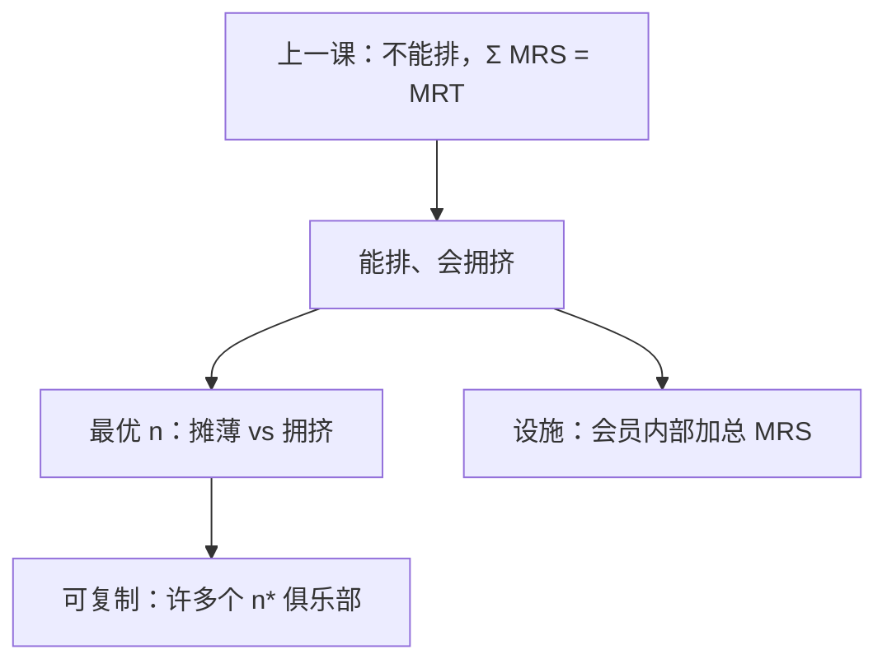

# 俱乐部物品

一种可以排他、却会因人数拥挤的商品：会费分摊固定成本，最优俱乐部规模在分摊与拥挤之间切一刀。

<footer>—— 据 Buchanan, An Economic Theory of Clubs, Economica, 1965 整理</footer>

[上一课](/econ/public-goods)（公共物品与免费搭车）。纯公共品非竞争又非排他，$\sum\mathrm{MRS}=\mathrm{MRT}$，自愿贡献免费搭车。本课不重写萨缪尔森加总，也不把 Lindahl 价再列一遍。缺口是中间形态：围墙能立住（排他），但容量内越来越挤（部分竞争）。Buchanan 的俱乐部把「谁进来、规模多大」写成选择，而不是全人口强制消费同一 $G$。

## 问题

纯公共品：$n$ 增加不降每人的 $G$，又赶不走不付费者。俱乐部：设施 $X$ 可排他，效用 $u(x,n)$，$n$ 升则拥挤，$u$ 对 $n$ 下降。固定成本 $C(X)$ 由会员分摊，会费 $c=C(X)/n$。最优要同时选设施规模与人数。缺口不是再骂免费搭车，而是：**排他恢复之后，最优 $n$ 从哪来，以及为何「整个经济一个俱乐部」一般不是解。**

共享的好处是摊薄 $C$；坏处是拥挤。一阶条件：新会员带来的会费下降，应等于他加在全体身上的边际拥挤。设施的边际成本应等于会员边际评价之和——在俱乐部内部像一条迷你萨缪尔森条件，但 $n$ 是内生的。

### 排他把免费搭车切掉一块

能收费，自愿贡献博弈换成「进不进这个俱乐部」。仍可能有许多俱乐部竞争（Tiebout 用脚投票是后话），本课先钉单一俱乐部的最优规模。不能排他时，Buchanan 的会费收不上来，退回上一课。

Buchanan 1965 的图：横轴是 $n$，纵轴是人均净收益。最优 $n^*$ 在人均收益最大处，不是「越大越好」。纯公共品是拥挤为零的极限，$n^*$ 趋于全体；纯私人品是拥挤极陡，$n^*=1$。

## 方法

代表性会员，对称分享。规划：$\max_{X,n} u\bigl(X,n\bigr)$ s.t. 人均成本 $C(X)/n$（或把预算写进 $u$ 的私人品）。两个一阶条件分别钉 $X$ 与 $n$。人口很大、可复制俱乐部时，均衡是许多个规模为 $n^*$ 的俱乐部，像长期进入把厂商钉在有效规模——对照[长期进入](/econ/long-run-entry)，这里复制的是设施加会员包。

非对称偏好：不同 $\theta$ 想要不同 $X$ 与 $n$，混合俱乐部有拥挤外部性与排序成本，分层（高需求者自己一组）往往更稳。本课对称教具已够把「内生 $n$」钉住。会费必须能排除不付费者；排他技术一垮，退回上一课的自愿贡献。

不要把会费写成商品税。会费是排他装置，不付则进不去；Ramsey 税是对已经在市场上的私人品钉楔子。

## 机制

内生 $n$ 的机制是拥挤与分摊的对冲：第 $n+1$ 人降低人均固定成本，也降低每人的 $u$。切点就是俱乐部的「有效规模」。排他的机制是把非会员的 MRS 从加总里拿掉——他们不享用 $X$，萨缪尔森加总只在会员里做。这与纯公共品「必须加总全人口」正好相反。

可复制的机制与 U 形 AC 同一：单个设施有最优容量，经济靠开新俱乐部扩张，而不是把一个游泳池无限挤进去。IRS 若强到整个经济只能有一个设施，俱乐部理论碰到自然垄断，会费变成规制问题。

非对称会员：高拥挤敏感者愿为低 $n$ 付更高会费，分层俱乐部把不同 $\theta$ 分开，类似纵差异的质量阶梯，但这里分的是容量而不是 $s$。强制开放入会把 $n$ 推过 $n^*$，人均净收益下降——排他不是天然的恶，它是最优规模的工具。

地方公共品、社区、协会是经验对应。Buchanan 的理论不保证自愿俱乐部达到全球帕累托：排除在外的人可能仍有正评价，只是低于会费。全局有效还要问这些人能否另组俱乐部。

## 边界

拥挤若对 $n$ 不可微，最优规模可以停在整数区间。

Tiebout 用管辖竞争显示偏好，下一课之后的林达尔也不代替用脚投票：那是许多俱乐部（社区）竞争，把 Buchanan 的 $n^*$ 乘上辖区数目。反歧视、开放入会规则会把 $n$ 的选择从俱乐部手中拿走。下一课[公地](/econ/common-pool)取另一极：很难排他、但消费可分——拥挤变成捕获，会费收不上。

后课默认：俱乐部是可排他、拥挤的共享；最优规模在摊薄与拥挤之间；纯公共品与纯私人品是 $n$ 的两个极限。

本课不把会费写成 Ramsey 税。

## 小结

- 排他恢复后，免费搭车换成入会决策。
- 最优 $n$ 平衡人均成本下降与边际拥挤。
- 设施规模在会员内部满足加总 MRS。
- 下一课：不能排他却可分的资源，捕获替代会费。
- 出处：Buchanan, *Economica*, 1965。
