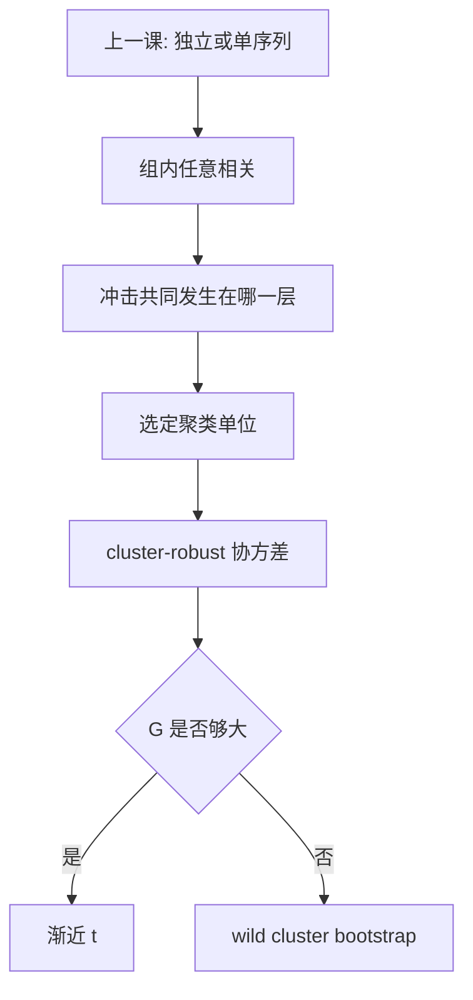

# 聚类标准误

同一聚类里的观测可以任意相关；聚类标准误只要求聚类之间近似独立。把一家企业二十年当成二十个独立点，显著性几乎一定虚高。

<footer>—— Liang and Zeger 广义估计方程传统；Cameron, Gelbach and Miller, Review of Economics and Statistics 2008；Bertrand, Duflo and Mullainathan, QJE 2004；对照 Angrist and Pischke 第 8 章</footer>

[上一课](/econ/hac-heteroskedasticity)用 White 修独立截面的异方差，用 Newey–West 修**一条**序列的短记忆。本课缺口是面板与重复抽样：误差在同一企业、同一县、同一学校里相关，但不同聚类之间可以近似独立。把 $N\times T$ 格点当 $NT$ 个 i.i.d.，或只开 robust 不开 cluster，SE 系统性偏小。识别下一课才回到[遗漏变量与测量误差](/econ/ovb-measurement-error)；本课把推断钉在「冲击发生的那一层」。

## 问题

聚类 $g$ 内允许 $\mathrm{Cov}(u_{gi},u_{gj})\neq 0$，组间 $g\neq h$ 则协方差为零。有效信息量接近聚类个数 $G$，不是行数 $N$。五十个州的政策回归，名义样本可以是州–年几千行，$G=50$ 才是渐近的分母。Bertrand–Duflo–Mullainathan 演示：州级 DiD 若忽略序列相关，$t$ 统计量严重膨胀。缺口不是再选一次核带宽，而是：**相关块的边界在哪，以及 $G$ 不够大时正态近似还能否用。**

### 聚类不是越细越好

把聚类拆到个体，等于回到 White：组内相关被假装切碎。把聚类升到「全世界一年一个簇」，$G$ 太小，CRVE 自己也不稳。层级应对准**赋值或冲击的共同来源**：政策在县，就县聚类；共同宏观冲击再加时间维，才考虑双向。乱聚到「看起来相关的一切」，是把设计语言换成相关图。

Abadie–Athey–Imbens–Wooldridge 强调：聚类应对准设计（哪些单位被政策或被抽样绑在一起），不是把所有显著的组内相关都收进 SE 配方。

## 方法

聚类稳健协方差（cluster-robust / Liang–Zeger）把每个 $g$ 的 $X_g'\hat u_g\hat u_g'X_g$ 整块加总，再夹进 $(X'X)^{-1}$ 两边。组内相关结构不必参数化——这是它相对随机效应 GLS 的便宜之处。面板企业固定效应：默认企业聚类；州政策：州聚类。双向聚类用 Cameron–Gelbach–Miller 的公式，要求两个方向的簇都足够多。

$G$ 很小（常见口诀：少于约 50）时，渐近 $t$ 仍偏乐观。补救：wild cluster bootstrap（Rademacher 权重乘残差，保留簇结构）、或把推断改成随机化 / 置换——后者是另一套逻辑，本课只标出口。

不平衡聚类——少数簇特别大——会让 CRVE 低估方差。报告 $G$、最大簇份额，比只报「已经 cluster」更诚实。

## 机制

机制是承认：一次共同冲击打在整个 $g$ 上，不能靠多一行观测把这次冲击「平均掉」。三明治中间从 $\sum_i \hat u_i^2 x_i x_i'$ 变成 $\sum_g$（簇得分外积）。$G\to\infty$ 才是一致性的渐近；行数 $N\to\infty$ 而 $G$ 固定，聚类 SE 并不自动对。这与上一课 HAC 的 $T\to\infty$ 是同一类「依赖单位个数」故事，只是依赖单位从时间换成了簇。

固定效应吸掉簇内时不变均值，**不**吸掉簇内时变相关。开了企业 FE 仍要企业聚类，两句话不互相替代。

Miller 等人后来的警告：少量大簇、处理几乎只发生在几个簇里时，CRVE 与 bootstrap 都可能失效。这时要回到设计：有效对照到底有几个。

## 边界

聚类救不了识别：簇内 $X$ 与 $u$ 仍可一起动，那是[遗漏变量](/econ/ovb-measurement-error)的事。空间相关若跨过你画的边界，「簇间独立」失败，要更高一层或空间 HAC。量化栏公司金融里双向聚类更常见，本课不重写那些表，也不进限价簿。后课[Bootstrap](/econ/bootstrap-econ)会把 wild cluster 写成一般重抽样装置；这里只为 $G$ 小留一个入口。

后课默认：政策在哪一层赋值，SE 就聚到那一层；写下 $G$。下一课从推断回到外生失败的两条经典形状。

## 小结

- 组内可任意相关、组间独立：有效 $N$ 接近 $G$。
- 聚类层级对准冲击，不是越细越「稳健」。
- $G$ 小时渐近 $t$ 偏乐观，考虑 wild cluster bootstrap。
- FE 不替代聚类；聚类不替代外生。
- 出处：Bertrand, Duflo and Mullainathan, *QJE* 2004；Cameron, Gelbach and Miller, *ReStat* 2008；Angrist and Pischke；Wooldridge。
