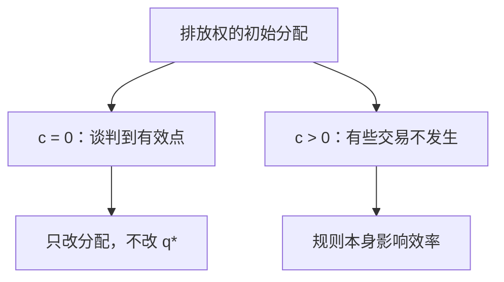

# 科斯定理与交易成本

若交易成本为零，权利的初始分配不影响资源配置的效率；有摩擦时，法律规则本身就是经济问题。

<footer>—— 据 Coase, The Problem of Social Cost, Journal of Law and Economics, 1960 整理</footer>

[上一课](/econ/missing-markets)（缺失市场）。用庇古税把漏列的边际塞回私人一阶条件，但计划者必须知道 $\mathrm{MD}(q^*)$。缺口是：当事双方若能自己谈，还要不要这个税？科斯把问题从「算准税率」换成「界定权利、看谈判成本」。本课钉零成本基准与摩擦打开后的含义，不把科斯写成「政府永远多余」。

## 问题

庇古默认损害方向是单向的：工厂害邻居，所以罚工厂。科斯指出相互性：禁止工厂等于损害工厂使用空气的权利。有效性问的是：权利放在哪一边，事后的生产与损害是否还能被谈回社会最优。若谈判没有成本，初始权利只改变谁向谁付钱，不改变最终的 $q^*$。

缺口因此不是再写一条 $\mathrm{MD}$ 曲线，而是：在[核](/econ/core-equivalence)那种可结盟逻辑里，把「排放权」当作可转让禀赋。两人、权利清晰、转移可执行时，核收缩到有效点附近——这与埃奇沃思透镜是同一几何，只是商品多了一维权利。

### 科斯定理不是科斯写的那五个字

Stigler 后来才叫它定理。Coase 原文的重点在后半：交易成本为正时，初始权利与责任规则改变哪些交易发生得起。零成本只是对照。把原文读成「放任即可」，丢掉了摩擦那一半。

教具：工厂产值与洗衣店损失。权利给洗衣店，工厂买排放权直到边际产值等于边际损失；权利给工厂，洗衣店付钱让工厂减产，停在同一点。支付方向相反，有效点相同。

## 方法

对象：两人、完全信息、权利可转让、合约可强制执行、效用可转移（或至少可谈判到帕累托边界）。结论：有效配置与权利的初始分配无关；分配效应当然有关。这是[第二福利定理](/econ/welfare-theorems)的私人版本：总额转移在这里是权利本身，市场（谈判）去实现有效点。

交易成本 $c>0$ 时，只有增益超过 $c$ 的交易发生。权利放在「本来就会做有效选择」的一方，可以省掉谈判；放错边，谈判又谈不成，就停在无效点。于是法律的比较静态是：哪一种初始规则使必须发生的交易更少、更便宜。

多人、免费搭车时，谈判联盟复制了核的阻塞困难：人越多，越接近下一课的公共物品。科斯基准在小数目上最干净。

## 机制

零成本时，价格（或一次性支付）把外部性重新商品化。权利是禀赋，谈判是交易，有效性回到第一定理。税变成多余——不是因为损害不存在，而是因为市场已经被补全。支付方向随初始权利变，这是分配； $q^*$ 不变，这是效率。两人盒里把权利画成禀赋点，谈判沿透镜走到合同曲线，与[埃奇沃思](/econ/edgeworth-pareto)同一张图。

摩擦破坏的是「补全」这一步。写合约要描述状态、监测排放、防止事后敲竹杠。权利模糊时，双方争的是权利本身，不是排放数量。此时庇古税与科斯谈判都缺信息：前者缺 $\mathrm{MD}$，后者缺可执行的产权。比较的是两种信息体制，不是「市场对政府」的口号。人数一多，每个受益者都想让别人去谈，摩擦与免费搭车叠在一起——那是下一课。

### 企业是降低交易成本的一种装置

Coase 更早的《企业的性质》把企业看成用权威替代市场谈判。若工厂和洗衣店合并，排放变成内部转移定价，双边外部消失。合并本身有组织成本，超过这个成本就不如继续做两个主体再谈判或再征税。本课不重写厂商技术，只把治理结构放进可行性：税、禁令、合并、法庭，是替代的契约形式。

拟线性（或可转移效用）关掉收入效应，教具才有「 $q^*$ 与权利无关」。效用不可转移时，权利带来的财富会改需求，有效点可以微移。不要在一般偏好里硬说数量一字不差。

权利必须可让渡。若「清洁空气」无法排除搭便车的居民，双边谈判组不起来。定理的域是稀少当事人、权利清晰、法庭便宜。

## 边界

完全信息是关键。不对称信息下列出菜单，谈判本身有逆向选择与信号，要等到本课程的信息课序。不可分、非凸时谈判可能停在错误的角点。收入效应大、效用不可转移时，「与初始分配无关」只对效率近似成立，对分配不成立。

也不要把科斯用来给限价簿背书。权利交易仍是抽象的净转移，不是订单簿上的排队。后课公共物品把非竞争、非排他推到极端，谈判的联盟规模爆炸。

权利若不可转让，零成本结论立刻垮：谈判没有商品可交。科斯要的是可交易的产权，不是「贴一张告示」。

后课默认：零交易成本下，清晰产权可使外部性内部化；正成本时，权利分配进入效率。

## 小结

- 外部性有相互性；有效性问最终 $q^*$，不先验惩罚某一方。
- 零成本谈判下，初始权利只改分配；正成本下，规则改效率。
- 科斯是补全市场，不是取消损害。
- 人数一多，谈判靠近免费搭车。
- 出处：Coase, *JLE* 1960；定理一名来自 Stigler 的转述。
