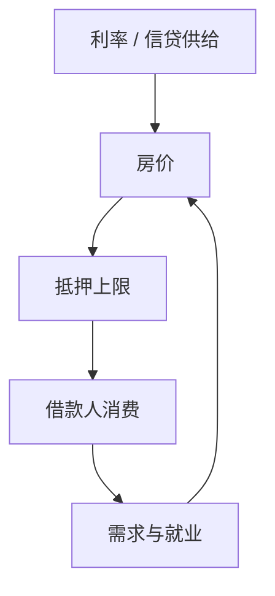

# 抵押约束与房价

住房既是消费又是抵押；房价进入借贷上限时，利率与信贷供给的脉冲被按揭渠道放大成消费与新建。

<footer>—— Iacoviello, House Prices, Borrowing Constraints, and Monetary Policy in the Business Cycle, AER 2005；Kiyotaki–Moore 的住房版本</footer>

[上一课](/econ/gertler-kiyotaki)把银行净值接到信贷。家庭侧最重要的抵押是房。本课缺口是 **房价–LTV 循环**，接到已有的家庭债务事实。不重写银行激励约束代数。

## 问题

Iacoviello：耐心储蓄人与不耐心借款人，住房服务进效用，借款受房价×LTV 约束。货币紧缩降房价，收紧约束，借款人消费大降——比代表性欧拉大。与 Mian–Sufi 的截面一致。缺口是给家庭债务课一条 NK/DSGE 装置，而不是再列邮编回归。

Iacoviello, *AER* 95(3), 2005, 739–764。Kiyotaki, Michaelides and Nikolov；Guerrieri and Iacoviello 的偶尔绑定。住房供给弹性（Glaeser、Saiz）改 $q$ 的响应。

## 方法

两类家庭，住房存量缓慢调整或土地固定。货币政策进名义利率，经贴现与还款进 $q$。银行可有可无：先硬 LTV，再接 GK 的按揭供给。偶尔绑定：繁荣时约束松，IRF 像普通 NK；崩溃时绑定，非线性。宏观审慎 LTV 直接动约束参数。

与 HANK 两资产：住房常是非流动性资产，贫流动性与高 LTV 是表亲。不要两套模型各说各话：校准应对同一套 MPC 与住房财富弹性。

## 机制

机制仍是价格进约束。住房特殊处：服务流使 $q$ 有消费需求支撑，不只资产需求；供给慢使短期弹性更靠需求与信贷。名义刚性债：利率重置快慢决定现金流通道 vs 房价通道。浮动利率经济（部分欧洲）对政策利率更敏感。

预期：新闻式的未来租金或诊断性房价外推，会先松后紧约束，制造内生繁荣崩溃。

本课不估计全国房价的因子模型，不把 REIT 微观结构当宏观。

## 边界

本课不定最优 LTV 数字（审慎课）。不写土地使用法。商业地产与家庭住房机制类似、主体不同。下一课把名义价格水平本身拉进债务负担——债务通缩。

后课默认：房价经 LTV 放大货币与信贷冲击；绑定是状态依存的。下一课：通缩如何加重名义债。

## 小结

- 住房抵押把房价焊进家庭借贷上限。
- 货币与信贷脉冲对借款人消费的效应大于代表性欧拉。
- 偶尔绑定产生非线性 IRF。
- 出处：Iacoviello, *AER* 2005。
