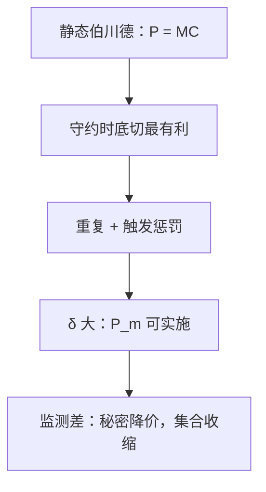

# 合谋与卡特尔

秘密降价的诱惑随买家数目与监测难度上升；静态伯川德把垄断价喊碎，重复互动才可能把它撑住。

<footer>—— 据 Stigler, A Theory of Oligopoly, JPE, 1964；Friedman, A Non-cooperative Equilibrium for Supergames, RES, 1971 整理</footer>

定位：[上一课](/econ/bertrand-capacity)。同质、产能无限时同时喊价落到 $P=\mathrm{MC}$；产能预承诺可以把产量读回古诺。本课不重讲配给规则与 Kreps–Scheinkman。缺口是：静态博弈里垄断价不是相互最优，卡特尔协议在一次性伯川德里不可自我实施。要把垄断价撑住，必须换时间结构——接到[重复博弈](/econ/folk-theorem)，本课只写产业组织这一侧。

## 问题

卡特尔想实施垄断产量 $Q_m$ 与价格 $P_m$，再按配额分 $\pi_m$。静态里每家的最优偏离是：别人守约时，自己略微底切（伯川德）或把自己的产量扩到剩余需求的 $\mathrm{MR}=\mathrm{MC}$（古诺）。利润从份额变成几乎整块垄断剩余，一次性没有惩罚，合谋崩溃。缺口不是再定义一次 MR，而是：**静态无法维持 $P_m$，维持需要可置信的未来损失。**

Stigler 把秘密降价写成信息不对称：卖方看不见对方的成交价，只看见自己的销量波动。买家越多、订单越碎，把降价伪装成需求冲击越容易，合谋越脆。这是监测问题，与无名氏定理的完美监测上界对照。

### 卡特尔不是另一家垄断者

把 $n$ 家加总当成一家去读勒纳，漏掉激励相容。配额、补偿支付、共同销售机构，都是为了改偏离收益；没有这些，联合利润最大化只是规划，不是均衡。产能约束可以帮忙：打满的工厂底切空间小，合谋更容易——与上一课「产能把伯川德接回古诺」是同一把刀，方向变成「产能也挡住偏离」。

Friedman 的纳什回归：合作路径上要 $P_m$，一旦观测到偏离，永远回到阶段纳什（伯川德则是 $P=\mathrm{MC}$）。贴现 $\delta$ 够大时，未来损失压过当期底切。本课不把无名氏集合整段搬来，只钉这一触发。

## 方法

阶段博弈取伯川德或古诺。合作支付 $\pi_c$，偏离 $\pi_d$，惩罚支付 $\pi_p$（常取阶段纳什）。激励相容：

$$
\pi_d-\pi_c\le\frac{\delta}{1-\delta}(\pi_c-\pi_p).
$$

$\delta$ 越大、 $(\pi_c-\pi_p)$ 越大、当期偏离增益越小，合谋越容易。$n$ 增加通常摊薄 $\pi_c$、放大 $\pi_d$ 的相对诱惑。需求繁荣抬高当期偏离收益，Stigler–Rotemberg 一类比较静态说繁荣期更难合谋——声明监测假设后再用。

公开价格、同质大单、行业协会的信息交换，都是把监测从噪声里捞出来。本课不写反托拉斯条文，只写激励。

不要把「惩罚」写成限价簿上的掠夺性挂单；这里是产品市场的重复定价，没有时间优先队列。

## 机制

自我实施的机制是贴现：偏离赚一次 $\pi_d-\pi_c$，之后每期少赚 $\pi_c-\pi_p$。产能与差异改变的是 $\pi_d$：差异越大，底切抢不到全部需求，偏离变钝，合谋可以更松——但差异也降低 $P_m$ 相对竞争的升水，净效应要算。秘密降价的机制是信号提取：观测不到对方的 $p$，只能对销量做假设检验，惩罚会误伤，于是均衡必须掺噪声、效率下降。

与斯塔克尔伯格无关：合谋是对称的重复，不是先动承诺。指定一家「领导报价」若可观测、可惩罚，只是合谋的交流装置，不要写成[产量领导](/econ/stackelberg)的反应曲线切点。

产能的另一面：过剩产能使惩罚更狠（偏离后可以立刻扩产砸价），也使当期偏离更诱人。经验上「过剩产能支撑卡特尔」不是定理，要看惩罚与偏离哪一头升得更快。产品同质、公开报价、买方集中，Stigler 的监测更易；碎买家、秘密折扣，触发策略的观测失败，无名氏集合收缩。

Stigler 1964 强调买方侧的信息结构，不是博弈论触发策略。Friedman 1971 才把超博弈均衡写清楚。两篇合在一起：激励相容加监测。

## 边界

有限次重复、阶段纳什唯一时，逆向归纳钉死竞争；有限次要合谋，需要阶段有多个纳什或声誉。反垄断的宽赦、私人诉讼改变 $\pi_d$ 的法律期望，本课不写。后课[限制进入定价](/econ/limit-pricing)对付的是潜在进入者，不是在位者之间的配额。

后课默认：静态伯川德（或古诺）撑不住卡特尔；重复加监测才可能。无名氏定理给出可能性，不给出哪一个卡特尔会被选中。

## 小结

- 静态价格战把 $P_m$ 底切掉；合谋是重复博弈的激励相容。
- 监测越差、买家越碎，秘密降价越容易，卡特尔越脆。
- 产能与差异改偏离收益，不改「需要未来惩罚」这一层。
- 下一课让一家先动，把同时选择改成可观察的产量承诺。
- 出处：Stigler, *JPE*, 1964；Friedman, *RES*, 1971。
