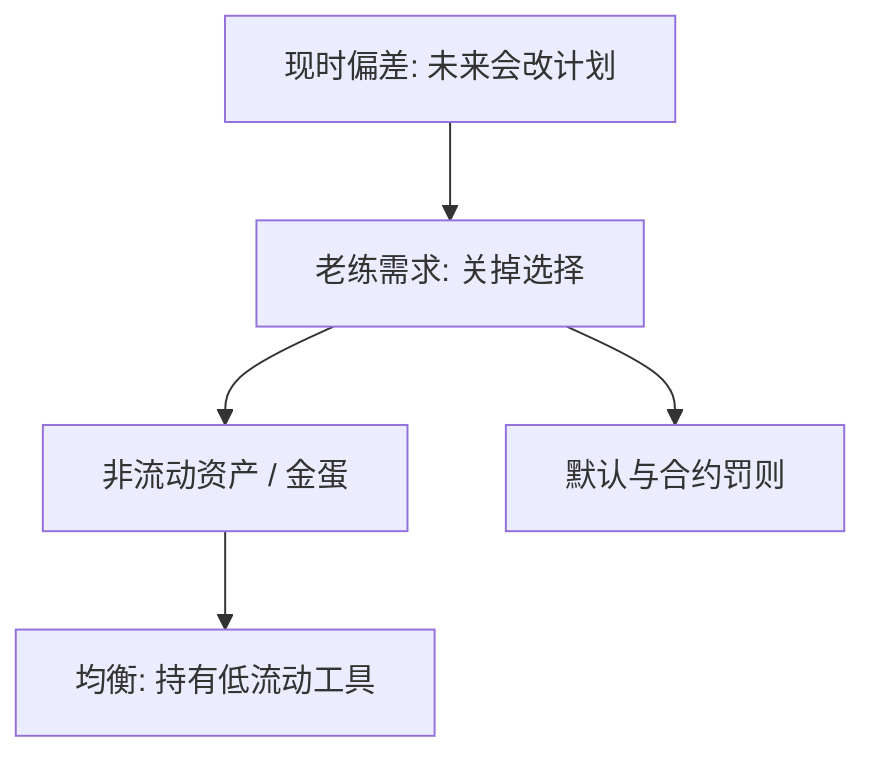

# 承诺装置

若未来的自己会改计划，有价值的不是更多选择，而是现在把某些选择关掉。

<footer>—— Strotz, Myopia and Inconsistency in Dynamic Utility Maximization, RES 1955–56；Laibson, QJE 1997；对照 Thaler and Shefrin, AER 1981</footer>

[上一课](/econ/hyperbolic-present-bias)给出准双曲与老练自我。本课缺口是：老练知道会偏，于是需求**承诺**——非流动性、默认缴存、合约罚则——把未来菜单缩小。不重写 $\beta$–$\delta$，只问装置如何进入预算。

## 问题

指数贴现下，更多选择弱优于更少（在无摩擦菜单上）。准双曲下这句话失败：未来菜单里若含「立刻吃掉储蓄」，老练的长期自我宁愿今天就看不见这个选项。缺口因此不是再定义偏好，而是承认**约束可以是被需求的**。这与显示偏好课的「选择揭示排序」不矛盾：被关掉的选项从未进入当期菜单，谈不上揭示。

也不要把承诺写成限价簿上的撤单限制。这里没有队列；装置是家庭资产负债表与合约条款。

幼稚自我不买承诺：他们以为未来会执行。观测到的承诺需求是老练程度的证据，不是贴现率本身的测量。

## 方法

Strotz 的策略是事先限制未来可行集。Thaler 与 Shefrin（1981）的计划者–执行者：长期自我选约束，短期自我在约束内花钱。Laibson 的金蛋：非流动资产在下一期才能变现，现时自我无法把它变成即期消费，于是均衡持有金蛋，哪怕其回报并不高。Ashraf、Karlan 与 Yin（2006）在田间提供不可提前支取的储蓄账户，需求来自意识到现时偏差的人。

承诺可以是市场的（定期存款、住房首付），也可以是制度的（养老金默认、强制年金）。本课先钉「缩小菜单有正价值」，具体生命周期与年金谜后课再接。

## 机制

机制是改变未来自我的可行集，从而改变子博弈完美均衡。提高提款成本、拉长锁定期、把边际储蓄设成默认，都是把 $c_{t+1}$ 的上界或价格改掉。计划者并不需要改变 $\beta$，只需要改变预算。这与宏观里「规则而非权变」同构但对象不同：那里绑的是政府，这里绑的是下一期的自己。

代价是流动性损失与冲击到来时的再融资成本。承诺过度会在收入风险下后悔——预防性储蓄与流动性约束是后课，本课只标出权衡：现时偏差要锁，风险要留一扇门。

与宏观政策课的承诺不是同一合同：Kydland–Prescott 绑的是政府，面对的是私人预期；这里绑的是下一期的自己，面对的是同一人的 $\beta$。工具可以长得像（规则、锁定期），对象必须分开写。默认缴存是后课素养与助推的接口，本课只要求：老练自我愿意为缩小菜单付正价格。

## 边界

不是所有非流动性都是承诺。交易成本、信息不对称、住房的消费服务，都会产生不流动，不必有双曲。识别承诺需求要看：人是否愿意为「不能提前取」付正价格。本课不估计该价格，不把助推课提前写完。

后课默认：生命周期与储蓄制度可以当承诺读，但先要有一个时间一致或准双曲的计划，才知道锁的是哪一种自我。

承诺需求识别的是老练程度：愿意为不能提前取付正价格。幼稚自我会拒绝同一合同。

后课把养老金默认、住房首付和年金加载都当成候选装置，先要分清锁的是流动性还是自我。

## 小结

- 现时偏差下，关掉未来选择可以是需求，不是缺陷。
- 金蛋、锁定期、默认缴存，改的是可行集，不是 $\beta$。
- 幼稚不买承诺；观测到的装置是老练的线索。
- 装置改可行集，不改贴现参数本身。
- 与政策承诺同构，对象是下一期的自己。
- 出处：Strotz, *RES* 1955–56；Thaler and Shefrin, *AER* 1981；Laibson, *QJE* 1997；Ashraf, Karlan and Yin, *QJE* 2006。
