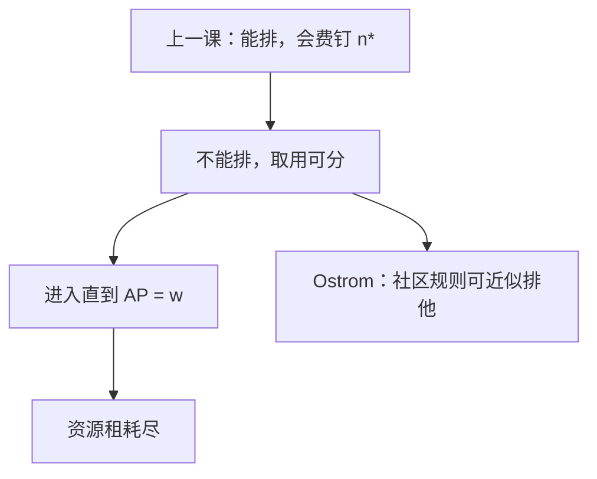

# 公地悲剧

资源可分、却很难把使用者关在门外时，每人按平均收益进入，直到租金耗尽；这是捕获，不是俱乐部会费。

<footer>—— 据 Gordon, The Economic Theory of a Common-Property Resource: The Fishery, Journal of Political Economy, 1954；Hardin, The Tragedy of the Commons, Science, 1968 整理</footer>

[上一课](/econ/club-goods)（俱乐部物品）。排他立住时，拥挤由会费与最优 $n$ 内部化。本课不重写摊薄对拥挤的切。缺口是排他失败、但消费是竞争的：多捕一吨鱼，别人少捕一吨。Gordon 的渔场把进入钉在平均产品等于机会工资；Hardin 把它写成「公地悲剧」。Ostrom 对照一句：社区可以自定规则，不必只在国有化与私有化之间选。

## 问题

公共池塘：消费可分（rival），排除成本高。进入自由时，每人看到的是平均产品 $\mathrm{AP}$，不是边际产品 $\mathrm{MP}$。均衡：$\mathrm{AP}(E)=w$，努力 $E$ 超过社会最优 $\mathrm{MP}(E)=w$，租金 $\int(\mathrm{MP}-w)$ 被耗尽。缺口不是再写俱乐部的 $u(X,n)$，而是：**平均对边际的缺口怎样把租吃光，以及这与纯公共品免费搭车不是同一博弈。**

纯公共品：多用一人不减别人的 $G$，问题是供给不足。公地：取用过多，存量或租金过少。俱乐部：能收费，故能停在 $n^*$。公地收不上会费，进入直到租为零——像[长期进入](/econ/long-run-entry)的零利润，但「利润」来自稀缺自然资源，耗尽是浪费不是正常回报。

### Hardin 不是唯一制度处方

Hardin 的叙事推向圈地或利维坦。Gordon 的渔场已经是价格接受下的开放进入模型，处方是进入限制或税费把 $E$ 拉回 $\mathrm{MP}=w$。Ostrom：占用者重复互动、监测、分级制裁，可以把规则变成事实上的排他——接近俱乐部，但产权不一定是私人土地证。本课对照一句即收，不把治理案例写成教材。

Gordon 1954：开放渔场的租耗尽。Hardin 1968 是随笔式推广。引用时分开：一个是平均产品均衡，一个是道德叙事。Ostrom, *Governing the Commons*, 1990 是制度对照，不是否定 Gordon 的开放进入算术。

## 方法

静态渔场：$q=f(E)$ 凹，$f(0)=0$。社会最优 $\max f(E)-wE$。开放进入：若渔人很多、鱼价标准化为 1，每人进入直到 $f(E)/E=w$。两条曲线的水平距离就是过度进入。动态存量、生物增长，把 $f$ 换成可持续产量，逻辑不变：开放进入吃掉资源租。

税费 $t$ 使 $(1-t)\mathrm{AP}=w$ 或按捕捞征相当于 $t$ 的许可，可以把 $E$ 拉回最优——与[总量管制](/econ/cap-and-trade)同一类工具：渔获配额可交易，则回到许可市场。排他一旦便宜，问题退回俱乐部。开放进入的零租不是「正常回报」，而是稀缺资源的浪费。

不要把公地写成纯公共品供给不足。一个是取太多，一个是建太少。

## 机制

AP 对 MP 的机制是未定价的拥挤：我多下一网，全体平均下降，我只感到自己的平均，不付别人的边际损失。这是负外部性，庇古税或配额对准的就是 $\mathrm{AP}-\mathrm{MP}$ 那一段。零租的机制是自由进入：正租吸引下一艘船，直到平均只够工资。

与俱乐部对照：会费是排他价格，把 $n$ 停在人均净收益最大；公地没有这道门，进入者只比工资。与科斯对照：渔民很多，双边谈判组不起来，标准化配额比一对一谈判更像许可课。

动态存量：开放进入不仅吃当期租，还把繁殖基数打薄，下期 $f$ 内移。静态 $\mathrm{AP}=w$ 已经浪费；加上生物增长，可能停在更低的稳态甚至崩溃。配额若可交易，把动态帽交给许可市场，逻辑与排放课相同，只是再生约束替换 $\mathrm{MD}$。

「公地」在法律上常指共同产权，不一定是开放进入。Gordon–Hardin 的算术针对开放进入。共同产权加规则，可以不是悲剧——这正是 Ostrom 与 Hardin 差的那一句。

## 边界

国际公海比封闭渔场更接近 Hardin：排他成本高、占用者跨主权。

动态崩溃（存量掉到再生产以下）比静态租耗尽更狠，本课静态已够机制。全球大气更接近公共品加公地的混合。下一课[林达尔](/econ/lindahl-samuelson)回到纯公共品的分权价格，不问渔场。

后课默认：开放进入的可分资源停在 $\mathrm{AP}=w$，资源租耗尽；能排他则回到俱乐部；Ostrom 说规则可以制造排他，不是否定算术。

本课不把开放进入的零租写成正常回报。

## 小结

- 可分且难排他：进入看平均产品，租被吃光。
- 这是过度取用，不是纯公共品的供给不足。
- Hardin 推向圈地或国家；Gordon 给出渔场均衡；Ostrom 加一句社区规则。
- 配额与税对准的是 $\mathrm{AP}-\mathrm{MP}$。
- 出处：Gordon, *JPE*, 1954；Hardin, *Science*, 1968；Ostrom, 1990。
