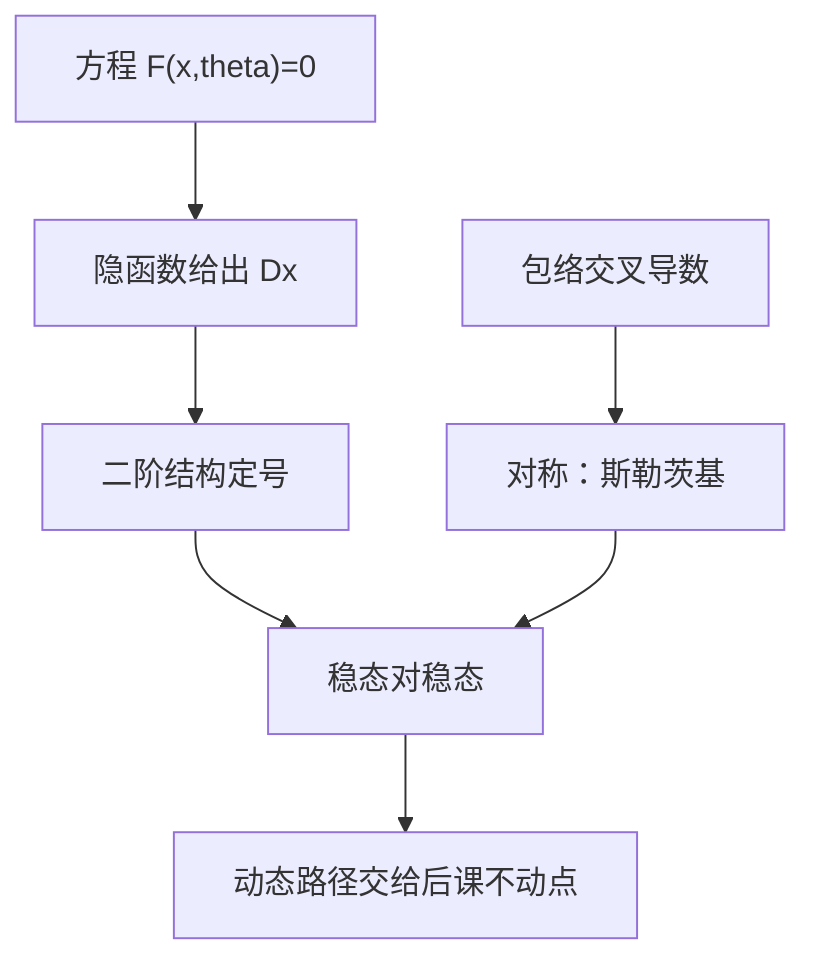

# 比较静态

参数动，最优怎么动：符号来自隐函数的矩阵，不必解出闭式需求。

<footer>—— 据 Mas-Colell, Whinston and Green 第 2–3 章与数学附录；Silberberg, The Structure of Economics, 选章整理</footer>

上一课[隐函数定理](/econ/implicit-function)给出 $Dx=-(D_x F)^{-1}D_\theta F$。缺口是把矩阵翻译成经济学语句：价格升、收入升、税率升，选择升还是降。本课只补「读符号」这一层，并标明何时必须上显示偏好或单调性方法，而不是硬微分。[包络定理](/econ/envelope-theorem)管值，$x$ 的移动是另一本账，不要互相代替。

## 问题

标准消费者：FONC $\nabla u=\lambda p$，加预算。对 $(p,w)$ 微分得到斯勒茨基方程的微分形式。本课不把[斯勒茨基方程](/econ/slutsky-equation)整章重写，只指出比较静态的分工：自身价格效应分解成替代（负半定）与收入；交叉价格没有符号，除非再加总替代、位似或拟线性。厂商要素需求对自身要素价格通常下降（凹生产或凸成本），对产出价格上升——符号来自利润最大化的二阶结构，不是来自「直觉上应该」。

宏观的稳态比较静态同一套：Ramsey 里 $\beta$ 变、折旧变，资本存量沿欧拉方程的 Jacobian 动。后课[Ramsey–Cass–Koopmans](/econ/ramsey-cass-koopmans)会用；这里只要求会读：先写均衡或最优的方程 $F(x,\theta)=0$，再对非奇异 Jacobian 求线性响应。

### 比较静态不是比较动态

比较静态比较两个稳态或两个最优，不描写怎么走过去。调整路径、鞍点稳定、转向是动态系统的事，后课压缩映射与贝尔曼才管。把 $dx/d\theta$ 画成时间路径是类别错误。也不要把符号定理当成定量：隐函数给局部线性近似，大扰动可以翻号（吉芬、多重均衡）。

Samuelson 的对应原理想用动态稳定限制比较静态符号。有用但不万能：稳定仍可能留下未定号的交叉项。

## 方法

三条常用路。(1) 直接隐函数：写出 $D_x F$，判断对角或二次型符号。(2) 包络加恒等式：先对 $V$ 求导两次交叉，用 Young 对称得到 $Dx$ 的对称性（斯勒茨基对称）。(3) 单调方法：目标对 $(x,\theta)$ 超模或单交叉，则 $x^*(\theta)$ 单调，无需可微——机制设计、寡头里更常见。主干微观先会 (1)(2)；非光滑或离散选择走 (3)。

无差异的参数（计价物缩放）必须先消掉，否则 $D_x F$ 奇异。后课[瓦尔拉斯定律与计价物](/econ/walras-law-numeraire)处理均衡侧；优化侧则是预算的一次齐次。比较静态要在归一化之后做。

## 机制

二阶充分条件给 $D_x F$ 一块负定（或加边负定）。右端 $D_\theta F$ 说参数往哪推一阶条件。负定矩阵的逆仍保持「自身项」的符号倾向：把自身价格放进 $D_\theta F$，自身需求倾向下降——这是替代效应的二阶来源。收入效应来自预算那一项，可正可负，于是总效应可正可负。比较静态的诚实表述是：能定号的写定号，定不了的停，不要用故事补符号。

集值最优没有 $Dx$。凸偏好不严格时，价格微动可以沿整段需求滑动。那时比较静态改成：最优对应的上半连续与单调（强集值意义下），而不是导数。这是后课 UHC 的伏笔。

定量比较静态需要校准或估计 Jacobian。本栏数学课只准备符号与局部线性；实证识别是计量主干，不在此展开。

## 边界

不在本课写完整斯勒茨基证明，不进入限价簿的价格冲击，不把 CAPM 的 beta 实证当例子。吉芬商品是合法的符号失败，留给[吉芬与劣等](/econ/giffen-inferior)。下一课离开局部导数，问全局：迭代映射何时收敛到唯一不动点。

后课默认：内部非退化最优的局部比较静态 = 隐函数线性方程；自身替代倾向为负；交叉项与收入项另行假设才能定号。

## 小结

- 比较静态读 $Dx$ 的符号，不要求闭式解。
- 二阶结构定自身项；交叉项与收入项常常未定。
- 包络交叉给出对称；超模给出单调而不靠可微。
- 比较的是稳态对稳态，不是调整路径。
- 下一课：[压缩映射](/econ/contraction-mapping)。
- 出处：MWG 第 2–3 章与数学附录；Silberberg, *The Structure of Economics*。
