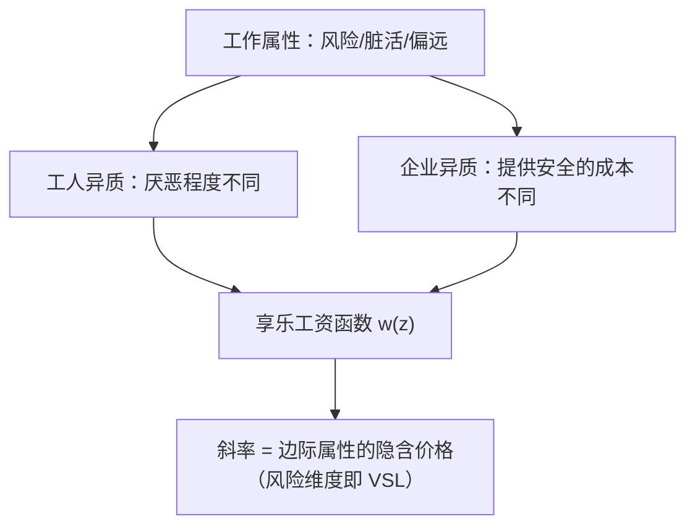
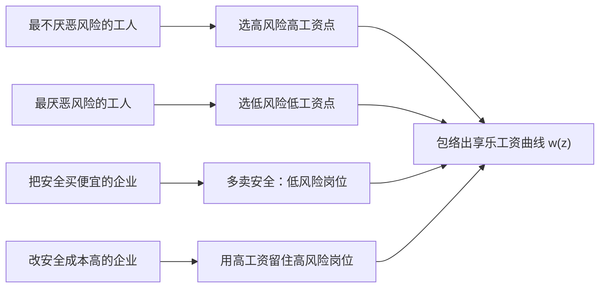

# 补偿性工资差异

不洁与危险的雇佣须付更高的工资，否则无人肯就；工资随所忍之苦而涨落。

<footer>—— 据 Smith, The Wealth of Nations, 1776 第一篇第十章；Rosen, The Theory of Equalizing Differences, Handbook of Labor Economics, 1986 整理</footer>

[上一课](/econ/labor-demand-mrp)把需求侧钉在 $pF_L=w$，但那是同质劳动的口径。同样的技能，为什么矿井比办公室多付一截？缺口是工资的第二个维度——工作属性。本课讲补偿性工资差异：风险、脏活、偏远怎么进工资，Rosen 的享乐工资函数怎么给属性定价，以及用蓝领危险工种的数据怎么检验。

## 问题

工人对属性有偏好：厌恶死亡风险、噪声、离城远。若恶劣岗位不多付钱，没人申请，企业招不到人；若多付太多，企业改买安全。均衡把工资写成属性的函数 $w(z)$，$z$ 里放死亡风险率、工伤率、环境恶劣度、地点偏远度——享乐工资函数。缺口两层：这条曲线为什么存在（市场机制），斜率怎么读（属性的隐含价格）。

术语翻译：享乐（hedonic）工资函数就是给工作的「属性包」逐项标价的价目表——危险加多少钱、噪声加多少钱、偏远加多少钱。工资不再只看学历和经验，还要看这份差事让你忍了什么：$w(z)$ 里的 $z$ 就是「忍受清单」，曲线的斜率告诉你每一项忍受市场肯付多少。

### 斜率是统计生命的价格

在 $(z,w)$ 平面上，不同厌恶程度的人选不同的点：最不厌恶者落在高风险高工资端。企业的安全成本不同，提供不同安全水平。均衡把所有匹配包络成一条向上的曲线，斜率 $\partial w/\partial z$ 是市场对边际风险的定价。死亡风险维度上：

$$
\mathrm{VSL} \approx \frac{\partial w}{\partial p_{fatal}},
$$

统计生命的价值不是给命标价，是工资-风险权衡的斜率。

## 方法

检验要三件东西：属性数据（行业与职业的死亡率、工伤率）、工人特征（教育、经验等控制变量）、以及混杂处理——危险岗位不是随机分配的，能力与偏好都影响谁进矿井。标准做法是个体层面工资回归：控制人力资本变量后，看死亡率的系数。Thaler–Rosen 1975 最早用美国劳动市场数据把工资-风险权衡估成显式的统计生命价值；后续文献（Viscusi 的综述）把美国口径的量级钉在数百万美元，并发现 VSL 随收入上升——对风险的厌恶边际随收入变化，低收入者的隐含定价更低，这本身就是不平等的一个截面。

数量感：若年死亡风险高出万分之一（$0.0001$）的岗位需多付 1000 美元，隐含 VSL 是 $1000/0.0001=1000$ 万美元。风险是概率不是确定性事件，所以叫「统计」生命；把新闻里「一条命值多少钱」的读法代入会全错。

## 机制

两个市场端条件缺一不可。工人端是信息：工人得知道风险，补偿才给得齐——不知道危险就没有人要求加价，属性定价失灵。企业端是成本：提供安全有成本且成本异质，均衡里工资与安全水平在企业间负相关。所以补偿差异不是统一的「险种费率」，而是工资与属性之间的整套契约束；属性多一个维度，曲线多一维。非工资属性同样适用：舒适属性（弹性工时、稳定、体面）可以反过来用低工资买，负的补偿也是补偿。

为什么信息是前提：一战前后美国「镭姑娘」用嘴舔镭漆笔尖描表盘，厂方明知镭有放射性却不告知，工资里一分危险补偿都没有——工人不知道危险，就不会要求加价，$w(z)$ 在这个维度上是平的。事后诉讼催生了职业安全规制。补偿差异定价的引擎是知情后的讨价还价，信息一断，整台机器停转。

Cain 1976 的综述给这条线划界：种族与性别之间的工资差大头不是补偿差异——属性差异解释不了那么多，剩下要靠人力资本积累差异、进入壁垒与歧视的机制去拆。补偿差异解释「同技能、不同属性」的差，解释不了「同属性、被压价」的差。

## 边界

别把溢价读成「危险是好事」：市场在补偿厌恶，不是奖励风险。安全规制把风险压下来，会把溢价一并压掉，规制评估不能只数「救下的命」，还要数被压掉的补偿，工人的净收益是两者之和。进入壁垒（执照、歧视）让补偿给不齐：壁垒内的人拿租金，壁垒外的人挤不进高补偿岗位，$w(z)$ 斜率变平。最后，属性与技能在数据里相关（危险岗的平均技能结构不同），不控技能会把补偿差异读成生产率差。

常见误区：看到矿工工资高，就以为市场在「奖励危险、危险值得」。实际上高工资补偿的是厌恶——工人整体宁愿少拿钱也要安全，企业才被迫用溢价把人「请」进矿井。顺着这个逻辑，危险岗位工资下降往往不是好消息，而是风险信息被掩盖或工人没了选择。

## 小结

- 恶劣属性由工资补偿，否则招不到人；补偿差异是市场定价而非恩惠。
- 享乐工资函数 $w(z)$ 的斜率是边际属性的隐含价格；死亡风险维度给统计生命 VSL。
- 检验靠个体层面工资回归加属性数据；Thaler–Rosen 1975 之后蓝领危险工种证据把美国口径钉在数百万美元。
- 信息不足与进入壁垒让补偿给不齐；种族与性别差距的大头不在补偿差异（Cain 1976）。
- 出处：Smith 1776 第一篇第十章；Thaler and Rosen 1975；Rosen 1986；Cain, JEL 1976。
