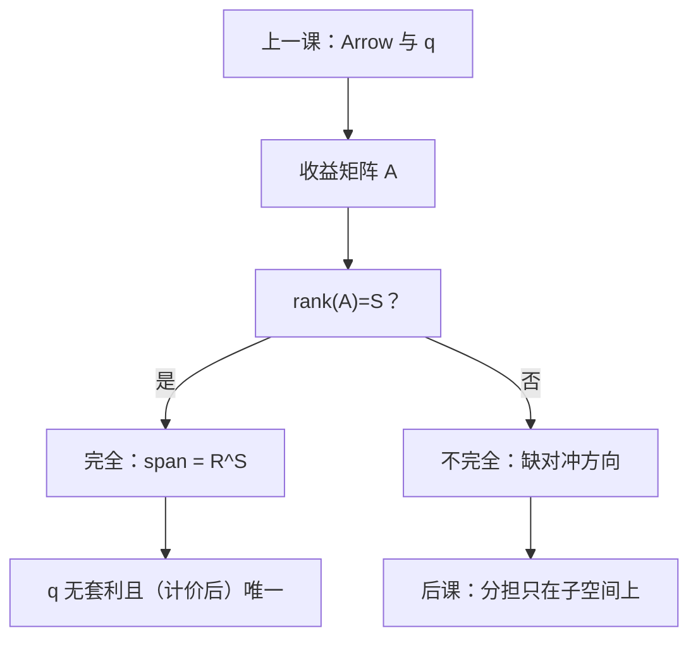

# 资产张成与完全市场

    
完全市场不是「证券很多」，而是有限资产的收益向量张成整个或有要求权空间。

    <footer>—— 据 Magill and Quinzii, Theory of Incomplete Markets, 1996；Mas-Colell, Whinston and Green 第 19 章整理</footer>

[上一课](/econ/state-contingent)把商品写成状态依存消费，并把 Arrow 证券当作完全市场的工作例子。本课不重写 $U=\sum\pi_s u(x_s)$，也不把状态价格 $q_s$ 再推导一遍。缺口是：真实菜单往往是 $J$ 张普通证券，收益矩阵 $A$ 是 $S\times J$ 的。何时这些证券已经张成 $\mathbb{R}^S$，何时还缺方向——完全与不完全从此是线性代数，不是形容词。

## 问题

Arrow 证券是单位矩阵：张成显然。把菜单换成股票、债券、期权之后，「有市场」不等于「任意或有束都能买到」。若仍默认上一课的 $\sum q_s x_s=w$，会把买不到的计划写进预算。缺口是用收益矩阵说话。证券 $j$ 在状态 $s$ 支付 $A_{sj}$。一期组合 $\theta\in\mathbb{R}^J$ 实现或有财富 $A\theta$。完全市场指

$$
\mathrm{span}(A)=\{A\theta:\theta\in\mathbb{R}^J\}=\mathbb{R}^S,
$$

即 $\mathrm{rank}(A)=S$。此时存在状态价格 $q$（对无套利），使任意 $x$ 的成本为 $q\cdot x$，与上一课的 Arrow 预算同构——只是实现 $x$ 的组合未必唯一。

$J<S$ 则必不完全：至少缺一个对冲方向。$J\ge S$ 仍可能秩不足（证券线性相关）。张成是秩，不是张数。

### 动态完备不是再印一套 Arrow

多期里，若每期都能按新信息交易，少数长期证券也可以动态张成。那是 Magill–Quinzii 与随机折现因子课的对象。本课只钉一期、有限 $S$ 的静态张成，以免把「每天都能再交易」偷运进完全性。

无套利：不存在 $\theta$ 使 $A\theta\ge 0$、$A\theta\ne 0$ 且成本非正。无套利当且仅当存在严格正的状态价格 $q$，使证券价格 $p=A^\top q$。完全性额外要求 $q$ 在相差计价物的意义上唯一。

## 方法

给定 $A$ 与证券价格 $p$，先问无套利（存在 $q\gg 0$，$p=A^\top q$），再问 $\mathrm{rank}(A)$ 是否等于 $S$。完全则任意或有要求权有复制组合，定价唯一。不完全则只有 $\mathrm{span}(A)$ 里的要求权能定价唯一；正交补上的方向没有市场价格，上一课的分担一阶条件只在可张成子空间上成立——下一课风险分担会用到这道刀。

期权、Arrow 证券都是 $A$ 的列。把它们写成「新商品」没有错，但检验完全性仍是列空间。本课不估计 $q$，也不把 $A$ 写成限价簿的可成交清单。

概率 $\pi$ 仍客观。张成是支付的线性几何，不依赖偏好；偏好只决定在已张成的菜单上选哪一点。

## 机制

为什么秩等于 $S$ 就能回到上一课：任意 $x\in\mathbb{R}^S$ 可解 $A\theta=x$，预算 $p\cdot\theta=q\cdot x$。Arrow 市场与一般完全市场只差一个基变换。缺秩则存在 $v\ne 0$，$A^\top v=0$，沿 $v$ 的再分配不能被证券完成；帕累托分担的 MRS 对齐在该方向上没有价格去执行。

冗余证券（多出来的线性相关列）不增加张成，却可能方便交易。完全性不禁止冗余。无套利把 $p$ 钉在列空间的对偶上；有冗余时复制不唯一，价格仍唯一。

MWG 第 19 章把不完全市场写成 GEI：即期商品加证券，而不是完整的或有商品清单。本课只取张成这一刀，不把存在性、太阳黑子提前写完。

## 边界

连续状态需要无限证券或动态交易才能完备，静态有限 $J$ 几乎必不完全。本课主干用有限 $S$。道德风险下状态不可验证，合同写不成，那是信息课，不是 $A$ 的秩。

模糊没有客观 $\pi$，但张成仍是支付几何；本课不把模糊引进 $A$。也不把「市场深度」「流动性」读成张成：那是量化栏的成交机制，这里只有到期支付向量。

后课默认：完全市场指 $\mathrm{span}(A)=\mathbb{R}^S$；否则分担与定价只在列空间上成立。

## 小结

- 完全性是收益矩阵的列空间等于 $\mathbb{R}^S$，不是证券张数。
- 无套利给出状态价格；完全性额外给出（计价后的）唯一 $q$。
- 不完全则缺对冲方向，上一课的 Arrow 预算不能照搬。
- 下一课在完全的那一端写帕累托风险分担。
- 出处：Magill and Quinzii, *Theory of Incomplete Markets*, 1996；Mas-Colell, Whinston and Green 第 19 章。
