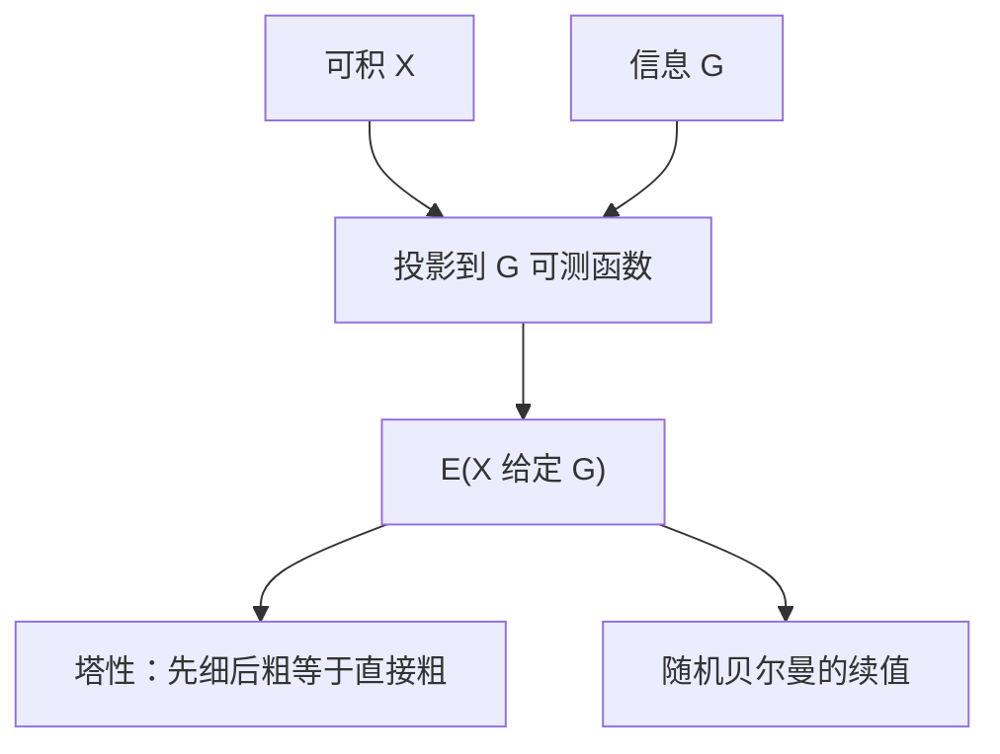

# 条件期望

给定信息之后的最优均方预测，是对子 $\sigma$-代数可测的那一次投影；塔性让「先粗后细」与直接一步相同。

<footer>—— 据 Billingsley, Probability and Measure, 选章；Stokey, Lucas and Prescott, Recursive Methods 第 7–9 章整理</footer>

上一课[样本空间与 σ-代数](/econ/sigma-algebra)把信息写成子 $\sigma$-代数 $\mathcal{G}$。随机贝尔曼、欧拉方程、理性预期里出现的 $\mathbb{E}_t$，不能再当成「把未知数换成均值」的口头禅。缺口是条件期望：$\mathbb{E}[X\mid\mathcal{G}]$ 是对 $\mathcal{G}$ 可测的可积随机变量，满足对一切 $G\in\mathcal{G}$，$\int_G\mathbb{E}[X\mid\mathcal{G}]\,dP=\int_G X\,dP$。本课只补这一算子及其塔性、迭代法则；大数定律是下一课。

## 问题

无信息时 $\mathbb{E}[X]$ 是一个数。有信息时预测仍是随机的：不同信息集给出不同数字。条件期望是唯一（a.s.）的 $\mathcal{G}$-可测函数，在每个信息块上积分与 $X$ 一致。有限分划上，它就是块内平均值。一般情形由 Radon–Nikodym 给出，本课不证。

均方意义：$\mathbb{E}[X\mid\mathcal{G}]$ 是 $X$ 到 $\mathcal{G}$-可测平方可积随机变量子空间的正交投影。正交性 $\mathbb{E}[(X-\mathbb{E}[X\mid\mathcal{G}])Z]=0$ 对一切有界 $\mathcal{G}$-可测 $Z$ 成立——「残差与已知信息不相关」。理性预期均衡里的正交条件，就是这句话。

### 条件期望不是「给定一个数 $x$ 的公式」

初等课本写 $\mathbb{E}[Y\mid X=x]$ 为 $x$ 的函数。严谨对象是随机变量 $\mathbb{E}[Y\mid\sigma(X)]$，再在 $\{X=x\}$ 上取值。连续分布下单点概率为零，「给定 $X=x$」要正则条件概率才有密度版。后课宏观写 $\mathbb{E}[u'(c_{t+1})\mid\mathcal{F}_t]$，对象是随机变量，不必先拿出密度。不要把条件期望缩回一条公式再对 $x$ 求导，除非已经声明正则版本。

$\mathbb{E}[X\mid Y]$ 是对 $\sigma(Y)$ 条件，不是「把 $Y$ 当常数代入 $X$ 的表达式」。$X$ 与 $Y$ 的联合结构决定投影，表达式代换会偷看不可测的部分。

## 方法

线性：$\mathbb{E}[aX+bZ\mid\mathcal{G}]=a\mathbb{E}[X\mid\mathcal{G}]+b\mathbb{E}[Z\mid\mathcal{G}]$。已知的可提出：若 $Z$ 对 $\mathcal{G}$ 可测且有界，$\mathbb{E}[ZX\mid\mathcal{G}]=Z\mathbb{E}[X\mid\mathcal{G}]$。塔性：$\mathcal{H}\subset\mathcal{G}\Rightarrow\mathbb{E}[\mathbb{E}[X\mid\mathcal{G}]\mid\mathcal{H}]=\mathbb{E}[X\mid\mathcal{H}]$。迭代期望 $\mathbb{E}[\mathbb{E}[X\mid\mathcal{G}]]=\mathbb{E}[X]$ 是塔性取 $\mathcal{H}$ 平凡。Jensen：凸 $\phi$ 时 $\phi(\mathbb{E}[X\mid\mathcal{G}])\le\mathbb{E}[\phi(X)\mid\mathcal{G}]$。后课风险厌恶、预防性储蓄用的条件 Jensen，在这里一次说清。

随机贝尔曼：$Tv(s,z)=\max_a\{F+\beta\mathbb{E}[v(s',z')\mid s,z,a]\}$。条件期望把未知的下期值压成对当前可测的函数，压缩论证才能在函数空间上继续。适应性策略：$a_t$ 对 $\mathcal{F}_t$ 可测，于是不能对尚未实现的冲击取条件之外的依赖。

## 机制

信息块内部，你不能再分辨 $\omega$；最优的数是块上的平均（对 $P$）。换一块，平均数换一个。塔性说：先用细信息投影、再忘掉一部分，等于从未见过细信息——因为正交投影到套着的子空间可分解。宏观写 $\mathbb{E}_t\mathbb{E}_{t+1}X_{t+2}=\mathbb{E}_t X_{t+2}$，就是滤波随时间变细时的塔性。

欧拉方程 $\mathbb{E}_t[\beta R_{t+1}u'(c_{t+1})]=u'(c_t)$ 把一阶条件里未知的下期边际放进条件期望：对今天信息正交的残差不能再用来改善。这是 FONC 加投影，不是新的偏好理论。本课不把消费欧拉展开。

条件方差 $\mathbb{E}[(X-\mathbb{E}[X\mid\mathcal{G}])^2\mid\mathcal{G}]$ 仍是随机变量。预防性储蓄关心的是这个对象的凸性，不是无条件方差。

## 边界

本课不证 Radon–Nikodym，不讲鞅收敛定理全文（后课资产定价若需要再引）。不要把条件期望写成量化栏的 Itô 积分。也不进入 CAPM 的 beta 回归实证：正交投影与线性回归同族，但证券定价的假设不在金融栏这一课。下一课把无条件的样本平均与正态近似钉死，为加总与推断预备。

后课默认：$\mathbb{E}_t$ 是对当时信息的条件期望；随机欧拉、随机贝尔曼都按投影读写；塔性可直接用。

## 小结

- $\mathbb{E}[X\mid\mathcal{G}]$ 是 $\mathcal{G}$-可测投影，块上积分与 $X$ 一致。
- 可提出已知量；塔性给出迭代期望。
- Jensen 在条件里仍成立，供风险态度使用。
- 随机 DP 的续值是条件期望，不是随便写的均值。
- 下一课：[大数定律与中心极限](/econ/lln-clt)。
- 出处：Billingsley, *Probability and Measure*；Stokey–Lucas–Prescott 第 7–9 章。
