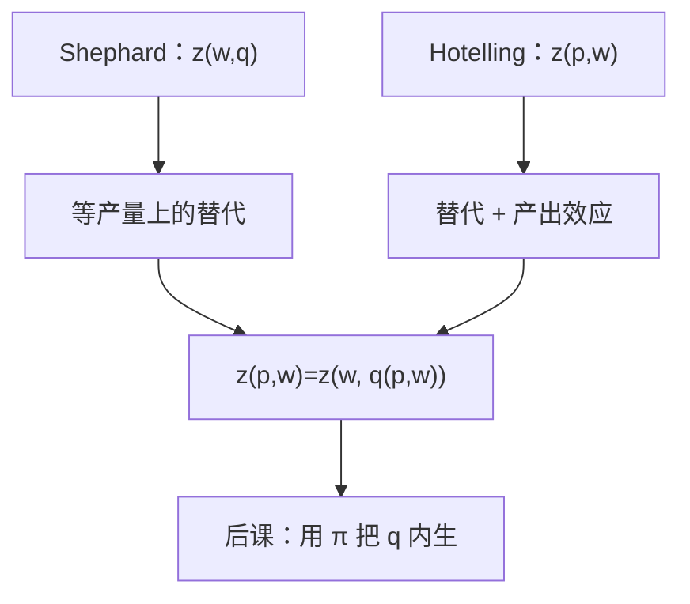

# 条件要素需求

    
锁住产量时要素如何随工资替换，与放开产量后要素如何随工资、产品价格一起动，是两条曲线——前者没有产出效应。

    <footer>—— 据 Varian, Microeconomic Analysis；对照 Shephard 与 Hotelling 引理</footer>

[上一课](/econ/shephard-hotelling)用包络读出 $z(w,q)=\nabla_w c$ 与无条件的 $z(p,w)=-\nabla_w\pi$。本课不重证两条引理。缺口是把二者的差别写成可调用的语言：后课劳动市场、税收归宿若把「要素需求」画成一条，会漏掉 $q$ 随 $p$ 动的那一层。

## 问题

条件要素需求 $z(w,q)$ 回答：产出锁在 $q$ 时，要素价格变，厂商沿等产量如何换投入。它是成本最小化的解，齐次零次于 $w$，对 $q$ 在一次齐次技术上线性。无条件要素需求 $z(p,w)$ 回答：产品价格也给定、产量已经按利润最大调过之后，要素用多少。缺口是恒等式

$$
z_j(p,w)=z_j\bigl(w,q(p,w)\bigr),
$$

从而对 $w_k$ 的导数多出一项产出效应：$\partial z_j/\partial q\cdot\partial q/\partial w_k$。Shephard 只看见第一项（替代）；Hotelling 看见两项之和。把条件劳动需求直接贴到劳动市场上，等于假定产品市场的 $q$ 冻住——短长期课有时故意这样做，但必须声明。

### 替代矩阵不是要素市场的斜率

$c$ 对 $w$ 凹，故 $D_w z(w,q)$ 半负定、对称（可微时）。这是沿等产量的替代，类似希克斯需求。无条件需求对 $w$ 的斜率还含 $q$ 的调整，符号仍通常为负（要素作为利润问题里的「劣」价格），但弹性更大。不要把 Allen–Uzawa 替代弹性写成劳动需求的市场弹性。

消费者斯勒茨基：马歇尔 = 希克斯 + 财富项。厂商这里：无条件 = 条件 + 产出项。财富与产出不是同一通道，只是对偶平行。

## 方法

给定 $w,q$，用 Shephard 或等产量切点算 $z(w,q)$。给定 $p,w$，先由 $p=\mathrm{MC}(q)$ 解出 $q(p,w)$（下一课把这条供给写全），再代入条件需求。比较两条曲线：条件曲线沿等产量，无条件曲线沿扩张路径加上等产量滑动。

位似或一次齐次时，扩张路径是射线，$z(w,q)=q\,a(w)$，产出效应与规模成比例。里昂惕夫没有替代，条件需求对 $w$ 无弹性，无条件弹性全部来自 $q$。本课只标明分解，不估数字。

本课 $p$ 仍是参数。要素市场出清、买方垄断不在这里。也不把 $z$ 写成限价簿上愿意成交的库存。

## 机制

产出效应的机制：$w_k$ 上升 → 边际成本上升 → 最优 $q$ 下降 → 所有正常要素少用。即使某种要素与 $k$ 在等产量上是互补还是替代，这一层通常同向减少投入。条件需求把这层关掉，于是只剩「贵的要素被便宜的要素替换」，可能出现交叉价格为正（替代）。无条件交叉价格还要叠加规模收缩，净效应不定。

与成本课的接口：上一课已经警告不要把 $z(w,q)$ 当成要素市场反函数。本课给出正确的叠法。与利润课的接口：Hotelling 的 $-\partial\pi/\partial w$ 自动含两层；若实证只观察到 $q$ 与 $z$，要用条件还是无条件，取决于数据里 $q$ 是否被控制。

短长期：资本沉没时，条件需求里一部分 $z$ 不再对当期 $w$ 反应，那是下一课之后的对象。本课默认全部投入可按 $w$ 重选。

## 边界

联合生产、$q$ 为向量时，产出效应是一条链 $\partial z/\partial q\cdot\partial q/\partial w$。配额使 $q$ 外生，无条件退化成条件——管制产业常用这一刀。IRS 下 $q(p,w)$ 可以没有有限解，无条件需求整段不好定义；条件需求在给定 $q$ 上仍可写。

也不处理要素质量、效率单位。本课 $z$ 是物理投入。量化栏的成交量不是条件需求：这里没有报价，只有计划投入。

后课默认：写要素需求必须声明锁不锁 $q$；锁住的是 $z(w,q)$，放开的是 $z(p,w)$，二者差产出效应。

## 小结

- $z(w,q)$ 沿等产量；$z(p,w)$ 等于把最优 $q$ 代回条件需求。
- 无条件斜率 = 替代（Shephard）+ 产出效应；市场弹性常用后者。
- 一次齐次时条件需求对 $q$ 线性，产出效应成比例。
- 下一课把 $q$ 放开，用利润最大写出供给。
- 出处：Varian, *Microeconomic Analysis*；Shephard, 1953；Hotelling, *JPE*, 1932。
