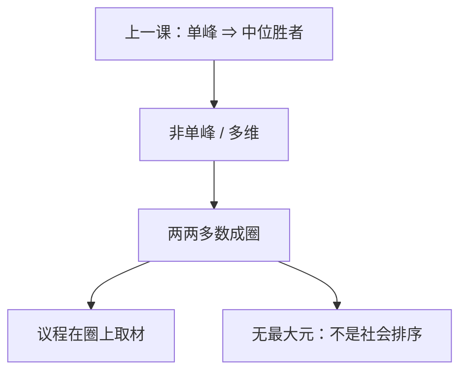

# 孔多塞循环

两两多数可以转圈：甲胜乙、乙胜丙、丙胜甲；没有 Condorcet 胜者，议程决定结局。

<footer>—— 据 Condorcet, Essai sur l'application de l'analyse à la probabilité des décisions, 1785 整理</footer>

[上一课](/econ/median-voter)（中位选民）。一维单峰时多数停在 $x_m$。本课不重写 Black 的切割，也不把两党收敛再推一遍。缺口是单峰失败：三方案石头剪刀布剖面，两两多数循环，Condorcet 胜者不存在。Arrow 用过这个教具说明「多数不是排序」；本课把它从边注升级：循环何时出现、议程怎样挑选圈上的点，以及多维政策为何几乎总会转。

## 问题

三人三方案。偏好 $a\succ_1 b\succ_1 c$，$b\succ_2 c\succ_2 a$，$c\succ_3 a\succ_3 b$。多数：$a$ 胜 $b$，$b$ 胜 $c$，$c$ 胜 $a$。每一对都有多数，但没有一个方案能击败其余所有。缺口不是再列 Arrow 四条，而是：**中位定理的前提一撤，多数规则剩下的是成对比较的竞赛图，不必有最大元。**

议程：先比 $a$ 与 $b$，胜者对 $c$。不同顺序选出不同点——谁设议程，谁在圈上拾取。这不是选民改了偏好，是程序在循环上选切片。

### 循环不是计算错误

每人的排序都传递。不传递的是多数关系。把循环当成「选民非理性」是读错层次。单峰排除的正是这种剖面：在一维上无法把三个峰排成石头剪刀布。多峰、多维理想点，循环剖面是正常的。

Condorcet 1785 已经看见多数可以转圈，并讨论过其他聚合规则。Arrow 把循环放进不可能的定义域；Black 用单峰把它挡在门外。本课停在多数关系本身，不把 Borda 再展开。

## 方法

竞赛图：方案为点，多数方向为箭。有源点（击败所有人）当且仅当 Condorcet 胜者存在。一维单峰保证有源点。两维欧氏偏好、理想点不共线时，任意点几乎都可以被某方向的多数打败——McKelvey：议程可以在空间里漫游到任意地方。本课要的是一维循环教具加「多维更糟」这一句，不把混沌定理从头证。

打破循环必须另加程序：修正案顺序、淘汰、议程委员会。这些程序一般不满足 IIA：第三方案的插入改变前两名的对决顺序。这正是 Arrow 警告过的。没有程序，多数只给出竞赛图，给不出「社会要的那一个 $G$」。

市场失灵课序在此结束：公共品与税若交给多数，先问是否单峰；否则「人民要的 $G$」依赖程序。下一课程从个人策略起，不再假定桌上有被多数唯一决定的 $W$。

## 机制

圈的机制是多数的「非传递」：每一对的多数来自不同的两人联盟，三个联盟转圈，没有一个联盟是决定性到能钉住全局排序——这与 Arrow 证明里决定性收缩方向相反：这里没有任何单人独裁，但加总也不闭合。议程的机制是路径：圈上每一步都有多数，顺序决定停在哪一站。

与中位的对照：单峰让所有成对比较与同一个人（中位）的排序一致，竞赛图是从 $x_m$ 指向外的星，有源点。循环图没有源。政策空间多一维，就多一个转圈的方向。

议程委员会若能指定顺序，等于在顶圈里选点。这与独裁不同：结局仍须是某次多数的胜者，不能是圈外被全体击败的方案。但「人民的意愿」不再是唯一 $G$，公共品课的萨缪尔森条件没有被多数自动执行。

循环存在，不等于任何方案都一样好。圈外的点仍可被全部圈内点击败。议程权力是在 Condorcet 集（顶圈）里挑选，不是对任意差方案授权。

## 边界

顶圈是议程还能挑的范围，不是任意差方案。

概率投票、议题捆绑、政党结构，可以给出预测但不恢复 Condorcet 胜者。实验与立法议程是实证，不是本课的逃逸。McKelvey 的「几乎任意点可被议程达到」依赖连续多维与欧氏偏好；离散方案上顶圈可以很小。Gibbard–Satterthwaite 说：就算程序给出唯一结果，广泛域上也会有策略投票——那是博弈课。本课只钉多数关系可以不传递。

后课默认：非单峰时两两多数可以循环；没有 Condorcet 胜者则结局随议程；中位定理不能无声明地用于多维公共决策。

本课不把循环写成选民非理性。

## 小结

- 个人传递推不出多数传递；石头剪刀布是合法剖面。
- 无 Condorcet 胜者时，议程在圈上决定结果。
- 单峰排除循环；多维几乎把排除拿掉。
- 市场失灵课序止于此；下一课程从策略与均衡起。
- 出处：Condorcet, 1785；对照 Black 1948 的单峰逃逸。
