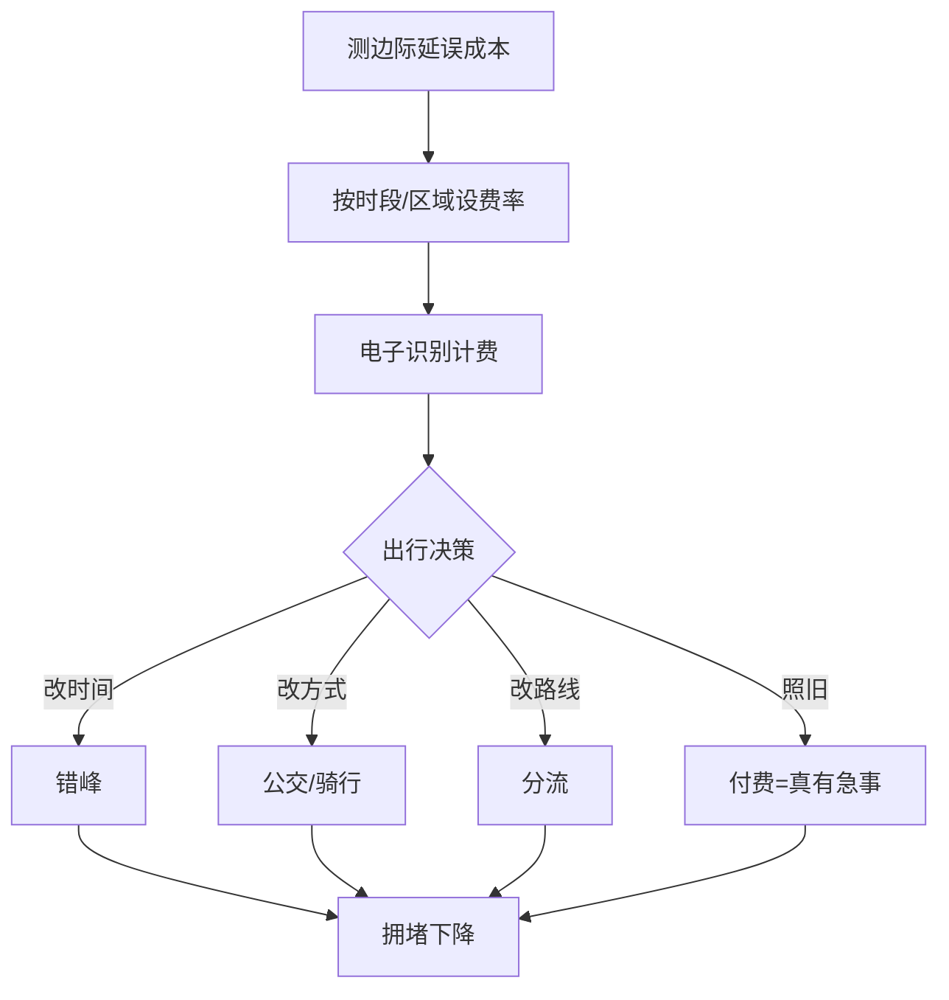
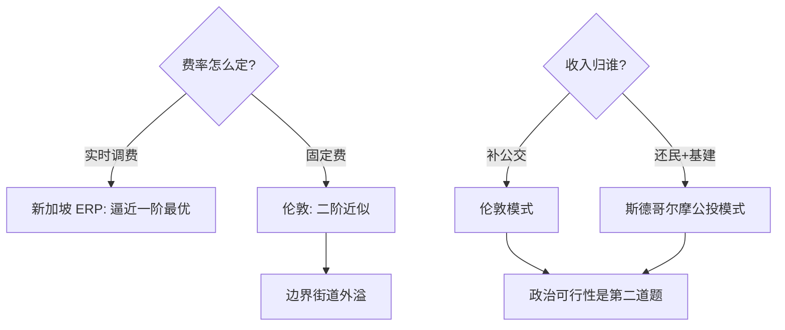

# congestion-pricing

堵车的本质是收费错误：路在最挤的时候免费，等于给最不需要补贴的人发钱。

<footer>—— 据 Pigou《The Economics of Welfare》(1920)；Vickrey 纽约地铁定价备忘录 (1950s)；Singapore ERP</footer>

[土地价值税](/econ/land-value-tax)对「不动的东西」收费，本课对「会挤的东西」收费。道路在高峰期是俱乐部品变公共池塘——每个新加入者给所有人添堵。缺口是**拥堵定价**：把出行者强加给他人的时间成本变成他自己面对的价格。本课不建模路网均衡的工程细节。

## 问题

一人上路，私人成本是自己的时间+油钱；社会成本还要加上给所有后来者添的边际延误。免费道路下，只要私人成本低于出行价值，路上就一直加人直到大家都慢——**拥挤外部性**。要回答：费率怎么定（Pigouvian 边际延误成本）、收入归谁、分配怎么补。

术语翻译：边际拥堵成本（marginal congestion cost）= 我上这条路给**所有人**（含我自己）增加的延误总和；Pigouvian 税 = 把这个外部成本变成我自己的价格。注意「我加给自己的延误」我自己已经算过，税只该补「加给别人」的部分。

数字实例：伦敦拥堵费 2003 年起收 5 英镑/日（现 15），中心区车流降约 15–18%，公交客流升；斯德哥尔摩 2006 试行后拥堵降 20–25%，公投转正。新加坡 ERP 按车种与时段实时调费，是最接近 Pigouvian 理想价的系统。

## 方法

定价公式：费 = 边际外部延误成本的货币值，随实时流量调整。实施三件套：**识别**（电子收费门架或 GPS 计费）、**差异化**（时段/区域费率）、**替代品先行**（公交运力与班次在收费前提升）。收入去向是政治可行性核心——伦敦补公交，斯德哥尔摩以「还税于民 + 建地铁」打包过公投。

直觉类比：高峰道路像没有排队价的网红餐厅——门口大排长龙（堵在路上），餐厅却不涨价；拥堵费就是「取号费」，愿付的人直接入座，不愿付的换个时间来，翻台率（道路通行力）反而更高。

## 机制

效率机制是需求侧分流沿四个边际展开——时间、方式、路线、是否出行——每一次调整都把「支付意愿最低」的车流从高峰移走，均衡流量降至边际成本定价处。分配机制的账要算全：低收入驾车者付费、低收入公交受益、 cleaner air 的健康收益偏向沿路居民——多数试点再分配净效应偏向中低收入，但「付费才能进城」的直觉阻力远大于账面。动态机制：费率响应式调节（新加坡式）逼近一阶最优；固定费（伦敦式）是二阶近似，高峰外溢到边界街道是它的典型副作用。

常见误区：把拥堵费当「财政创收工具」——设计目标是**减少拥堵**，最优情形下收入应趋于零（没人堵了）；以收入为目标会故意维持拥堵。另一误区是只收费不给替代品——斯德哥尔摩先加 200 辆公交再收费，顺序颠倒民调即翻车。

## 边界

适用前提：拥堵源主要是小汽车、替代方式存在、识别技术可靠。失效场景：收费区边界的「绕行污染」、货车转嫁成本至物价、低收入刚需通勤者的支付能力。公平性修正工具：对区内核准居民的折扣（伦敦 90%）、低收入返款、按里程而非按次计费。更广的视角：拥堵定价是「对使用外部性收费」的模板，机场起降时刻、电网峰谷电价、云平台带宽同构——[土地价值税](/econ/land-value-tax)管存量红利，本课管流量外部性，两块拼图合成城市财政的完整图景。

直觉类比：好的拥堵费像好的闹钟——目的不是叫你付钱，是让你改时间；一旦大家都准点（不堵了），闹钟（收费）自然响得越来越少。

## 小结

- 费率 = 边际外部延误成本，实时差异化逼近一阶最优。
- 四个分流边际：时间、方式、路线、出行与否。
- 政治可行性与效率同等重要：替代品先行 + 收入归属明确。
- 出处：Pigou 1920；Vickrey 1950s 备忘录；Singapore LTA ERP 文档；Stockholm 2006 评估报告。
