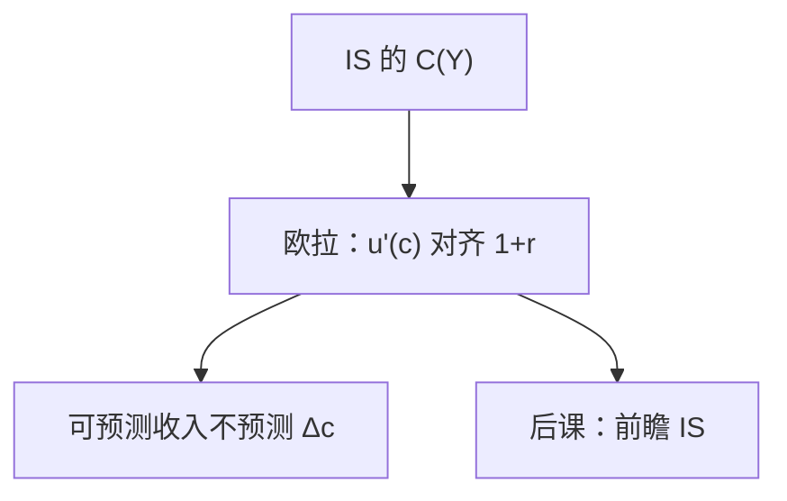

# 跨期消费与欧拉方程

消费的一阶条件不是「收入决定消费」的同期函数，而是把未来边际效用贴现到与资产回报对齐。

<footer>—— 据 Ramsey 1928 的最优储蓄；Hall, Stochastic Implications of the Life Cycle–Permanent Income Hypothesis, JPE 1978；对照 Friedman 持久收入</footer>

[上一课](/econ/is-lm)的 IS 用 $C=C(Y)$ 关闭商品市场。那是会计式的短期装置，不是家庭最优。本课的缺口是：一旦家庭能在债券或资本上跨期转移，消费服从欧拉方程，$Y$ 的当期增量不必一对一变成 $C$。新凯恩斯把这条欧拉改写成前瞻 IS；本课先在实物与完全市场里写清。

## 问题

持久收入（Friedman）已经说过：消费跟的是财富与持久资源，不是当期 $Y-T$ 的机械比例。Ramsey 计划者使消费路径满足

$$
\frac{u'(c_t)}{u'(c_{t+1})}=\beta(1+r_t),
$$

即欧拉：少吃一单位，按 $1+r$ 积累，再吃回来，边际效用比必须等于贴现的回报。Hall（1978）在理性预期下把随机欧拉写成：若 $r$ 与偏好使折现后边际效用成为鞅，则消费本身近似随机游走——可预测的收入不预测消费变化。

IS 的 $C(Y)$ 把可预测收入的系数写成大正数。欧拉说：已被预见的 $Y$ 波动，应被资本市场抹平。缺口是用跨期条件替换静态消费函数，而不是重讲效用公理。

黄金律课已经出现确定性 Ramsey 欧拉。本课加上不确定与可观测含义。流动性约束、习惯形成会破坏随机游走，那是边界，不是把 $C(Y)$ 请回来当理论。

## 方法

两期或无限寿命、完全债券市场、一次总付税。家庭一阶条件即上式，或对数线性后

$$
\mathbb{E}_t\Delta c_{t+1}=\sigma(i_t-\mathbb{E}_t\pi_{t+1}-\rho),
$$

$\sigma$ 为跨期替代弹性。这就是新凯恩斯 IS 的消费核：实际利率相对时间偏好越高，消费越往后推。当期 $Y$ 仍通过资源约束与劳动收入进入，但方式是财富与预期路径，不是 Keynes 的同期边际消费倾向单独决定。

李嘉图等价在此露头：一次总付的减税若对应未来增税，财富不变，欧拉不变，$C$ 不动。完整财政乘数留到政策课；本课只要这条逻辑依赖欧拉与完全市场。

### 投资仍可以很 Keynes

即使 $C$ 被抹平，$I$ 仍可对 $q$ 或 $i$ 剧烈波动，计划 $I$ 与计划 $S$ 的均衡仍要有一个利率或数量去对上。欧拉替换的是消费函数，不是取消商品市场均衡。Hicks 的交点还在，只是 IS 变成了前瞻的、含 $\mathbb{E}c_{t+1}$ 的关系。

## 机制

家庭用资产抹平边际效用。利率上升时，当前消费相对未来变贵，$\Delta c$ 的期望上升（先少吃）。收入的暂时冲击若能借贷，消费几乎不动；永久冲击改变财富，消费水平跳一次，之后仍服从欧拉。这与铸币税、自然率不冲突：长期 $y^*$ 仍由实物决定，欧拉决定的是 $c$ 的**路径形状**和实际利率的关系。

若借贷受限，当期 $Y$ 重新进入 $C$，IS 的短期乘数变大。那是摩擦，要声明，不能默默退回 $C=cY$。

欧拉用的是 $r\approx i-\pi^e$。LM 给出名义 $i$。没有 $\pi^e$，跨期相对价格没定义。菲利普斯与 Fisher 方程在此接头。确定性 Ramsey 是本式无期望的版本，与黄金律课的计划者同一条欧拉。Hall：若 $r$ 恒定、$u$ 二次，则 $c_{t+1}=c_t+\varepsilon_{t+1}$。

随机折现因子与本课欧拉同源，资产定价检验留给公司金融课，以免吞并量化栏实证。宏观主干只保留无风险欧拉当总需求的利率通道。

## 边界

本课不估计 $\sigma$，不把股票溢价之谜写成宏观主干。公司金融的证券结构不是这里的单一债券 $r$。量化栏的微观价格不是欧拉里的 $i$。Hall 的随机游走是检验，不是对所有样本的描述。过度敏感与过度平滑是经验偏离，不把 $C(Y)$ 请回当理论。

后课默认：需求侧的消费用欧拉，不再用静态 $C(Y)$ 当结构。下一课给价格粘性，让名义利率能暂时钉住实际利率。

## 小结

- IS 的 $C(Y)$ 不是跨期最优；欧拉把 $c$ 接到实际利率与预期。
- Hall：可预测收入不应预测消费变化（在所列假设下）。
- 前瞻 IS 是欧拉的宏观写法。
- 完全市场下减税的财富效应可被未来税抵消。
- 流动性约束使欧拉不等式化，静态乘数在受约束家庭上复活。
- 出处：Ramsey 1928；Friedman 持久收入；Hall, JPE 1978。
