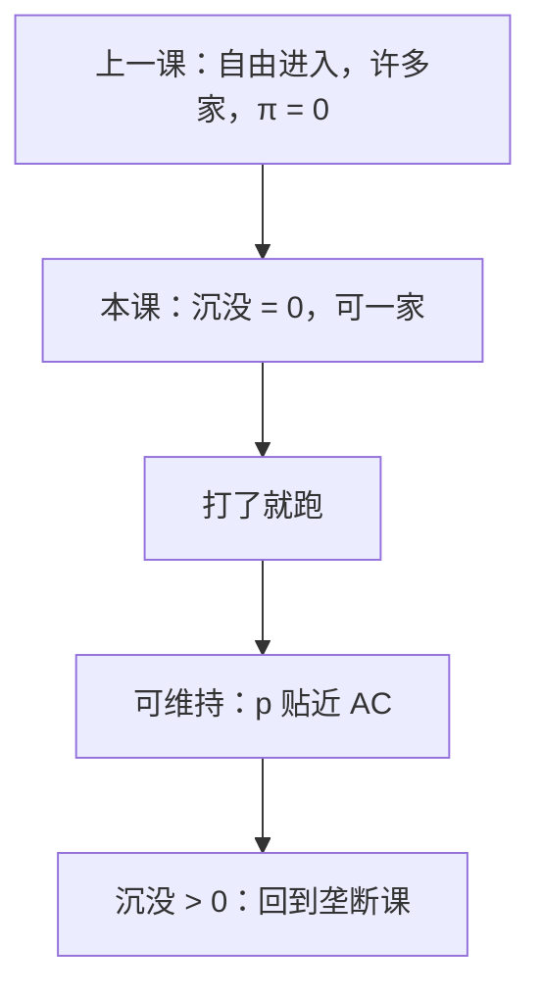

# 可竞争市场

若进入与退出没有沉没成本，潜在进入者可以打了就跑；在位者即使只有一家，也只能要可维持的价格，超额利润站不住。

<footer>—— 据 Baumol, Contestable Markets, American Economic Review, 1982；Baumol, Panzar and Willig, 1982 整理</footer>

[上一课](/econ/long-run-entry)（长期进入与零利润）。自由进入把完全竞争的长期 $\pi$ 赶到零，但那是价格接受、可复制的 U 形 AC。本课不重讲 $S_{\mathrm{SR}}$ 与整数缝。缺口是：若技术是次加的、市场「自然」只装得下一家，只要沉没进入成本为零，潜在竞争仍可能把价格压到可维持的平均成本。进入威胁替代了实际的 $n\to\infty$。

## 问题

上一课的进入者要建厂，工厂一旦落下就有沉没。可竞争把这层拿掉：进入、生产、退出，成本全部可回收，在位者来不及反应。进入者盯住在位价格 $p$，以略低的价抢走需求，赚完离开。均衡若还有 $\pi>0$，就会被打了就跑。缺口不是再写一次零利润，而是：**零利润现在由潜在进入执行，不要求市场上真的有许多家，也不要求 $p=\mathrm{MC}$。**

可维持价格：在位的 $(p,q)$ 使任何进入计划都不能在 $p$ 上赚到正利润，同时在位者自己不亏。自然垄断的次加成本下，可维持往往是 $p=\mathrm{AC}$ 的拉姆齐式平均成本价，而不是 $p=\mathrm{MC}$（MC 在 AC 下方时会亏）。

### 可竞争不是完全竞争换了名字

完全竞争要价格接受加许多家实际在产。可竞争允许一家，但要求进入成本不沉没、在位价格被进入者当成参数。没有这两条，一家就是[垄断](/econ/monopoly-lerner)。沉没一旦为正，打了就跑的成本收不回，威胁空了——上一课把沉没写成壁垒高度，本课取零这个极点。

Baumol–Panzar–Willig 的「可维持」比「$\pi=0$」更紧：多产品时还要挡住只挑肥产品的进入。弱看不见的手：可维持配置在凸性下接近有效，但次加性下 $p=\mathrm{MC}$ 不可维持。

## 方法

对象：进入时滞为零、沉没为零、在位者价格在进入发生前锁死（Sylos 式，但这里锁的是「来不及改价」）。结论：均衡必须可维持。单产品自然垄断，可维持意味着 $p=\mathrm{AC}(q)$、$q=D(p)$，经济利润为零。若需求与 AC 的切点在下降段，则 $p>\mathrm{MC}$，配置有一阶无谓损失，但仍比不受约束的垄断价低。

多产品：交叉补贴可能被「挑肥」进入拆掉，可维持要求没有一组产品能被单独进入打穿。这与完全可分配的成本检验相连，本课只钉逻辑，不把会计分摊写完。

不要把「潜在进入」写成限价：限价是在位者主动压产；可竞争是进入技术把在位者的可行价格集切掉。工具不同。

## 机制

威胁的机制是可逆性：进入者与在位者面对同一成本，事后没有「已经沉下去、必须应战」的不对称。在位者若敢要 $p>\mathrm{AC}$，进入者按这个 $p$ 算净现值仍为正，于是进。在位者预见到这一点，只能停在可维持边界。

与[长期进入](/econ/long-run-entry)的对照：那里零利润靠 $n$ 真的增加、沿短期供给把 $p$ 压下来；这里 $n$ 可以仍是一，$p$ 被尚未发生的进入钉住。整数缝在可竞争里也更窄：打了就跑不要求第二家长期留下。

次加成本下 $p=\mathrm{MC}$ 会亏损，可维持停在 $\mathrm{AC}$，与下一课[自然垄断的拉姆齐](/econ/natural-monopoly-ramsey)外表像，来源不同：这里没有规制者选逆弹性权，是潜在进入把可行价格切到平均成本。需求一旦不足以在 $\mathrm{AC}$ 上出清，可维持集可以空，需要补贴或放弃严格可竞争。

批评的核心是时序：真实进入几乎总有沉没与反应时滞。可竞争是基准，不是对航空、电信的直接描述。沉没一出现，本课的威胁退回[限制进入](/econ/limit-pricing)要处理的承诺问题。

## 边界

沉没、合同锁期、在位者瞬时改价，都会拆掉「打了就跑」。规制用可竞争当参照时，要先问进入的可逆性，不能看见一家就自动允许平均成本定价。多产品可维持集可能空，需要补贴或放弃严格可维持。

航空、电信常被拿来当例子，也是最早的反例：航线有机队与机场槽位沉没，在位者可以瞬时改价。用可竞争去放松规制，必须先核对这两条，不能看见「进出相对自由」就写成定理。

下一课撤掉潜在进入与价格接受，面对向下的 $P(Q)$，用勒纳指数读垄断势力。本课的教训是：家数不等于势力；势力还要看进入的沉没。

后课默认：沉没为零时，即使一家，可维持价格把超额利润赶走；沉没为正，潜在竞争不再等价于实际竞争。

## 小结

- 可竞争把零利润交给潜在进入，不要求许多家在产。
- 沉没为零、进入可逆，是威胁可信的前提。
- 可维持可以是 $p=\mathrm{AC}$ 而不是 $p=\mathrm{MC}$。
- 下一课：进入挡住之后，一家面对市场需求。
- 出处：Baumol, *AER*, 1982；Baumol, Panzar and Willig, 1982。
