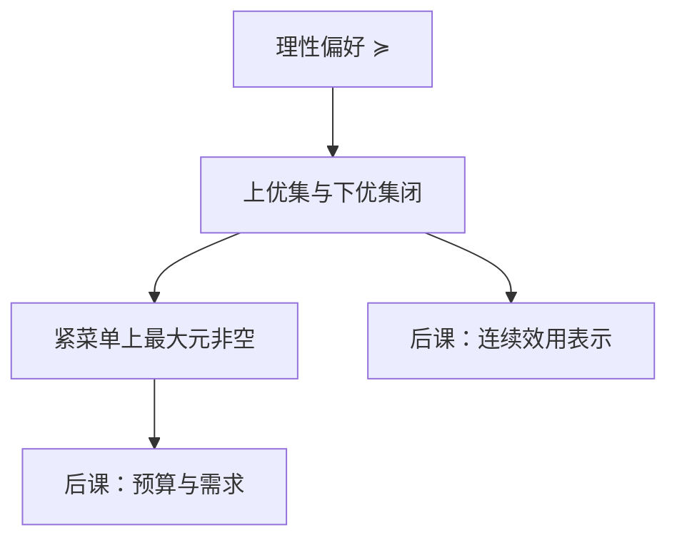

# 连续性

一个连续的偏好排序，在连通的消费集上，可以被连续的数值函数表示。

<footer>—— 据 Debreu, Representation of a preference ordering by a numerical function, 1954；Theory of Value, 1959 整理</footer>

上一课[偏好、完备与传递](/econ/preference-choice)钉死了理性：完备加传递，有限菜单上最大元非空。本课不重讲这两条公理，也不从「人喜欢什么」另起。缺口是：理性还没有拓扑。消费理论真正用的 $X\subseteq\mathbb{R}_+^n$ 是无限集，菜单可以闭、可以无界；最大元可能空，后课要写的连续效用也还没有对象。本课只加上优集与下优集都闭这一条。

## 问题

有限 $B$ 上，完备加传递已经够：把方案两两比下去，最大元非空。把 $X$ 换成 $\mathbb{R}_+^n$，同样的理性可以失败。开预算没有最大元；闭但无界的集合上，偏好若在无穷远处仍严格上升，最大元也可以空。Weierstrass 要的是：目标在紧集上连续。偏好还不是函数，连续必须先写成集合的闭。

缺口因此不是新的比较，而是拓扑条件。对每个 $x$，上优集 $\{y:y\succsim x\}$ 与下优集 $\{y:x\succsim y\}$ 都是 $X$ 中的闭集。序列说法：若 $x^n\to x$、$y^n\to y$ 且 $x^n\succsim y^n$，则 $x\succsim y$。没有这条，紧预算上仍可能没有最大元；有了它，后课才谈得上连续 $u$。单调、凸仍未进场。

### 闭优集不是「感觉平滑」

连续性排除极限处的跳跃：一串都比 $y$ 好的点，极限不能突然变差。它不声称决策者的感受可微，只声称无差异集把 $X$ 分成整齐的层。词典序是标准反例：理性，但不连续，没有连续效用表示。主干不把它当消费者。

无差异 $x\sim y$ 上一课已定义。有了闭优集，无差异集才是闭的。上一课没有拓扑，还画不成「无差异曲线」。

## 方法

取 $X\subseteq\mathbb{R}_+^n$ 非空。理性且连续的 $\succsim$ 在非空紧菜单上有最大元：上优集闭，与紧集相交仍紧，有限交性质给出非空。预算集 $B(p,w)$ 本身未必紧——无界——后课还要用单调或局部非饱和把最优赶到有界区域。本课只钉「紧菜单 + 连续 ⇒ 最大元非空」，不把价格写进定义。

Debreu（1954, 1959）进一步说：在连通消费集上，连续理性偏好有连续效用表示。本课不把嵌区间的构造展开成证明，只锁定连续性是表示定理的拓扑前提。完整的「何时存在 $u$」是[效用函数何时存在](/econ/utility-representation)的缺口；这里只把上、下优集闭交给后课。连通性排除把 $X$ 切成互不搭界的两块：否则两块上可以分别标数，中间的跳跃不必连续。MWG 第 3 章把同一套条件写成偏好作为 $X\times X$ 子集是闭的，后课引用时不换对象。

## 机制

连续性让「接近」与「排序」兼容。最优若存在，最优集是闭的：最大元的极限仍是最大元。后课把菜单换成预算，需求对应才能有闭图像，一般均衡的存在性才有对象。不连续的理性偏好可以在有限集上运转，一放到价格连续变动的市场里，选择会跳。

它仍然极瘦。多多是否更好、平均是否更好，连续性都不回答。那两问是[单调与局部非饱和](/econ/monotonicity-lns)和[凸偏好](/econ/convex-preference)的缺口。本课也不给出唯一的 $u$：连续表示若存在，严格递增变换仍表示同一 $\succsim$。预算还没有价格参数；本课的菜单只是 $X$ 的紧子集，后课才把 $B(p,w)$ 特化成超平面切出的一块。

开上优集 $\{y:y\succ x\}$ 是连续性的对偶说法之一。后课写「无差异曲线把更好的一侧隔开」，靠的就是这些开集。

## 边界

连续性是模型为了用分析工具付的拓扑代价，不是实验里测出来的平滑感觉。框架效应、不传递，上一课已划成对照；本课在理性内部工作。若连续性失败，后课的需求函数、包络定理整段暂停。

存在最大元其实只需要上优集闭（偏好上半连续）：紧菜单上闭上优集有有限交性质。下优集闭（下半连续）是为了表示连续：没有它，效用可以在极限处掉下去。Debreu 两条都要。本课把它们捆在「连续性」一词里，后课写连续 $u$ 时默认两条都在。

也不要把 Debreu 1954 的表示与 1959 年《价值理论》里的均衡存在混成一步。前者只问排序能否写成连续函数；市场、价格、存在性是后面的课。本课连 $u$ 的构造都不写完，更不预支均衡。

后课默认：谈到消费者在 $\mathbb{R}_+^n$ 上的偏好，它连续。最大元在紧菜单上非空；连续表示的存在，下一课才收。

## 小结

- 理性在有限集上够用；无限消费集上还要拓扑，最大元才不空。
- 连续性 = 上优集与下优集都闭；序列保持弱偏好。
- 词典序理性但不连续，主干不用。
- 上优集闭管最大元存在；下优集闭管表示连续。Debreu 两条都要。
- 连续 $u$ 是后课的表示定理，本课只交出闭优集。
- 出处：Debreu, 1954 与 *Theory of Value*, 1959；Mas-Colell, Whinston and Green 第 3 章。
