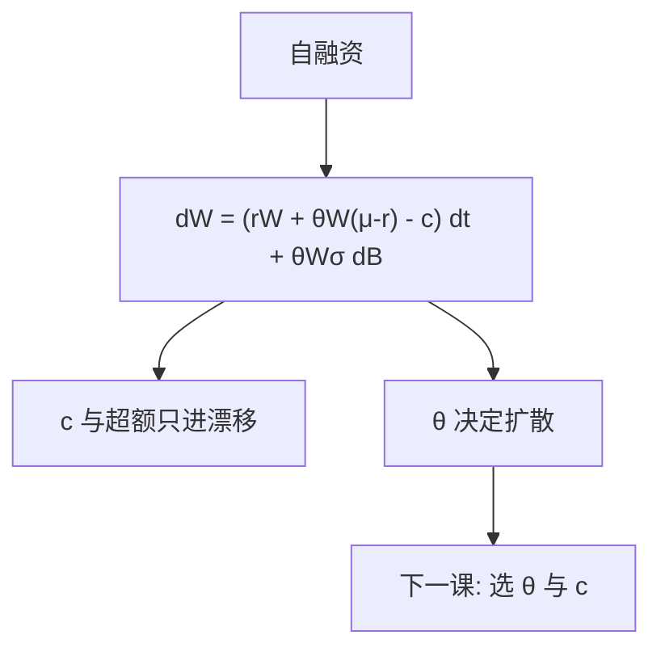

# 连续时间预算约束

财富的微分等于资本利得加利息减消费；伊藤项让预算本身成为随机微分方程，而不是每期的算术和。

<footer>—— 据 Merton, Optimum Consumption and Portfolio Rules in a Continuous-Time Model, JET 1971</footer>

[上一课](/econ/brownian-ito)给出 $\mathrm{d}f$ 的公式。本课缺口是把公式写成**预算**：消费率 $c_t$、组合权重 $\theta_t$ 如何驱动 $W_t$。不求解最优，$\theta$ 与 $c$ 仍是任意适应过程（满足正则）。后课 Merton 问题才对它们取最大值。

## 问题

离散： $W_{t+1}=(W_t-C_t)(1+R_{p,t+1})$。连续极限：设无风险 $r$，风险资产 $\mathrm{d}S/S=\mu\mathrm{d}t+\sigma\mathrm{d}B$，权重 $\theta$ 在风险资产上，则

$$
\mathrm{d}W=\bigl[rW+\theta W(\mu-r)-c\bigr]\mathrm{d}t+\theta W\sigma\,\mathrm{d}B.
$$

这是状态的动力学。横截或非负财富排除加倍。缺口是承认：连续时间的可行性是对这道 SDE 的积分，消费是速率，组合是暴露。需求系统的「份额」在此变成 $\theta$；没有特征 logit，只有暴露于 $B$ 的系数。

Merton, *JET* 3, 1971。劳动收入、多个布朗、随机 $r$，只是把 $\mathrm{d}W$ 加项。本课先单一风险资产、常系数，便于看见结构。

## 方法

从自融资出发：除消费外没有注入，持仓的价值变化全部来自价格变化。伊藤乘法给出 $\theta$ 进入漂移与扩散的方式——扩散只被风险暴露驱动，消费只进漂移。这与 FTAP 衔接：$\mathrm{d}W$ 的扩散若能被 $\theta$ 对冲掉任意 $\mathcal{F}$–适应的目标（在完全时），复制就是选 $\theta$。预算是复制与最优的共同约束。

不要把 $\mathrm{d}W$ 写成每笔成交后的现金账户。连续时间没有逐笔：是理想化的再平衡。价差下再平衡有成本，Constantinides 后课把预算改成区间策略。本课零成本。

## 机制

机制是暴露与消耗分开记账。消费降低漂移，立刻减少未来投资的基数；风险暴露同时提高（或降低）漂移里的超额，并打开扩散。二次变差使 $W$ 的凹变换（如 $\log W$）多一项 $-\tfrac12\theta^2\sigma^2$，即便 $\mathrm{E}[\mathrm{d}W]$ 看起来很美。这就是后文最优会惩罚 $\theta$ 的原因——在预算里已经藏了 Jensen，不只在效用里。

多个资产：$\theta$ 成向量，$\sigma$ 成矩阵，扩散维数等于独立布朗数。维数不够则预算张不成任意终端财富，回到动态不完全。维数对齐则本课的 SDE 是完全市场的预算。

随机利率：债券价格也扩散，$W$ 多暴露一项，后文对冲需求正是为了对付这项。本课 $r$ 为常数，对冲还没有对象。

## 边界

本课不谈存在唯一强解的 Lipschitz 条件。下一课在这道预算上最大化 $\mathrm{E}\int u(c)\,\mathrm{d}t$（加遗产），得到 Merton 权重。ICAPM 主干课已经用过对冲的结果；本单元从预算重新走到那条结果，并停在组合理论，不重写截面因子。

后课默认：连续时间预算是自融资 SDE；消费进漂移，组合进漂移与扩散。财富下界排除加倍。零交易成本。

## 小结

- $\mathrm{d}W=[rW+\theta W(\mu-r)-c]\mathrm{d}t+\theta W\sigma\mathrm{d}B$。
- 自融资：无注入；扩散由风险暴露单独决定。
- 这是最优与复制的共同约束，还不是最优。
- 出处：Merton, *JET* 1971。
