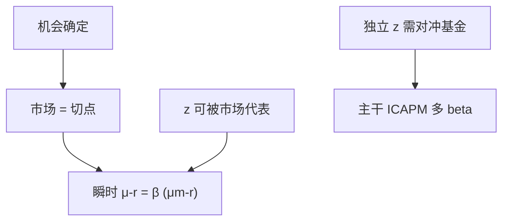

# 连续时间 CAPM

瞬时均值–方差加同质预期、机会确定（或被市场充分代表）时，出清仍给出瞬时市场 beta 定价。

<footer>—— Merton, An Intertemporal Capital Asset Pricing Model, Econometrica, 1973 的瞬时 CAPM 特化；对照 Sharpe–Lintner</footer>

[上一课](/econ/hedging-demand-origin)在需求里加上对冲。本课缺口是出清后的定价：何时对冲项在加总里消失或被市场吸收，回到瞬时 CAPM。主干 [CAPM 作为均衡](/econ/capm-theory) 是离散单期；本课是同一加总在连续时间的瞬时版。不估计 beta，不写 GRS。

## 问题

每人 $\theta_i=$ 切点 $+$ 对冲。加总：市场清算切点需求；若每人的对冲能被一组可交易基金代表，再清算那些基金。机会确定：对冲为零，市场即切点，瞬时

$$
\mu_i-r=\beta_{i,m}(\mu_m-r),\qquad \beta_{i,m}=\frac{\mathrm{Cov}(\mathrm{d}R_i,\mathrm{d}R_m)}{\mathrm{Var}(\mathrm{d}R_m)}.
$$

这是连续时间 CAPM。机会随机但所有 $z$ 的对冲基金恰好落在市场张成里（例如单一 $z$ 与市场完全相关），仍可压成单 beta。一般 ICAPM 是多 beta，主干已写。本课钉特化：瞬时、扩散、出清。

瞬时：溢价对 $\mathrm{d}t$ 的系数。有限持有期的积分溢价还含路径，不是本课。Breeden 用消费把多 beta 再压成一个，那是 CCAPM，也不在此重写。

## 方法

同质预期、CRRA 或使切点相同的加总条件，连续再平衡、无摩擦。市场组合的扩散是财富加权的 $\theta$ 之和。有效性：市场瞬时均值方差有效 ⇔ 单 beta。SDF：$m$ 的无穷小是 $1-b\,\mathrm{d}R_m$（差利率），与离散 $m=a-b R_m$ 同构。资金约束课序已经指出：不能人人再平衡或不能自由借贷时，这一步失败——本课假设能。

与量化栏 CAPM：那里用离散时段的超额收益回归。瞬时 beta 不是月度 beta。测量误差与区间选择是换栏的问题。本课禁止用月度 $R^2$ 判决 1973。

## 机制

机制仍是加总后的有效性。连续时间只是让「这一瞬间的均值方差」精确等于 EU 的瞬时问题，躲过离散 MV 的二次/正态刀刃。出清把共同切点标成市场。对冲若存在且不能被市场代表，有效前沿的切点不再是市场，线性落到多因子——那是 ICAPM，不是本课的特化失败，是特化条件没满足。

信息：连续再平衡假定公共价格过程；知情者若有额外域流，他们的 $\theta$ 含投机项，市场不再是共同切点。Kyle 与 Merton 加总不要混在同一句话里。本课公共信息。

Black 的零 beta 在连续时间同样可用：关掉瞬时无风险，用与市场瞬时不相关的组合当截距。

## 边界

本课不修补低 beta 异象。资金约束已经给出许可；实证换 [/quant/capm](/quant/capm)。下一课把利率本身做成一般均衡对象：CIR 用生产或禀赋把 $r$ 从「常数参数」变成状态变量的函数。连续时间 CAPM 把 $r$ 当给定；CIR 给 $r$ 一条均衡 SDE。

后课默认：瞬时 CAPM 是常机会（或市场代表全部对冲）加出清的特化。与离散 Sharpe–Lintner 同构，装置是扩散。不是横截面检验。

## 小结

- 机会确定 + 出清 ⇒ 瞬时市场 beta 定价。
- 对冲能被市场张成时，仍可单 beta；否则回到 ICAPM。
- 连续时间许可证是瞬时 MV=EU，不是实证区间。
- 出处：Merton, *Econometrica* 1973；对照 [/econ/capm-theory](/econ/capm-theory)。
