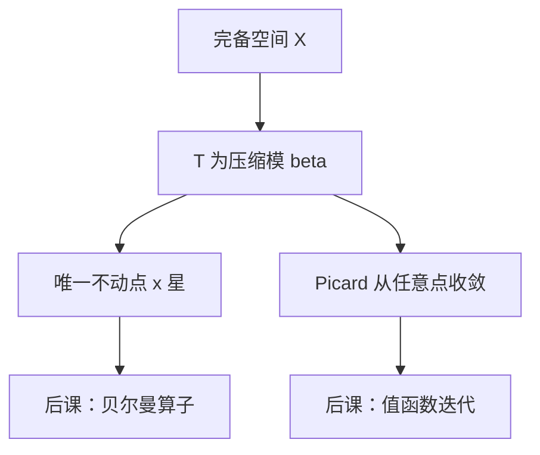

# 压缩映射

距离每次至少按固定比例缩小，完备空间里迭代收敛到唯一不动点，并且与起点无关。

<footer>—— 据 Stokey, Lucas and Prescott, Recursive Methods in Economic Dynamics, 1989, 第 3 章；Ok, Real Analysis with Economic Applications 整理</footer>

上一课[比较静态](/econ/comparative-statics)在方程 $F(x,\theta)=0$ 的局部光滑枝上读符号。宏观与动态规划问的是另一类对象：值函数、价格函数满足 $T(v)=v$。缺口不是再微分一次，而是：算子 $T$ 何时有唯一不动点，以及 Picard 迭代何时全局收敛。本课给出 Banach 压缩；Brouwer/Kakutani 管「连续但非压缩」的存在性，不给唯一、不给算法。

## 问题

$(X,d)$ 完备度量空间（后课常用有界连续函数空间 $C(K)$ 配 $\sup$ 范数，$\mathbb{R}^n$ 本身也完备）。$T:X\to X$ 为压缩：存在 $\beta\in(0,1)$ 使 $d(Tx,Ty)\le\beta d(x,y)$ 对一切 $x,y$ 成立。则 $T$ 有唯一不动点 $x^*$，$T^n x_0\to x^*$ 对任意 $x_0$，误差 $\le \beta^n d(x_0,Tx_0)/(1-\beta)$。

Blackwell 充分条件：若 $T$ 单调且有折扣性 $T(f+a)\le Tf+\beta a$，则 $T$ 在 $C(K)$ 上是模 $\beta$ 的压缩。后课[贝尔曼方程](/econ/bellman-equation)的贝尔曼算子在 $\beta<1$ 时走这条，不必每次手算 Lipschitz。本课先把压缩本身钉死。

### 压缩不是「迭代几次就差不多」

数值上迭代几次残差变小，可能只是局部收缩或碰巧的阻尼，不是定理。没有全局模 $\beta<1$，可能存在多个不动点，Picard 从不同初值去不同极限，或根本发散。最优增长的贝尔曼算子是压缩；没有折扣的一些搜寻问题、$\beta=1$ 的平均报酬问题，要换等价范数或别的定理，不能口头称「也是压缩」。

压缩自动连续。连续映射可以不是压缩：单位闭盘上的恒等映射连续，不动点整盘都是，模是 $1$。

## 方法

验证三件事：空间完备、映射把空间送进自身、$d(Tx,Ty)\le\beta d(x,y)$。函数空间上常用 $\sup$ 距离；加权 $\sup$ 范数可以把无界状态上的贝尔曼仍收成压缩（Stokey–Lucas–Prescott 的标准技巧）。等价范数改变 $\beta$，不改变完备性——有限维所有范数等价，无穷维要选对。

唯一性来自：两个不动点距离 $\le\beta$ 倍自身，故为零。存在性来自：Cauchy 列 $x_{n+1}=Tx_n$ 因几何级数而 Cauchy，完备则收敛，极限必是不动点（$T$ 连续）。后课[值函数迭代](/econ/value-function-iteration)就是这条 Picard。

## 机制

每次应用 $T$，直径按 $\beta$ 缩小，所以迭代尾巴被几何级数锁住。折扣因子 $\beta<1$ 在经济学里恰好是这个模：未来值被压过一次，两套值函数的差距明天最多 $\beta$ 倍今天。没有折扣，明天的差距可以原样传回今天，压缩失败。

比较静态与压缩可以接力：不动点 $x^*(\theta)$ 若 $T$ 对 $\theta$ 连续（或单调），极限继承连续性（或单调）。这比隐函数弱：不要求可微，但要求全局压缩结构。动态规划里值函数对参数的单调，常用这条，而不是去微分欧拉方程。

模 $\beta$ 同时给出计算预算：要误差小于 $\varepsilon$，大约 $n\sim\log\varepsilon/\log\beta$ 步。$\beta$ 接近 $1$ 时迭代很慢，那是后课加速与策略迭代的动机。

## 边界

本课不证一般完备度量空间的全部点集拓扑，也不把压缩写成数值线性代数的谱半径讲义。非扩张映射（$\beta=1$）可以有、可以没有不动点，不在本课强行收。下一课放下唯一性，只问连续函数在紧凸集上是否至少有一个不动点——均衡存在要用那个，因为超额需求通常不是压缩。

后课默认：折扣贝尔曼算子是压缩；Picard 全局收敛到唯一值函数。

## 小结

- 完备空间上的压缩有唯一不动点，Picard 全局几何收敛。
- Blackwell 条件让贝尔曼算子直接继承模 $\beta$。
- 压缩 $\Rightarrow$ 连续且唯一；连续远远不够压缩。
- $\beta$ 接近 $1$ 时存在仍在，计算变慢。
- 下一课：[Brouwer 不动点](/econ/brouwer-fixed-point)。
- 出处：Stokey, Lucas and Prescott, *Recursive Methods* 第 3 章；Ok。
