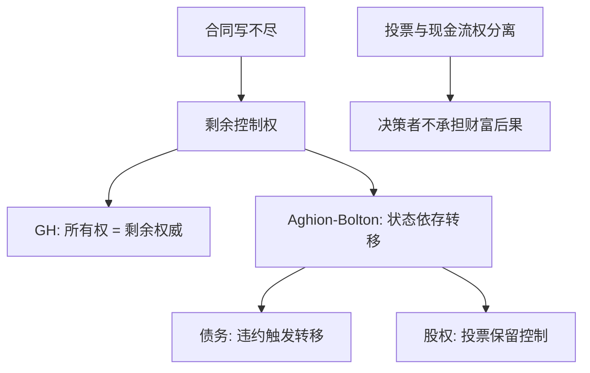

# 控制权与治理

合同写不尽的那些决策，必须事先指定谁有权做；融资合同同时在切现金流与切这项权利。

<footer>—— Grossman and Hart, The Costs and Benefits of Ownership, Journal of Political Economy 1986；Aghion and Bolton, An Incomplete Contracts Approach to Financial Contracting, Review of Economic Studies 1992</footer>

定位：[上一课](/econ/ipo-underpricing-theory)。上市把股权卖给公众，柠檬与信号已经解释折价。本课缺口是上市之后还切了什么：投票权与现金流权可以分离，剩余控制权落在谁手里决定事后投资。不重写赢家诅咒，不把治理写成交易所的撮合规则。

## 问题

MM 的切片是对既定收益流的要求权排序。收益流本身却依赖事后决策：是否扩张、是否替换经理、是否接受收购。这些决策在事前无法写尽——状态不可验证，或写尽的费用高于所得。Grossman 与 Hart（1986）把所有权定义为剩余控制权：合同未规定之事由谁决定。缺口是把这句话接到融资：债与股不仅切现金流，也切控制权何时转移。

Aghion 与 Bolton（1992）给出合同形式：企业家有私人收益，投资者要货币回报；控制权可以随可验证信号（如违约、业绩门槛）从企业家转到投资者。双层股权、金字塔、现金流权与投票权的楔子，是同一逻辑的证券设计，不是公司法的附录。

现金流权是对剩余利润的索取比例。投票权是对剩余决策的比例。一股一权时两者重合；双重股权与金字塔让它们分开。代理成本随楔子上升，因为决策者不必承担决策的财富后果。

## 方法

不完全合同：可验证的部分写成条款（利息、抵押、否决事项）；不可验证的部分指定权威。权威有成本与收益——拥有控制权的一方会把私人收益写进决策，另一方向专用性投资不足。最优所有权把事后敲竹杠的损失最小化。企业边界是这个规划的解；融资合同是把规划嵌进状态依存的权威转移。

金融合同。好信号下企业家保留控制，以保护私人收益与项目特异性；坏信号下控制转给投资者，以阻止继续浪费。债务是一种便宜的转移技术：不付即违约，违约是可验证信号，控制权进入破产或重整。股权保留控制直到投票权被征集。这与 Jensen 的债务纪律同方向，但微观基础换成权威，而不是「把现金带走」单独一句。

IPO 之后若创始人保留超级投票权，卖出的是现金流权，留下的是权威。抑价理论解释第一次出售的价格；本课解释出售之后谁还能改项目。

## 机制

机制是事后谈判力。专用性投资一旦沉没，没有控制权的一方会被敲竹杠，于是事前少投。把控制权给投资更重要、或私人收益更危险的那一方，是次优。融资不过是用可验证的违约去逼近「坏状态下把权给投资者」。破产法是这套转移的公共技术；[直接与间接成本](/econ/bankruptcy-direct-indirect)度量的是技术的费用。

投票与现金流权分离使权威可以留在私人收益高的人手中，同时对外出售大量现金流。楔子越大，FCF 浪费与壁垒收购越便宜。治理安排（独立董事、收购规则）是对楔子的约束，不是对 MM 切片的否定：它们改变的是事后决策，从而改变收益流本身。

### 控制权不是限价簿上的优先权

价格优先、时间优先是交易协议，对象是已发行证券的排队。本课的控制权是对**尚未写进合同的经营决策**的权威。两者都叫 priority，不是同一个状态机。簿的几何在量化栏第一课；本栏不预支。

一股一权不是定理。它是使现金流权与投票权重合的默认。当私人收益与货币回报冲突大时，偏离可以是次优——代价是楔子带来的代理。

## 边界

不要把治理写成「独立董事清单」或某司法辖区的法典摘要。本课只保留剩余控制权与状态依存转移。也不要把 Grossman–Hart 的企业边界全文搬进来：纵向一体化是同一理论的另一应用，这里只用所有权定义。

下一课在控制权已经指定谁能投资之后，问投资时机：不可逆时等待本身有价值。[实物期权](/econ/real-options-theory)不再写投票权。

后课默认：债与股同时切现金流与控制权；违约是可验证的权威转移。投票与现金流权可以分开，楔子是代理。不要把治理写成微观结构。

剩余控制权是合同未规定之事的权威，不是剩余索取权的同义词。索取是现金流，权威是决策。

Aghion–Bolton 的转移依赖可验证信号。信号不可验证时，状态依存控制写不成。

## 小结

- 不完全合同下所有权是剩余控制权（Grossman–Hart）。
- 融资把控制权做成状态依存转移（Aghion–Bolton）；债务用违约当信号。
- 投票权与现金流权分离制造楔子，改变事后投资。
- 出处：Grossman and Hart, *JPE* 1986；Aghion and Bolton, *Review of Economic Studies* 1992。
