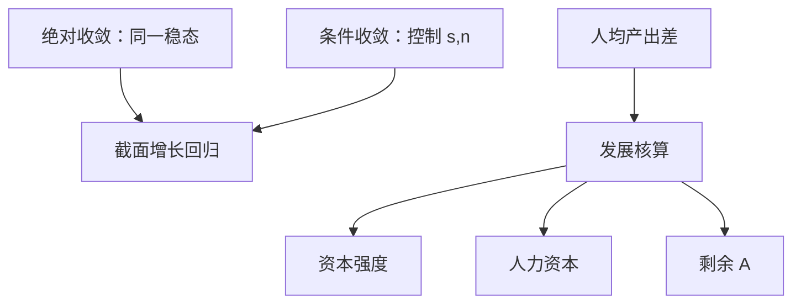

# 收敛与发展核算

索洛预测条件收敛；把穷国的落后写成「缺机器」还是「缺效率」，是核算问题，不是再写一遍运动方程。

<footer>—— 对照 Solow 1956 的条件预测；Hall and Jones, QJE 1999 的发展核算</footer>

[上一课](/econ/misallocation-tfp)（错配与 TFP）。让 $g$ 可以来自人力资本与研发。若知识非竞争，穷国按理可以模仿，水平差应缩小；若壁垒使 $A$ 不可移动，差会持久。本课的缺口不是再推内生增长，而是：用账户把跨国（或跨期）的人均产出差拆成资本、人力资本与剩余效率，并分清绝对收敛与条件收敛。货币课从下一课开始，增长主干在此收束。

## 问题

索洛：参数相同的经济走向同一稳态，穷的 $k$ 增长更快——**绝对收敛**。参数不同则走向不同 $k^*$，只在控制 $s,n$ 等之后才有**条件收敛**。内生增长可以取消收敛。经验上要先声明检验的是哪一句，不能把「东亚增长快」直接叫成索洛证实。

即便收敛方向清楚，水平差的来源仍未知。同样的 $K/L$，产出可以差一截：剩余进入 $A$ 或效率。Hall 与 Jones（1999）一类发展核算把

$$
\frac{Y}{L}=A\cdot\Bigl(\frac{K}{Y}\Bigr)^{\alpha/(1-\alpha)}h
$$

这类分解写成可计算形式（具体指数因写法而异），问有多少差来自资本强度、多少来自 $h$、多少来自 $A$。本课用核算，不用增长回归当因果。

Solow 1957 的残差是时间上的技术变化。发展核算是截面上的水平残差。都叫 $A$，不要当成已经识别了研发部门。

## 方法

收敛：看 $\Delta\log y_i$ 对初始 $\log y_i$ 的斜率。负斜率是 $\beta$ 收敛。$\sigma$ 收敛看离散度是否下降。条件收敛加入储蓄、人口、教育。Barro 式回归是简化式，卢卡斯批判对政策含义同样适用——那是后课，这里只警告系数不是结构 $s$。

发展核算：取生产函数，用观测的 $K$、$L$、教育代理 $h$，把 $A$ 当残差。资本份额 $\alpha$ 通常取收入法中的资本份额，争议立刻进入分解。制度、误配置可以藏在 $A$ 里，本课不把 $A$ 命名为「文化」。

增长核算（时间差）与发展核算（截面差）公式同源、样本不同。中国或东亚的高速增长可以是 $K$ 积累为主、 $A$ 为辅，或反过来，取决于时段与数据；本课不写未核对的数字故事。

### 误配置也是 A

若资本与劳动困在低生产率企业，加总 $A$ 下降，即使每家企业的技术不变。这是对「剩余=技术」的警告。微观误配置文献是扩展，主干仍用加总分解当第一刀。

## 机制

条件收敛来自递减报酬：离自己的 $k^*$ 越远，边际产出越高。绝对不收敛来自 $s,n,g$ 不同，或来自内生增长的多重路径。发展核算里 $A$ 的大份额，表示「只运机器」不够；但 $A$ 大也可能是 $K$、$h$ 测错，或价格平减不一致——回到[价格指数](/econ/price-index-real)的购买力平价篮子，不是外汇市场上的 CIP。

政策含义到此为止：核算指出差在哪一块，不指出哪一项改革的乘数。后课货币与周期处理的是 $y$ 对 $y^*$ 的短期偏离，假定 $y^*$ 的水平已被增长课说明。

增长核算（时间差）与发展核算（截面差）公式同源、样本不同。东亚高速增长可以是 $K$ 积累为主、$A$ 为辅，或反过来，取决于时段与数据；本课不写未核对的数字故事。内生增长预测：若知识可模仿，水平差应缩小；若壁垒使 $A$ 不可移动，差会持久——核算是对这句话的测量，不是再推一遍 $\dot{A}$。

Barro 式收敛回归是简化式。系数不是结构 $s$，政策含义要等卢卡斯批判。本课只用它分清绝对与条件收敛的句子。

## 边界

收敛回归不是随机对照试验。殖民、地理、制度的工具变量争论不在本课展开。也不要把人均 GDP 差写成交易员看到的价差；本栏接到限价簿之前，价格是宏观指数与相对价格。资本份额 $\alpha$ 取收入法时，争议立刻进入 $A$ 的大小。

后课默认：长期水平用 $K$、$h$、$A$ 说话，短期缺口用 $u$ 与 $y-y^*$。下一课引入货币作为支付手段，增长账暂时放下。

## 小结

- 索洛给条件收敛；绝对收敛需要参数相近。
- 发展核算把 $Y/L$ 拆成资本、人力资本与剩余 $A$。
- $A$ 是残差，含技术、制度与误配置。
- PPP 篮子进入截面比较；那不是 CIP。
- 货币中性建立在已经缩减、已经有 $y^*$ 的世界上。
- 出处：Solow 1956/1957；Hall and Jones, QJE 1999。
