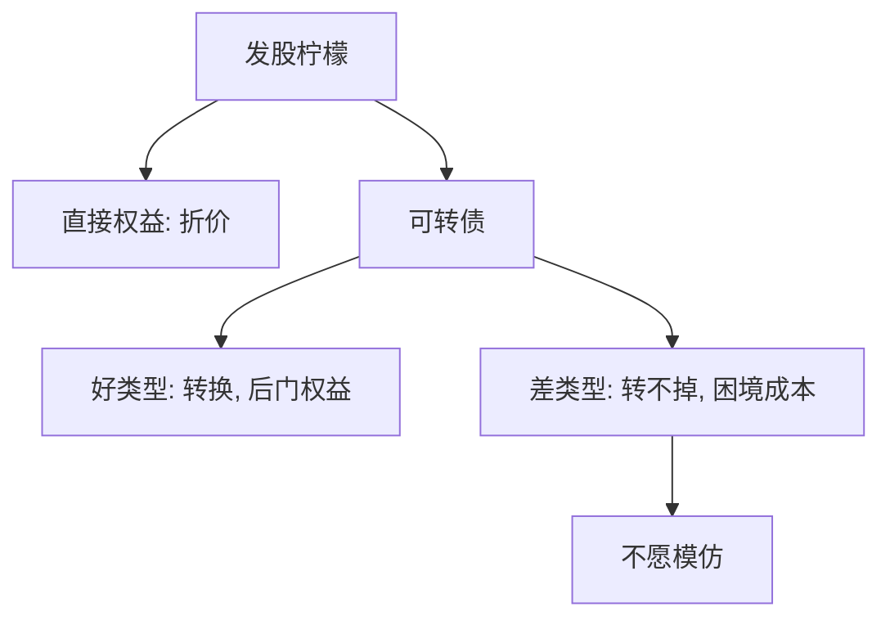

# 可转债

可转债是后门权益：信息不对称使直接发股太贵时，先发带转股权的债，好消息实现后再变成股，差类型更难模仿这条路径。

<footer>—— Stein, Convertible Bonds as Backdoor Equity Financing, Journal of Financial Economics, 1992</footer>

[上一课](/econ/share-repurchase)处理的是现金如何离开企业。本课缺口换成现金如何进来：优序里股权最贵，直接 SEO 有柠檬折价。Stein（1992）给出可转债作为后门权益。不重推 Myers–Majluf 的发股泄漏，不把转债写成交易员的期权账。

## 问题

优序：留存、债、股。成长企业往往内部资金不够、债务容量也有限，又必须为投资筹资。直接发股被读成高估。缺口是：有没有一种证券，让好类型在事后把债转成股，而不在事前接受全部柠檬折价？Stein 的回答是可转债加财务困境成本：好企业预期股价会升到迫使（或诱使）转换，于是最终得到权益；差企业预期转不掉，留下债，积压与困境成本对它们更疼，于是不愿模仿。

这与 Jensen–Meckling 的可转债「抑制资产替代」可以并存，但本课主线是信息：后门权益，不是期权对冲手册。

后门：发行时当债定价，成功路径上变成股。投资者不是在发行日按公平股权价全额买入，而是买入一个或有转换。

## 方法

类型是资产或项目的质量。直接股权：两种类型混同或分离，好类型承担折价。可转债：票息加转股期权，转换价设在中间。好类型的股价路径穿过转换区，债消失、股本增加，积压解除。差类型转不掉，面对还本——若困境成本高，分离：只有好类型选转债，差类型选债或放弃项目。财务困境成本在此是分离的必要家具，不是上一课权衡的重复计算。

赎回条款可以加速转换，把后门关得更死。本课只取精神：可转是带选择权的延迟股权，不是「便宜的债」。

### 与积压、转移的接缝

可转债减轻积压：转换把债清掉，增长期权不再被征税。它也减轻转移：债权人分享上行，赌大的激励变弱。Stein 强调的是第三条——信息。三句话都真时，转债仍可能被用；本课读者从优序走进来，只把信息刀钉死。

## 机制

机制是或有的证券设计。好类型愿意接受「若成功则稀释」的合同，因为成功时稀释发生在高价上，且避免了发行日的混同折价。差类型知道成功不会来，转债对他们是贵的债加一个虚值期权，再加困境。单交叉靠困境成本或类似的不对称代价。这与股利信号同构：贵行动分离；对象从支付换成融资工具。

市场半强式处理发行公告：宣布转债与宣布 SEO 的信息含量不同。本课不估公告超额。量化栏若把转债当可交易因子或隐含波动，与本课的公司金融设计分开。

Stein, *JFE* 1992。不要把可转债写成「总是比股便宜」。分离失败时，转债可以是另一种混同，折价改头换面。

## 边界

不要在此校准转换溢价或把强制赎回写成套利策略。不要进入限价簿上的转债做市。下一课 [IPO 抑价作为理论](/econ/ipo-underpricing-theory)换进入公众市场的那一次切片：Rock 的赢家诅咒，不是后门债。

后课默认：可转债可以是信息不对称下的后门权益，分离靠差类型转不掉时的困境成本。优序的「最后才是股」在成功路径上被改写成「先债后转」。

MM 无关性在无摩擦时让转债只是切片；本课的对象是柠檬与困境这两块摩擦。

赎回权让发行人在股价越过转换区后强制转股，缩短后门打开的时间，也把利率风险提前结束。差类型若预期自己永远够不到赎回触发，仍不愿发行——分离可以更干净，也可以因赎回被滥用而崩成另一种混同。

IPO 下一课是进入公众市场的第一次股权切片，对象是分散的不知情买家，不是已经上市企业的 SEO 柠檬。Stein 的后门不替代 Rock 的抑价。

## 小结

- 可转债：发行时当债，好消息路径上变成股，避开直接 SEO 的柠檬。
- 差类型转不掉则承担困境，于是不愿模仿——Stein 的分离。
- 抑制积压与资产替代是旁支；本课主线是信息。
- 赎回可以加速转换，也可以被滥用成另一种混同。
- 下一课 IPO 抑价是进入公众市场的第一次切片，不是后门债。
- 出处：Stein, *JFE* 1992；优序见 Myers and Majluf。
