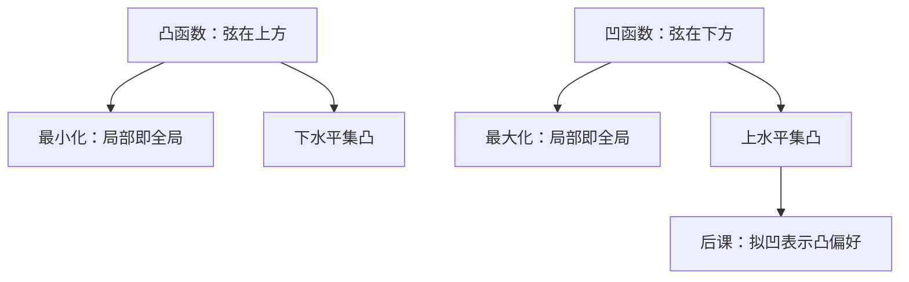

# 凸函数与凹函数

函数凸，说的是弦在图的上方；经济学里成本常取凸、效用常取凹，两者是同一几何的符号翻转。

<footer>—— 据 Boyd and Vandenberghe, Convex Optimization, 第 3 章；Mas-Colell, Whinston and Green 数学附录整理</footer>

上一课[凸集与凸组合](/econ/convex-set-combo)把可行域收成凸集。目标函数仍可以任意弯曲：在凸预算上最大化一个「喜欢极端」的函数，最优仍会跳到顶点。缺口是函数自身的形状。本课只定义凸与凹，以及它们与一阶、二阶条件的接口；不把约束优化证一遍。

## 问题

$f:C\to\mathbb{R}$ 在凸集 $C$ 上为**凸函数**，若对一切 $x,y\in C$、$t\in[0,1]$，
$f(tx+(1-t)y)\le t f(x)+(1-t)f(y)$。弦在图的上方。凹函数把不等式反过来：弦在图的下方。$f$ 凹当且仅当 $-f$ 凸。最小化凸函数、最大化凹函数，局部最优即全局最优——这是后课敢用一阶条件代替全局搜索的原因。

支出最小化里成本对产量凸（规模不经济或线性）；利润对价格凸（包络是线性函数族的点态上确界）。效用表示若凹，则偏好凸；反之，凸偏好只保证存在拟凹表示，不一定有凹表示。拟凹：$\{x:f(x)\ge\alpha\}$ 皆凸。后课[凸偏好](/econ/convex-preference)要的是拟凹，本课先把凸/凹本身钉死，以免把基数凹当成序数凸。

### 凸函数不是凸集

日常把「凸」乱套。凸集是点集含线段；凸函数是函数值不超过弦。凸函数的**下**水平集 $\{x:f(x)\le\alpha\}$ 才是凸集；凹函数的**上**水平集才是凸集。把效用图画成「凸向原点」的无差异曲线，对应的是上优集凸，即拟凹，不是 $u$ 凸。$u$ 若凸，决策者喜欢极端，与标准凸偏好相反。

仿射函数既凸又凹。线性预算的支出 $p\cdot x$ 是仿射，对偶里它两边都好用。

## 方法

可微时：凸 $\Leftrightarrow$ $f(y)\ge f(x)+\nabla f(x)^\top(y-x)$（一阶下估）。二阶：Hessian 处处半正定则凸（$C^2$ 时也接近必要）。凹则 Hessian 半负定。后课[无约束一阶与二阶条件](/econ/unconstrained-fonc)会用这块：凹目标的一阶条件充分。

凸函数在开凸集的内部连续，几乎处处可微（有限维）。经济学里常直接假设 $C^1$ 或 $C^2$，不是因为定理需要光滑，而是后课比较静态要导数。次梯度 $\partial f(x)=\{g:f(y)\ge f(x)+g^\top(y-x)\ \forall y\}$ 在不可微点取代梯度；成本函数在价格网格的折点处用次梯度，Shephard 引理的集值版。本课不展开凸分析计算。

保凸运算：非负加权和、点态最大值、仿射复合 $f(Ax+b)$。这解释了「一族线性利润的上包络仍凸」。

## 机制

弦在上方意味着沿任何方向差商不降：越往右，斜率越大。这就是边际成本递增、边际效用递减（凹效用）的同一句话。没有它，一阶切点可以是极小而不是极大，Lagrange 会指向最差点。

严格凸：弦**严格**在图上方（$x\neq y$，$t\in(0,1)$）。严格凸的最小化至多一个解；严格凹的最大化至多一个解。后课把马歇尔需求写成函数，默认的就是严格凹效用（或严格凸偏好）加上严格凸预算几何。完全替代是凹但不严格凹的边界：最优可以是整段。

单调变换保住拟凹，毁掉凹。$\log u$ 与 $u$ 表示同一偏好，一个凹一个可以不凹。优化算法在乎你写哪一个数字；偏好理论在乎拟凹。

## 边界

本课不讲凸共轭、Fenchel 对偶的计算细节，那是附录。也不把风险厌恶读进来：彩票上的凹是后课[风险厌恶与阿罗–普拉特](/econ/risk-aversion)，对象不是 $\mathbb{R}_+^n$ 里的确定消费。下一课把凸函数改写成上境图，为分离做几何准备。

后课默认：说「凹效用」时知道它给出凸偏好且让最大化一阶条件充分；说「凸成本」时知道最小化局部即全局。

## 小结

- 凸：弦在图上方；凹是符号翻转。局部最优即全局最优。
- 可微时一阶下估、Hessian 半正定刻画凸。
- 拟凹管上水平集凸，是偏好凸；凹更强，会被单调变换毁掉。
- 严格凹给单值需求；不严格则最优可成线段。
- 下一课：[上境图与下水平集](/econ/epigraph-sublevel)。
- 出处：Boyd and Vandenberghe, *Convex Optimization*；MWG 数学附录。
