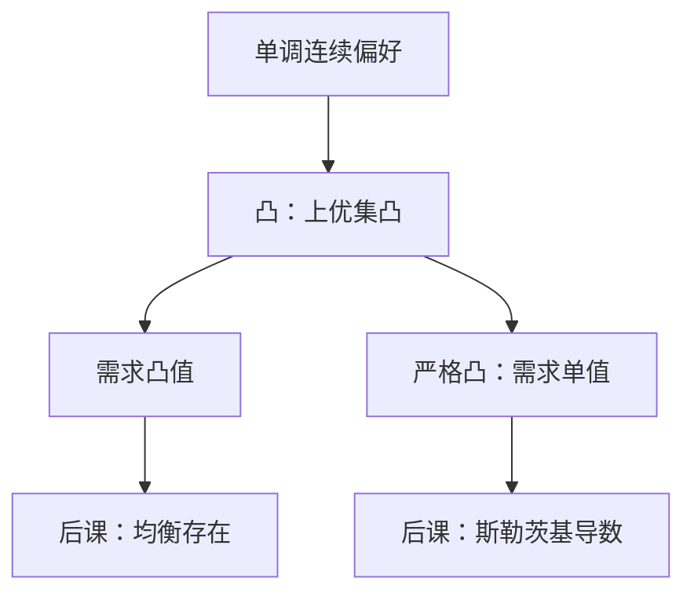

# 凸偏好

凸偏好说的是：若两束都不差于某一束，它们的平均也不差于该束。平均被讨厌时，需求可以是一段，均衡存在更脆。

<footer>—— 据 Debreu, Theory of Value, 1959；Mas-Colell, Whinston and Green, Microeconomic Theory 第 3 章整理</footer>

上一课[单调与局部非饱和](/econ/monotonicity-lns)让最优花光预算。本课不重讲局部非饱和，也不再定义闭优集。缺口是：单调连续仍可非凸。无差异集可以向「平均更差」弯曲；这时马歇尔需求集值，超额需求没有凸值，后课一般均衡的不动点更脆。本课只加凸。

## 问题

上优集 $\{y:y\succsim x\}$ 可以闭、可以「多多更好」，形状仍自由。若两束都不差于 $z$，平均却严格更差，决策者会在两端跳，中间不碰。价格微调时，最优从左端跳到右端，需求对应不是凸值。Kakutani 要用凸值上半连续对应；没有凸偏好，存在性证明缺一块。

缺口不是再要一次单调，而是平均是否被接受。凸偏好：若 $x\succsim y$，则对一切 $t\in[0,1]$，$tx+(1-t)y\succsim y$。严格凸：若 $x\succsim y$ 且 $x\neq y$，则中间严格更好。前者让需求凸值；后者让需求单值。可凹的 $u$ 表示凸偏好；严格拟凹对应严格凸。本课不重写[效用函数何时存在](/econ/utility-representation)的 Debreu 定理，只把形状加在已有连续表示上。

### 凸是多样性，不是风险厌恶

确定消费上的凸，说的是「不要走极端」：两种商品搭配比单押一种好。风险态度是彩票上的凹，对象不是 $\mathbb{R}_+^n$ 里的平均。不要把本课读成[风险厌恶](/econ/risk-aversion)。

无差异曲线「凸向原点」是两商品图上的口诀。精确定义是上优集凸，不必先画图。

## 方法

连续、凸、局部非饱和的偏好，在 $p\gg 0$ 的紧化预算上：最优集非空、闭、凸。严格凸则最优唯一，马歇尔需求可以写成函数。后课多数比较静态默认单值可微，以便写斯勒茨基；本课先承认：凸给对应，严格凸给函数。完全替代是凸但不严格凸的边界：价格比等于边际替代率时，最优是整段线段，对应凸值却不是单点——这是合法的正则边缘，不要误判成非凸。

Debreu 的均衡存在用的是凸偏好（再加连续性），让超额需求凸值。本课不把不动点证一遍，只指出缺口补在哪：没有凸，连续性和单调仍可能让人在两个极端之间跳跃，市场出清的对应没有凸值。

拟线性、位似是更窄的形状，不在本课。它们管收入效应，不管平均是否更好。凸可以与非位似共存：收入扩张路径可以弯曲，只要每条无差异集仍凸向原点。

## 机制

凸把「搭配」写成公理。边际替代率沿无差异集递减（在可微点）：越有更多的 $i$，越不愿意再拿 $j$ 去换 $i$。这是后课内部解切点画得出来的原因。非凸时，切点可能是极小而不是极大，一阶条件会骗你。Debreu 的存在性论证要的正是上优集凸，从而需求凸值、超额需求凸值；本课不把 Kakutani 证一遍，只把这块材料交给[均衡存在](/econ/ge-existence)。

集值需求不是缺陷。价格刚好使两个极端无差异，最优可以是整段线段——但那是凸组合，仍在最优集里。非凸的麻烦是最优集可能是两端、不含中点，对应不凸，均衡的存在与计算都失去标准工具。

生产一侧的凸技术与这里对偶：凸偏好让「更好」的集合凸，凸生产让可行集凸。两边一起，才有标准的福利定理几何。

## 边界

凸是方便，不是事实。不可分商品、规模门槛、上瘾，都会造出非凸。那时需求跳跃，均衡可能不存在或只存在混合。主干仍用凸，因为后面的存在性、福利定理、光滑需求都建立在它上面；非凸是对照，不是把本课改成产业组织。

也不要把凸偏好读成「效用可加」。可加可分是更强的结构；凸只约束平均。拟凹 $u$ 表示凸偏好，凹 $u$ 更强：凹是某个代表的基数形状，单调变换可以毁掉凹、保住拟凹。本课要的是偏好凸，不是某一个凹的数字。人际比较同样读不出来。严格凸有时过强，本课方法里已把完全替代留在凸、非严格的边上。

后课默认：消费者凸；写需求函数时默认严格凸。一般均衡存在性借这条凸值。

## 小结

- 单调连续仍可讨厌平均；凸把上优集收成凸集。
- 凸 ⇒ 需求凸值；严格凸 ⇒ 单值。
- 非凸让最优跳端点，均衡存在更脆。
- 拟线性、位似、风险态度都不是本课的形状。
- 出处：Debreu, *Theory of Value*；Mas-Colell, Whinston and Green 第 3 章。
