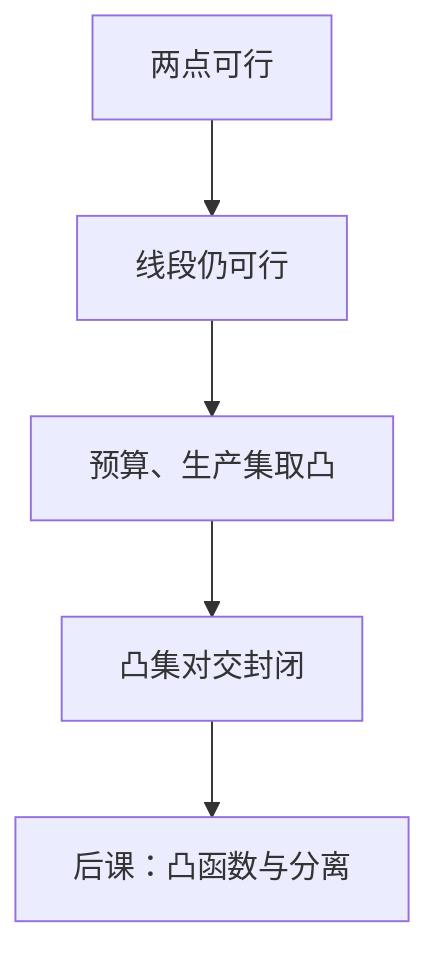

# 凸集与凸组合

凸集把「两种可行计划的加权平均仍可行」写成几何；平均一旦穿出集合，分离与均衡的标准工具就失效。

<footer>—— 据 Rockafellar, Convex Analysis, 1970；Mas-Colell, Whinston and Green, Microeconomic Theory 数学附录整理</footer>

上一课[欧氏空间与开集](/econ/euclidean-open-set)给了邻域、闭包与紧。可行域仍可以是任意形状：两个可行点的线段可能穿出集合，固定成本、整数约束都会造出这样的洞。缺口不是再定义开球，而是：哪些集合允许凸组合仍留在里面。后课的凸偏好、凸技术、分离超平面都先要这条。

## 问题

集合 $C\subset\mathbb{R}^n$ 为**凸集**，若对任意 $x,y\in C$ 与 $t\in[0,1]$，有 $tx+(1-t)y\in C$。等价地说，$C$ 含任意两点之间的线段。有限凸组合 $\sum_{i=1}^k\lambda_i x_i$（$\lambda_i\ge 0$，$\sum\lambda_i=1$）仍在凸集内。经济学翻译：若两种消费或两种工艺都可行，按比例混合仍可行。

预算 $\{x\in\mathbb{R}_+^n:p\cdot x\le w\}$ 是闭半空间与闭象限的交。半空间凸，凸集对交封闭，故标准预算凸。生产可能集若允许工艺的凸组合，也是凸集。后课[凸偏好](/econ/convex-preference)会把同一几何放在上优集上：平均不被讨厌。本课只钉集合，不谈偏好。

### 凸包不是「多买一点」

凸包 $\operatorname{conv}(A)$ 是含 $A$ 的最小凸集，由 $A$ 的所有凸组合构成。它不是单调性，也不是「集合变大一点」：非凸的两点集，凸包是中间整段线段。极值点不能写成其他两点的严格凸组合；线性规划的最优可以取在极值点，那是后课优化的事。Carathéodory：$\mathbb{R}^n$ 里凸包至多用 $n+1$ 个点。

空集与单点按定义凸。$\mathbb{R}^n$ 本身凸。凸不必开也不必闭：开球凸，闭球凸，半开线段也凸。

## 方法

凸集对交封闭，对凸组合封闭，对平移与正齐次缩放封闭。不对并封闭：两个凸集的并可以是两块不相交的团。这是后课「非凸技术让最优跳端点」的几何来源——可行域是两块的并时，平均可能不可行。

 Minkowski 和 $A+B=\{a+b:a\in A,b\in B\}$ 在 $A,B$ 凸时仍凸。交换经济里总供给是个体供给的 Minkowski 和；个体凸则加总凸。这是[存在性与不动点](/econ/ge-existence)能对总超额需求要凸值的前半段材料；后半段是偏好凸。本课不把均衡写出来。

相对内部与仿射包：有时预算落在超平面 $p\cdot x=w$ 上，集合在 $\mathbb{R}^n$ 里没有内点，但在仿射包里有相对内点。分离定理的严格版本要用相对内部，[分离超平面](/econ/separating-hyperplane)再补。本课只要求会认：降维的凸集仍然是凸集。

## 机制

线性约束的解集是超平面或半空间，它们凸；有限个线性不等式的交仍凸。所以「线性预算 + 非负」自动给出凸可行域，无需额外经济学假设。非线性约束则不然：$x_1 x_2\ge 1$ 的上侧在正象限凸，圆盘的补集不凸。后课 KKT 的正则条件会假设约束集合局部像凸的线性化；非凸约束让一阶条件既非必要也非充分。

凸可行域加上后课的凸目标，最优集本身是凸的：两个最优的平均仍可行、仍最优。对应因此凸值，Kakutani 才接得上。非凸时最优可以是两端、不含中点——那不是计算误差，是几何不允许混合。

整数商品把可行域收成格子。格子的凸包是连续松弛；松弛最优不必整数可行。主干先走凸，整数规划当对照。

## 边界

固定成本、规模门槛、0-1 进入，都会造出非凸。产业组织里这是常态，不是本课要消灭的现象。主干仍取凸，因为分离、KKT、均衡存在的标准证明都靠它。也不要把凸集读成凸偏好：集合凸是可行，偏好凸是「平均更好」，对象不同。下一课把形状从集合推到函数。

后课默认：预算与标准生产集凸；说最优集凸时，先检查可行域是否凸。

## 小结

- 凸集含线段；凸组合封闭；凸集对交封闭、对并不封闭。
- 线性预算自动凸；非凸来自整数、门槛、固定成本。
- 个体凸经 Minkowski 和传到加总，给后课超额需求凸值半边。
- 凸包是最小凸扩张，不是单调性。
- 下一课：[凸函数与凹函数](/econ/convex-concave-fn)。
- 出处：Rockafellar, *Convex Analysis*；MWG 数学附录。
