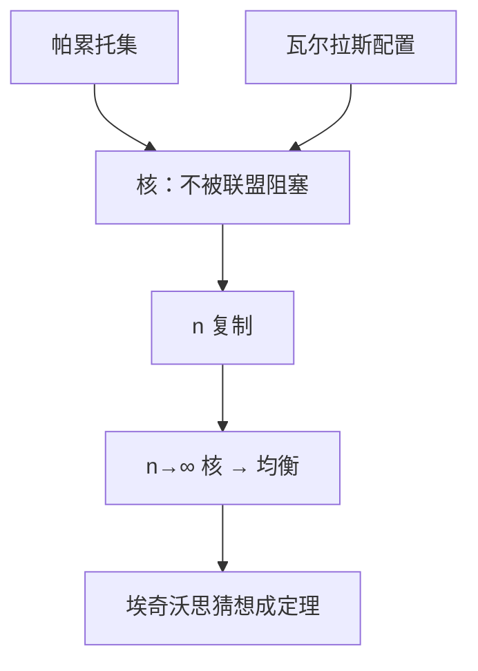

# 核与埃奇沃思猜想

当每类经济人被复制得充分多，核收缩到竞争均衡的配置；埃奇沃思的猜想在极限里成为定理。

<footer>—— Debreu and Scarf, A Limit Theorem on the Core of an Economy, International Economic Review, 1963；Edgeworth, Mathematical Psychics, 1881</footer>

[上一课](/econ/ge-existence)保证了竞争均衡在凸连续下非空，[福利第一定理](/econ/welfare-theorems)保证它有效。[埃奇沃思盒](/econ/edgeworth-pareto)里，有效点仍是一条曲线。缺口是：若不允许拍卖人，只允许联盟自己重新分配，哪些配置能站住？核比帕累托集更小；复制之后，核还会再缩到瓦尔拉斯配置。本课钉这句极限，不重写存在性证明。

## 问题

帕累托有效只防「全社会一起改进」，不防一小撮人带着自己的禀赋走开。配置 $x$ 被联盟 $S$ 阻塞（block），若 $S$ 仅用 $\sum_{i\in S}\omega^i$ 就能找出对 $S$ 中每人至少一样好、对某人严格更好的分配。核（core）是不被任何联盟阻塞的可行配置。核是帕累托集的子集：全社会是一个联盟；它通常仍比均衡集大。

两人盒里，核能挡住透镜外的点（两人联盟会回到互利交易），挡不住合同曲线上透镜内的一段——那一段没有更小的联盟可走。埃奇沃思猜想：把每类人复制 $n$ 份，$n\to\infty$，这段剩下的核会瘦成竞争均衡。Debreu–Scarf 把猜想写成极限定理。

### 阻塞不是价格，复制不是连续统

联盟只比较「带着自己的禀赋能否过得更好」，不报价格。复制是有限类型、每类 $n$ 人的序列，不是一开始就上测度空间。Aumann 的连续统经济里核直接等于均衡配置，那是同一思想的极限对象；本课用 Debreu–Scarf 的有限复制，假设更少、几何更清楚。

同等待遇：核配置必须给同一类型同样的束，否则被亏待的那一群复制人联盟阻塞。于是 $n$ 复制经济的核可以写回类型空间里的配置，再与原经济的瓦尔拉斯配置比较。

## 方法

原经济 $\mathcal{E}$ 有 $I$ 个类型。$n$ 复制 $\mathcal{E}_n$ 每类 $n$ 人，禀赋与偏好按类型复制。设 $C(\mathcal{E}_n)$ 为核。竞争均衡配置（按类型计）对一切 $n$ 都在核里：均衡已用价格让每人在预算上最优，任何联盟用自己的禀赋买到的总市值不超过总财富，无法人人更好——这是第一定理对联盟的加强。

Debreu–Scarf：在凸、连续、严格单调等标准假设下，

$$
\bigcap_n C(\mathcal{E}_n) = \text{瓦尔拉斯配置}.
$$

若某配置对一切复制都留在核里，则存在价格支撑它成为均衡。证明用分离：若不是均衡，存在一个对某些类型严格更好且总资源可被这些类型的整数组合负担的方向；当 $n$ 足够大，这个方向能被有限联盟执行。

## 机制

为什么复制会瘦核：两人盒里，「稍微偏向 $A$」的有效点之所以站住，是因为没有第三个 $B$ 可以和某个 $A$ 另开小灶。复制之后，吃亏类型的人可以跨过原来的配对，组成新联盟，用近似竞争的比例重新分。 $n$ 越大，联盟能逼近的再分配越细，只有那些已经能被价格支撑的点才挡得住所有整数组合的阻塞。

反向：均衡始终在核里，所以核从上面套住均衡集，从下面被复制收紧。极限里两边重合。这给竞争均衡一个不靠拍卖人的故事：人很多、类型少、可自由结盟时，讨价还价的剩余被竞争掉，只剩下瓦尔拉斯点。

核等价不要求真的看见价格。价格是支撑核极限配置的分离超平面，与第二定理的超平面是同一类对象。

### 同等待遇把核写回类型空间

$n$ 复制里若同一类型拿到不同的束，较差的那一群可以带着自己的禀赋走开，互分较好那一群的平均——凸性保证平均不差。故核配置必须同等待遇，讨论可以回到 $I$ 维类型空间，而不必盯着 $nI$ 个名字。Debreu–Scarf 的交集也在这个空间里取。

两人、不复制时，核是透镜与合同曲线的交，通常是一段。复制一次，新联盟能切掉靠近两端的点；再复制，剩下的段更短。几何上是合同曲线被越来越紧的「价格预算」夹住。极限不是过程收敛，是集合套。

竞争均衡在核里，对一切 $n$ 成立，不需要 $n$ 大。反向才要复制：核 $\subset$ 均衡只在极限。有限 $n$ 时核可以严格大于均衡集，讨价还价仍有余地。

## 边界

复制定理要类型有限、偏好凸。不可分商品、匹配市场里核可以空（Gale–Shapley 的稳定匹配是另一套解）。外部性使「联盟的资源」定义含糊：走开时是否带着污染。不完全信息使联盟不知道能承诺什么，核要改写成激励相容的版本，那是机制设计，不是本课。

连续统极限更干净，但丢掉了「有限联盟」的整数约束。实验与现场里结盟成本、沟通成本都为正，核能描述的是零成本可阻塞的基准。也不要把核收敛读成「交易一定走到竞争价格」的动态；它是集合套的极限，不是讨价还价过程的收敛定理。

后课离开这个无摩擦的合作解，问：若有些影响根本没有市场，核和均衡会一起失效。那是外部性。

## 小结

- 核是不被任何联盟用自己禀赋阻塞的配置；比帕累托集小，通常仍比均衡集大。
- 均衡始终在核里；复制使核收缩到均衡。
- Debreu–Scarf 把埃奇沃思猜想写成极限定理。
- 缺市场、不可分、不对称信息会拆掉核等价。
- 出处：Edgeworth, 1881；Debreu and Scarf, 1963。
