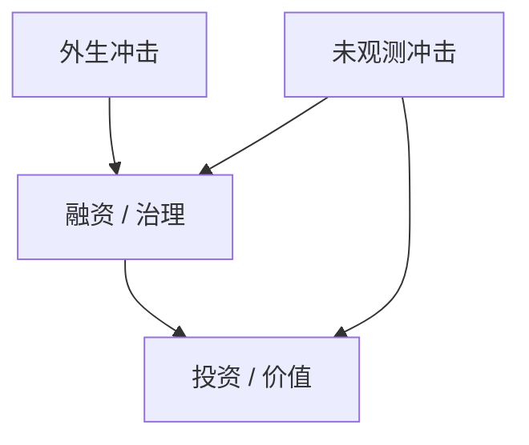

# 公司金融的实证识别

杠杆、投资与治理同时被同一未观测冲击驱动。没有设计，回归只是条件相关。

<footer>—— 对照 Angrist–Pischke 的设计语言；公司金融里 Rajan–Zingales、自然实验与 IV 的传统</footer>

[上一课](/econ/family-firms-pyramids)把 $V\neq C$ 写成结构。本课收束「公司金融进阶」：以后凡写「治理导致价值」，要能指出冲击从哪来。下一课才从[潜在结果](/econ/potential-outcomes)展开一般识别语言；这里只补公司金融特有的内生性，不把 Rubin 模型提前推一遍。

## 问题

投资对 $q$ 的回归、杠杆对利润的回归、独董对绩效的回归，都有反向因果与遗漏变量。自然实验：税法、管制、指数纳入、破产法庭、银行分支放松。IV 弱与排斥限制在公司治理里尤其脆（「法律起源」当 IV 的争论）。缺口是把本课程已有机制（权衡、优序、代理、控制权）映射到可辩护的设计，而不是再开一门计量。

Rajan and Zingales, *AER* 1998：依赖外部融资的行业 × 金融发展。Bertrand and Schoar 的经理人风格。Roberts and Whited 对公司金融识别的综述。

## 方法

先写反事实：同一家企业若治理/融资不同会怎样。再找使该差异近乎随机的冲击，并论证只经宣称渠道。差分：政策在时间与截面的交错。匹配与固定效应不能替代设计，只能减噪。与金字塔：控制权内生，用继承、创始人死亡等要非常小心排斥。与 ESG：评级机构方法论变更或强制披露，好过把 ESG 分数当外生。

## 机制

识别失败时，系数是选择与因果的混合物。例如高 $q$ 企业多投资，把 $q$ 当因果是把信息与机会混在一起。好的设计把 $D$ 的外生部分分离出来，对应本课程某一条机制（税盾、债务约束、控制权私人收益）。

## 边界

本课不发明新的 IV。聚类、弱 IV、双重差分平行趋势交给下一课程计量课序。贸易课序的跨国比较是另一套外生性（中国冲击等）。公司金融补层在此封口；下一课[潜在结果](/econ/potential-outcomes)。

## 小结

- 公司金融实证必须先有设计，再谈机制是哪一条。
- 治理与杠杆的回归默认有反向因果。
- 出处：Roberts and Whited 识别综述；Rajan–Zingales 1998；Angrist–Pischke 设计语言。
