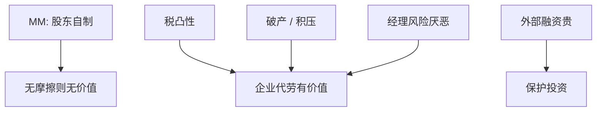

# 公司对冲的理由

    
在 MM 世界里股东自己能对冲，企业代劳没有价值；有税、破产成本、融资约束与经理风险厌恶时，企业风险管理可以改变真实投资。

    <footer>—— Smith and Stulz, The Determinants of Firms' Hedging Policies, Journal of Financial and Quantitative Analysis 1985；Froot, Scharfstein and Stein, Journal of Finance 1993</footer>

[上一课](/econ/insider-trading-theory)把经理的信息与交易写完。对冲是经理与企业改变风险暴露的合同。本课缺口是：为何公司要做衍生品与保险，而不是留给股东。不重写内部人租金，不把衍生品定价或限价簿写成主体。

## 问题

[MM 1958](/econ/modigliani-miller)：切片与自制杠杆无关，自制对冲同样。Smith–Stulz：凸的税函数、破产成本、经理凹效用，使企业层面降波动有价值。Froot–Scharfstein–Stein（FSS）：外部融资贵时，内部现金流波动导致投资波动；对冲使好项目不因汇率或利率冲击而停摆——把优序与实物期权接到风险管理。缺口是列出许可证，禁止「降低 beta 就能提高价值」——可分散风险不进 CAPM 门槛，对冲可分散风险不改变 $r_U$，只改变融资摩擦与税。

FSS：对冲的是与投资机会相关的现金，而不是把所有波动对冲到零。投资机会与现金正相关时，对冲需求下降——自然对冲。

## 方法

许可证清单：（1）税：累进或税损不对称，平滑应税所得提高税后现金；（2）困境：降低 $V$ 碰到 $V_B$ 的概率，税盾更安全，债务容量上升——动态权衡带变窄或中心上移；（3）融资约束：保证 capex 不中断；（4）经理：薪酬与人力资本不可分散，企业代为对冲可能降低风险补偿，或让经理敢投正 NPV（否则他们用高门槛自我保险）；（5）比较劣势：股东无法复制的保险（商品、特定税收）。

不是许可证：降低可分散风险以「降低 WACC」——除非通过（2）（3）改变真实杠杆或投资。资本预算：对冲成本进 FCFF 或 APV，不要把 WACC 减去一个「对冲折扣」。

与国家风险：汇率对冲是 $\lambda$ 的操作，不能替代征收情景。与空壳：债权人要求对冲作为契约，是条款课的延续。

## 机制

机制是摩擦使波动进入真实支出。税与破产是非线性；融资优序使内部现金的影子价格高。对冲把状态之间的现金挪到投资影子价格高的状态。这与家庭保险同构，对象是企业投资，不是消费欧拉的再推导。

代理阴暗面：经理对冲自己的职业风险，股东要的暴露被对掉；或用衍生品做投机、隐藏杠杆——对冲账户变成择时与赌博。董事会监督与披露是治理，不是定价模型。

### 不要用对冲替代国家风险溢价的情景

把 CRP 加进 WACC 又把现金流当成已对冲，口径混乱。能对冲的进成本，不能对冲的进情景或 $\lambda$，与第一单元最后一课一致。

Smith–Stulz *JFQA* 1985。Froot, Scharfstein and Stein, *JF* 1993。Brealey–Myers 把「股东自己能做的」排除出公司对冲清单。

## 边界

不要把本课写成期权希腊字母。下一课现金持有：对冲的替代是囤现金与信贷额度，同一 FSS 逻辑。ESG 会把目标函数从股东价值扩开，对冲清单跟着变。

后课默认：公司对冲只在税、困境、融资约束或经理激励下创造价值；不降低可分散风险的 $r_U$。投机性衍生品是治理问题。

## 小结

- MM 下企业对冲无价值；税、破产、优序融资约束给出许可证。
- FSS：对冲保护外部融资贵时的投资，不是把 beta 对到零。
- 成本进现金或 APV；禁止用「对冲降低 WACC」当接受规则。
- 出处：Smith and Stulz, *JFQA* 1985；Froot, Scharfstein and Stein, *JF* 1993。
