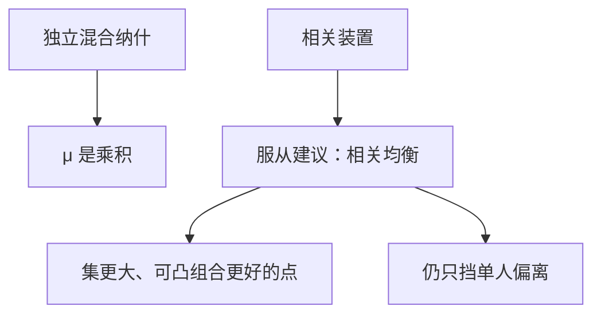

# 相关均衡

若有一个公开的相关装置向每人发出（可私人的）建议，服从建议可以在独立混合无法达到的支付上站住。

<footer>—— Aumann, Subjectivity and Correlation in Randomized Strategies, Journal of Mathematical Economics, 1974</footer>

[上一课](/econ/mixed-strategy)把有限博弈的存在性收成独立混合纳什：每人自己掷骰子，支撑内无差异。缺口是相关：若有一个公共随机装置——信号、调解人、与支付无关的阳光——均衡集能否更大？Aumann 的相关均衡（CE）回答这一问。本课扩大均衡集，不重写角谷存在性，也不进入扩展式。

## 问题

调解人按分布 $\mu$ 抽行动组合 $s$，向 $i$ 只出示 $s_i$。服从是均衡，若对每一推荐 $s_i$、每一偏离 $s_i'$，

$$
\sum_{s_{-i}}\mu(s_i,s_{-i})u_i(s_i,s_{-i})\ge\sum_{s_{-i}}\mu(s_i,s_{-i})u_i(s_i',s_{-i}).
$$

即：听说自己的建议后，按建议做不差于改招。独立混合纳什是 $\mu$ 为乘积测度时的特款。CE 集凸，包含纳什的凸包，且可以严格更大。

鸡博弈（两人同时选直闯或让）：混合纳什让「对撞」概率为正。相关装置可以只在「（让，直）」与「（直，让）」之间抛硬币，从不建议对撞——两人仍愿服从，因为以为对方会直闯。期望支付帕累托优于混合纳什。

### 相关不是可执行合约

调解人不能强迫，也不能让两人联合改招。偏离仍是单人的。CE 是非合作解，只是信息可以相关。合作的核允许联盟一起走开；这里联盟没有行动。不要把相关均衡写成「商量好了就不算博弈」。

公开相关（大家都看见同一硬币再各自混合）是 CE 的子集。私下建议可以更细：每人只看见自己的坐标，条件信念不同。Aumann 1974 的对象包含私下相关。

## 方法

对象：有限策略式。CE 是满足上述线性不等式的 $\mu\in\Delta(S)$。可行集是多面体，线性规划可算（给定支付）。存在性免费：纳什非空则 CE 非空。

与可理性化对照：可理性化不管信念是否来自同一个 $\mu$；CE 要求有一个公共的 $\mu$，每人的条件信念都由它经贝叶斯得到，并且愿意服从。CE 因此比「每人头脑里各有一套相关猜想」更紧，又比独立纳什更松。

## 机制

相关起作用，是因为它改变条件信念。听到「让」，我推断对方被建议「直」，于是让是最优；对方对称。独立混合做不到这种「保证不对称」：各掷各的，对撞概率乘出来。公共随机化若在行动前被双方看见，再协调到纯纳什的某个凸组合，已经能改善鸡博弈；私下建议在更复杂的博弈里还可以达到公开随机化达不到的点。

这与[太阳黑子](/econ/sunspot-equilibrium)同构：外在信号不改支付，只改协调。那里对象是价格函数，这里是行动建议。完全市场熄灭黑子，是因为可以保险；博弈里没有「对冲别人行动」的证券，相关可以站住。

### 计算落在不等式，不落在掷骰子故事

检查一个 $\mu$ 是不是 CE，只验证每条建议下的单人最优。不必解释调解人从哪来——可以是制度、惯例、或「大家都看见的无关新闻」。Aumann 1987 把 CE 读成贝叶斯理性加共同先验的策略式含义：相关来自对世界状态的共同不确定，不一定真有一个抽签人。

粗相关均衡只推荐纯策略组合；一个信息集上再混合，是更细的随机化，一般不扩大支付集。教科书主钉粗 CE。不要把相关装置写成限价簿的公开报价流。

## 边界

CE 不挑哪一个 $\mu$，与无名氏同样是可能性。扩展式里，相关要写进信息集上的建议，颤抖与序贯理性会再切一刀。不完全信息的相关均衡是另一套（Forging 共同先验）。

后课把博弈写成树：同时行动的相关装置不够，空威胁会出现。本课默认：谈到随机化，先分清独立混合与相关；CE 由线性服从约束刻画，集合含纳什且可严格更大。

## 小结

- 独立混合是乘积；相关均衡允许公共（可私下）建议。
- 服从约束是线性的；集合凸，可帕累托优于混合纳什。
- 仍是非合作：只挡单人偏离。
- 外在信号不改支付，只改条件信念。
- 出处：Aumann, *JME*, 1974；*Econometrica*, 1987。
