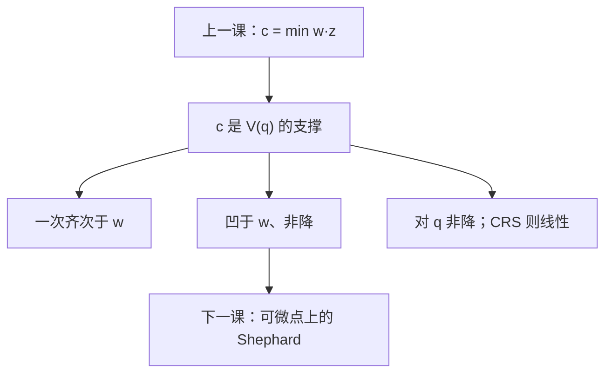

# 成本函数性质

成本是投入需求集的支撑函数：对要素价格一次齐次、非降、凹；这些在包络引理之前就已经从线性目标推出来。

<footer>—— 据 Varian, Microeconomic Analysis；McFadden, Duality of Production, 1978 整理</footer>

[上一课](/econ/cost-minimization)（成本最小化）。定义了 $c(w,q)=\min_z w\cdot z$ s.t. $f(z)\ge q$，并在边注里点过齐次、凹与 Shephard。本课不重解那道规划，也不把 TRS $=w$ 比再写一遍。缺口是把值函数的性质收成定理：**在对 $w$ 求导读出 $z$ 之前，$c$ 已经必须满足哪些等式与不等式。** 下一课才把包络升级成引理。

## 问题

$c$ 是最优值，不是又一个任意的会计科目。任意光滑函数不能当成本用：若它不是一次齐次，按比例改货币单位会改「真实」投入；若它对 $w$ 不凹，要素价格的平均会比平均成本更贵，与「同一 $z$ 仍可行」矛盾。缺口是列出对偶清单，使后课看到一个 $c$ 就能还原技术，而不必先信某个 $f$ 的函数形式。

投入需求集 $V(q)=\{z:f(z)\ge q\}$。则 $c(w,q)=\inf\{w\cdot z:z\in V(q)\}$，即 $V(q)$ 的支撑函数。支撑函数的性质不依赖 $f$ 可微，列昂惕夫的角点也包括在内。

### 先性质，后引理

Shephard 说 $\nabla_w c=z$。那是可微点上的包络，下一课专写。本课的齐次、单调、凹，在不可微时仍成立，而且它们约束着「什么样的导数（若存在）配得上一个 $c$」。把引理写在性质前面，会让人以为成本函数只有那一条导数公式。

一次齐次：$c(\lambda w,q)=\lambda c(w,q)$，$\lambda>0$。最优 $z$ 不变，只是账单乘 $\lambda$。这也是「没有货币幻觉」：要素价格与成本同单位。

## 方法

从定义推，不猜函数形式。

- 齐次：可行集不随 $\lambda$ 变，$w$ 换成 $\lambda w$，目标同倍。
- 非降：$\tilde w\ge w$ 则同一 $z$ 更贵，下确界不能更低。
- 凹于 $w$：对任意 $w,w'$ 与 $\theta\in[0,1]$，$c(\theta w+(1-\theta)w',q)\ge\theta c(w,q)+(1-\theta)c(w',q)$ 的方向其实是凹——支撑函数对价格是凹的：平均价格下，厂商仍可用原最优投入，成本不会高于平均值；最优化只会更省，故 $c$ 凹。
- 对 $q$ 非降：$V(q)$ 随 $q$ 缩小（自由处置下）。
- [一次齐次 $f$](/econ/homothetic-production)：$c(w,q)=q\,c(w,1)$。凸 $V(q)$ 时 $c$ 对 $q$ 凸。

连续：在 $w\gg 0$ 上，非空闭 $V(q)$ 给出有限 $c$；$w$ 碰到轴时可能爆炸或要允许 $+\infty$。

本课不选 $q$，也不引入产品价格 $p$。利润函数的齐次与凸是平行清单，留给供给课。

## 机制

凹的机制是点态极小：每个固定 $z$ 给出线性账单 $w\cdot z$，$c$ 是它们的下包络，故对 $w$ 凹（$c(\theta w+(1-\theta)w')\ge\theta c(w)+(1-\theta)c(w')$）。无替代时 $z$ 钉死，$c$ 对 $w$ 线性；能替代时一种要素变贵就换掉，成本上升慢于线性。不要用「平均两套投入」去证凹——混合可行计划管的是 $c$ 对 $q$ 凸。

齐次的机制是会计：没有相对价格以外的绝对尺度。CRS 把产量从 $V(q)$ 里提出去，剩下单位等产量的支撑，于是 MC 不随 $q$ 变——上一课已经用过这句，本课把它认作 $c$ 的性质而不是 $f$ 的再计算。

凹加一次齐次，意味着 $c$ 对 $w$ 的超梯度（条件需求）本身零次齐次，且满足负半定的替代矩阵——那是下一课导数存在之后的可积条件，本课只把凹钉住。

## 边界

要素配额、不可逆投入，使当期 $V(q)$ 不再是技术课那个静态集，$c$ 对某些 $w$ 的导数会「卡住」。联合产出时 $q$ 是向量，支撑对 $w$ 的性质不变，对 $q$ 的单调变成对产出价格的对偶。整数投入让 $c$ 对 $q$ 跳。

也不要把账本上的历史成本当成 $c(w,q)$：支撑函数永远是当期 $w$ 的前瞻最小值。

后课默认：$c(\cdot,q)$ 是 $V(q)$ 的支撑，对 $w$ 一次齐次、非降、凹；CRS 时对 $q$ 线性。可微点上的导数等式下一课再写。

## 小结

- 成本函数是投入需求集的支撑，性质来自线性目标加可行集，不来自猜 $f$。
- 对 $w$：一次齐次、非降、凹；对 $q$ 非降；CRS 则 $c=q\,c(w,1)$。
- 这些在 Shephard 之前成立，折拐技术也包括。
- 下一课在可微点把 $\nabla_w c$ 读成条件需求。
- 出处：Varian, *Microeconomic Analysis*；McFadden, 1978。
