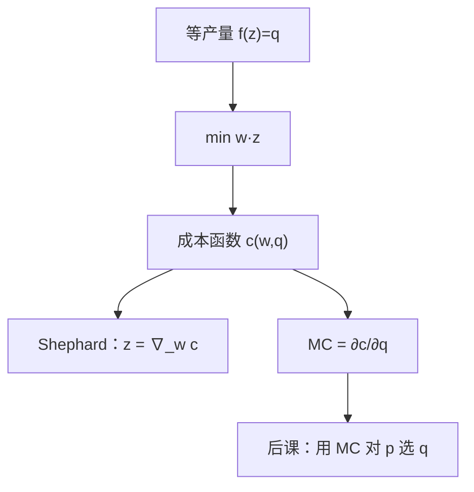

# 成本最小化

成本函数对要素价格的导数就是条件要素需求——不必再解一次规划，包络已经把最优投入读出来。

<footer>—— 据 Shephard, Cost and Production Functions, 1953 整理</footer>

上一课[技术、规模报酬与替代](/econ/production-technology)钉了生产集 $Y$ 与等产量，价格还在场外。本课不重讲 $Y$ 的凸与锥，也不把 TRS 再定义一遍。缺口是：后课利润、供给、短长期都要把「生产 $q$ 要花多少钱」写成要素价格的函数。没有这层对偶，边际成本没有来源。

## 问题

技术只说哪些 $(z,q)$ 可行。市场给要素标价 $w\gg 0$ 之后，同一 $q$ 仍可有许多投入组合。若每次都把原始的 $Y$ 拿去跟产出价格一起做利润最大化，后课无法把「已定产量上的成本」与「再选产量」拆开，短长期更没有语言。缺口是先解条件问题

$$
c(w,q)=\min_z\, w\cdot z \quad\text{s.t. } f(z)\ge q,
$$

得到成本函数与条件要素需求 $z(w,q)$。产量此时是参数，不是选择。利润最大化把 $q$ 内生化，是下一课。

内部解且光滑时，切条件为 $\mathrm{TRS}_{jk}=w_j/w_k$，即上一课的技术替代率被要素价格比钉住。这与消费者的 MRS 等于价格比同构，但对象是 $f$ 不是 $u$，不要把支出函数的符号直接搬过来当成本——对偶平行，定义域不同。

### 条件需求不是要素的市场供给反函数

$z(w,q)$ 是：产出锁死时，要素价格变，厂商如何换投入。它不回答「要素市场出清多少」，也不回答「产出卖多少」。把条件劳动需求画成劳动市场的需求曲线，漏了 $q$ 随产品价格变动的那一层。后课完全竞争会把两层叠回去；本课只钉条件这一层。

Shephard 引理：$\nabla_w c(w,q)=z(w,q)$。成本对 $w$ 凹、一次齐次，对 $q$ 递增。这些性质来自 $Y$ 的几何加线性目标，不必再对 $f$ 的函数形式打赌。

## 方法

给定 $w$ 与 $q$，在等产量上找支撑超平面 $w$。凸技术保证切点（或支撑集）给出最小成本。$c(\lambda w,q)=\lambda c(w,q)$：$w$ 与成本同倍，最优投入不变。$c$ 对 $w$ 凹：要素价格的平均不比平均成本更省——这是包络，与偏好凸性推出支出函数凹是同一套对偶。

边际成本 $\mathrm{MC}(q)=\partial c/\partial q$，平均成本 $\mathrm{AC}=c/q$。CRS 时 $c(w,q)=q\,c(w,1)$，MC 等于 AC 且不随 $q$ 变。DRS 时 MC 上升。IRS 时本课的最小化仍可写，但后课竞争供给会出问题——那是技术课已经埋的锥。

本课不选产出。$p$ 尚未进入厂商问题。也不把 $c$ 写成沉没或固定——那是短长期课的分类，这里一切投入都在 $z$ 里、都可按 $w$ 付。

## 机制

为什么导数就是需求：最优值对参数的一阶变化只走直接的价格项，约束里的调整被一阶条件消掉。这就是包络。于是估计 $c$ 再求导，与估计 $z$ 是同一信息，后课实证与理论都用这条路，不必每次回到 $f$。

TRS 被 $w$ 比钉住的机制：若技术上用一点要素 $j$ 能替代要素 $k$ 的比率高于价格比，成本还可以沿等产量下降。切则这个方向消失。替代弹性越大，同一 $w$ 变动引起的 $z$ 对调越猛，成本越「平」——$c$ 对 $w$ 更凹。

消费者支出函数 $e(p,u)$ 与这里的 $c(w,q)$ 对偶同构：$u$ 换成 $q$，$p$ 换成 $w$。不要把间接效用的 Roy 恒等式误写成 Shephard；Roy 对的是间接效用，下一课利润函数才有 Hotelling。

## 边界

$f$ 不可微、等产量有折拐时，Shephard 改成超微分，条件需求可以是集值。要素配额、不可逆投入，会让「给定 $q$ 立刻重选全部 $z$」不成立，那是下一课之后的沉没。本课默认一切投入在当期按 $w$ 租用。

也不处理要素市场垄断： $w$ 是参数。买方垄断把 $w$ 变成选择，本课序的市场结构走产品侧，不在这里改要素价格的含义。

联合生产时 $q$ 是向量，谢泼德仍成立，边际成本变成梯度。配额与不可逆投入把「当期重选全部 $z$」关掉，那是沉没课。也不把 $c(w,q)$ 当成账本上的历史成本：这里只有前瞻的 $w\cdot z$ 最小值。

后课默认：生产 $q$ 的最小支出是 $c(w,q)$；条件要素需求由 Shephard 引理读出。

## 小结

- 产量先当参数；成本最小化把 $Y$ 对偶成 $c(w,q)$。
- 切条件是 TRS 等于要素价格比；Shephard 用包络读条件需求。
- $c$ 对 $w$ 凹且一次齐次；CRS 时 MC 不随 $q$ 变。
- 下一课把 $q$ 放开，用利润最大给出供给。
- 出处：Shephard, *Cost and Production Functions*, 1953；Mas-Colell, Whinston and Green 第 5 章。
