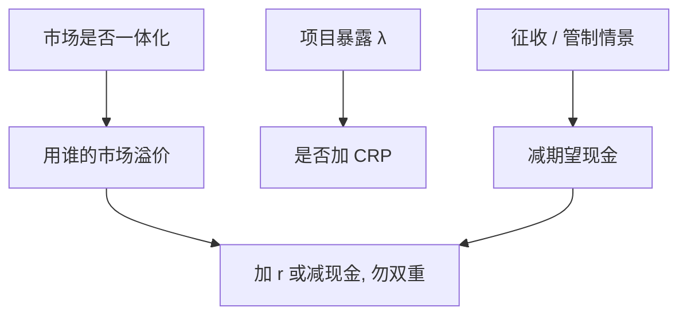

# 国家风险溢价

    
国家风险不是把主权利差一律加进每个项目的折现率；能分散的宏观冲击与不能分散的征收、外汇管制，应当分别进折现率或进现金流情景。

    <footer>—— 据 Damodaran 对国家风险溢价的操作讨论；Erb, Harvey and Viskanta, Journal of Portfolio Management 1996；Brealey, Myers and Allen 整理</footer>

[上一课](/econ/inflation-valuation)要求货币口径匹配。本课缺口是跨境项目：主权违约、征收、资本管制是否进入 $r$，以及「国家 beta」与公司/项目暴露的差别。资本预算单元到此收束。不重写 Fisher 方程，不把新兴市场股票异象写成量化栏因子。

## 问题

CAPM 的市场是谁的市场？全球一体化下，可分散的国别冲击不进全球投资者的要求回报；分割市场下，本国投资者的市场组合含大量本国风险，溢价更高。实务把主权债券利差加在成熟市场溢价上，当作国家风险溢价（CRP），再乘一个公司对国家的暴露。缺口是：主权利差补偿的是本币国债的违约与流动性，不是每个项目的经营风险；出口商收入在美元、成本在本地，暴露不是 1。把 CRP 一律加进 WACC，又把同一征收风险在情景里再扣一次现金，是双重计算。

Tirole：政治风险往往不可保、不可分散到全球股东之外，应进期望现金流（征收概率 × 损失）或进短于名义期限的回收路径。Brealey–Myers：能买保险或对冲的，进成本不进 $r$；不能的，才考虑溢价。

Erb–Harvey–Viskanta 用国家信用风险度量与股票回报做截面联系。这是投资组合证据，不是许可证把同一利差加到水电与出口加工的同一个 WACC 上。

## 方法

先定投资者与计价货币。全球投资者 + 美元现金：用美元 $r_f$ + 全球溢价 $\times$ 项目对全球市场的 beta；国家特有的征收与管制用情景减期望现金，或加一个与暴露成比例的 CRP。本地投资者 + 本币现金：用本币名义 $r$（已含通胀与本币风险溢价），不要再把美元主权利差加一层。

暴露：$\lambda=$ 收入/成本/资产在该国不可转移的比例。CRP $\times\lambda$ 加在 $r_U$ 上是粗糙线性。更好：现金流按政权情景加权，折现仍用无征收世界的 $r_U$。两种方法选一种，写进假设。

可比：用同国纯业务的 $\beta_A$ 已含部分国家周期；再加全额主权利差会部分重复。Damodaran 的 $\lambda$ 调整是为减轻重复，不是精确识别。

## 机制

机制是风险由谁承担、能否交易。全球 CAPM 下，国家消费与全球市场的协方差进 beta；征收是跳跃、常与全球 $R_m$ 弱相关，但对不可分散的控制权损失是财富税。加折现率把后期现金压得更狠（期限越长罚得越重）；征收若是一次没收，现金流情景更贴。长期特许权对折现率法极敏感——又回到终值课：一个 CRP 可以把 NPV 符号改掉。

宏观课序在前：主权违约、美元主导、资本管制已有总量语言。本课不重写 Eaton–Gersovitz，只把企业项目接到：政府是合同的一方，NPV 是在该合同可执行前提下的现值。

### 不要用国家评级替代项目分析

同一国的资源特许与移动支付，征收与外汇暴露不同。国家评级是主权债，不是项目 beta。母公司担保、离岸结构、双边投资协定，改变的是 $\lambda$ 与回收，不是把 CRP 设为零的借口——转移定价与担保本身有成本，应进 APV。

双重计算的典型：WACC 加主权利差，情景再假设超通胀与冻结股息。选一种主通道，另一种只作敏感性。

## 边界

本课结束「把项目折成今天的钱」。不估计全球市场溢价的「正确」数字，不进入限价簿。下一单元资本结构动态：Leland 把税盾与违约放进扩散，项目 $V$ 变成状态变量——贴现装置带到那里，不再争论 IRR。

后课默认：国家风险要么进暴露调整的溢价，要么进现金流情景，禁止双重；货币口径承接上一课。项目暴露不是主权利差本身。

宏观课序在前给出主权与美元；本课只做企业资本预算的接口。

## 小结

- 国家风险溢价不是主权利差对每个项目的一律加成。
- 一体化、计价货币、暴露 $\lambda$ 决定加 $r$ 还是减现金；二者只选主通道。
- 资本预算单元收束：NPV 口径、WACC/APV、终值、倍数、RI、期权、租赁、NWC、通胀与国家风险已经齐。
- 出处：Erb, Harvey and Viskanta 1996；Damodaran；Brealey, Myers and Allen。
