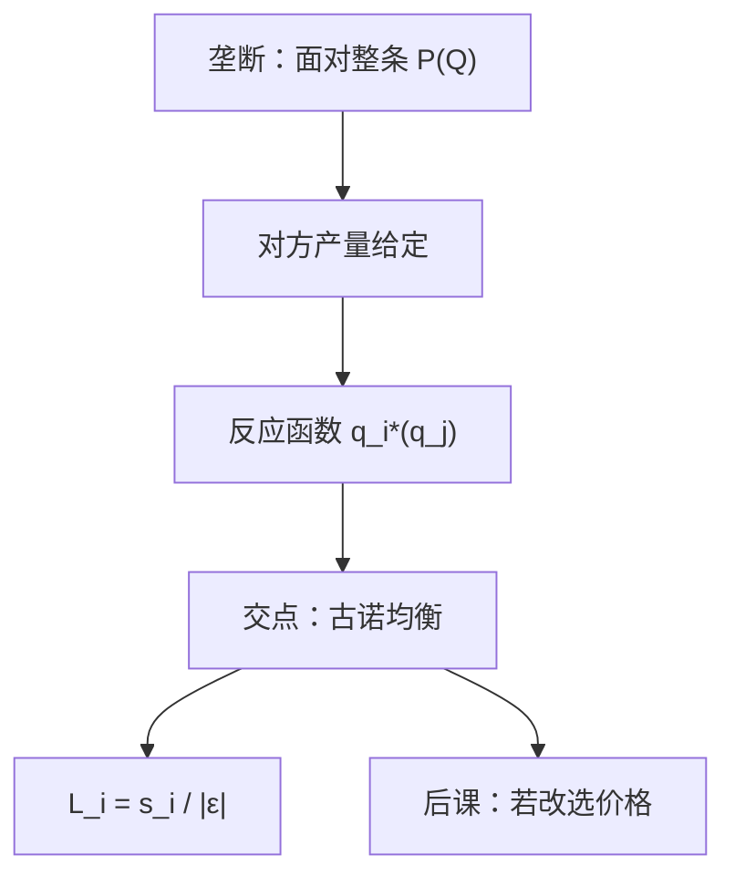

# 古诺数量竞争

两家矿主各自选定产量，价格由总产量在需求上读出；均衡是每家都在对方产量给定时做到最优。

<footer>—— 据 Cournot, Recherches sur les principes mathématiques de la théorie des richesses, 1838 整理</footer>

上一课[价格歧视三级](/econ/price-discrimination)仍是一家卖方，最多把需求拆成组别。本课不重讲按弹性加价。缺口是：$n=1$ 拿掉之后，若剩下几家同质产品的厂商，谁也不是面对整条 $P(Q)$ 的垄断者，谁也不是上一课序完全竞争里的价格接受者。必须给一个同时选择的策略变量：Cournot 选的是数量。

## 问题

两家，成本 $c_i(q_i)$，反需求 $P(q_1+q_2)$。厂商 $i$ 把对方产量当给定，解

$$
\max_{q_i}\, P(q_i+q_j)q_i-c_i(q_i).
$$

一阶条件是 $\mathrm{MR}_i=\mathrm{MC}_i$，其中 $\mathrm{MR}_i=P+q_i P'$，与垄断同一公式，只是弹性要按**剩余需求**来算。相互最优反应的交点是古诺均衡。缺口不是从零讲「什么是博弈」——纳什课序在后——而是把垄断的 MR 改成「给定别人已经放在市场上的数量」。勒纳变成 $L_i=s_i/|\varepsilon|$，$s_i$ 是份额：一家时 $s_i=1$，回到上一课；份额趋于零时 $L_i\to 0$，回到完全竞争。

对称、常数 MC、线性需求时，均衡总产量在垄断与竞争之间，随 $n$ 增加趋向 $P=\mathrm{MC}$。这给出市场结构课序的连续对照，不必另起一套福利语言。

### 反应函数不是供给曲线

$q_1^*(q_2)$ 是：对方若真产 $q_2$，我的最优产量。它向下倾斜（策略替代，在通常需求下）。行业供给曲线是价格接受加总，上一课序才有。把反应函数画成供给、再与需求相交，会把策略互动读成竞争均衡，份额公式全部失效。

均衡要求双方同时猜对对方的产量。这比价格接受强，比后课扩展式的先动承诺弱：没有谁先写进合同。存在性、混合策略留给博弈课。

## 方法

在 $(q_1,q_2)$ 平面上画两条反应曲线，交点即均衡。稳定的比较静态：成本下降，自己产量升、对方产量降，总产量升、价格降。合谋相当于回到垄断总产量再按某种规则分；古诺是非合作点，利润低于合谋、高于竞争。本课不引入折扣因子与惩罚，重复博弈在后课程。

产品同质、一次同时选数量，是本课菜单。若策略变量是价格，下一课伯川德会显示：同一成本结构可以给出完全不同的 $P$。不要在本课预先把价格竞争写成「更激烈」的口头禅，先把数量这一端钉死。

线性需求、对称常 MC 可解出闭式：双寡头产量介于垄断与竞争之间，$n$ 增大则加价按份额缩小。不对称成本时低 MC 者份额更大，行业勒纳是份额加权。本课只写到份额进入公式。

产能在本课是足够的：想产多少就能产多少，MC 已含全部成本。产能先定、再在市场上拼价格，是伯川德课的 Kreps–Scheinkman 接口。

## 机制

剩余需求的机制：别人已经供给 $q_j$，自己面对的是 $P(\,\cdot\,+q_j)$，斜率仍是 $P'$，但截距更低。份额进入勒纳，是因为压价损失只打在自己的 $q_i$ 上，不是打在全部 $Q$ 上。$n$ 变大时每家 $s_i$ 变小，加价被稀释——这是结构，不是偏好变化。

与完全竞争的衔接：价格接受等于把 $P'$ 当成零（自己看不见对市价的影响）。古诺把这一项留在 MR 里。进入若把 $n$ 撑大，价格向 $\mathrm{MC}$ 靠拢，与长期竞争的零利润不是同一句话：古诺即使自由进入，只要产品同质且同时选数量，仍可能留下加价，取决于进入后的 $n$ 与固定成本。本课不把进入做成内生，以免与完全竞争课的零利润焊死。

Cournot 原文用的是矿泉。引用 1838 年的《财富理论的数学原理研究》即可。

## 边界

产量与价格哪一个是真策略，要看制度：产能难调、市场上拼的是量，古诺像；价目表先贴出去，伯川德像。差异产品会把策略替代减弱甚至变成策略互补，霍特林课再处理。也不在这里写拍卖或限价簿撮合——同时选 $q$ 是抽象市场，没有订单。

反应曲线若因边际成本下降而向上，均衡可能丢失。合谋把全部降价效应内部化，产量回到垄断，但需要可执行契约——无名氏定理是博弈课。进入可叠在古诺上：正利润招来第 $n+1$ 家，直到盖住进入成本，加价不必降到零。

后课默认：同质寡占的数量均衡由相互反应给出，单家勒纳带份额。

## 小结

- 古诺把垄断的 MR 改成剩余需求上的 MR；均衡是反应函数的交点。
- $L_i=s_i/|\varepsilon|$：一家回到勒纳，份额趋于零回到竞争。
- 反应函数不是行业供给；合谋与重复惩罚不在本课。
- 下一课把策略变量换成价格，并问产能为何不让价格落到 MC。
- 出处：Cournot, *Recherches*, 1838；Mas-Colell, Whinston and Green 第 12 章。
