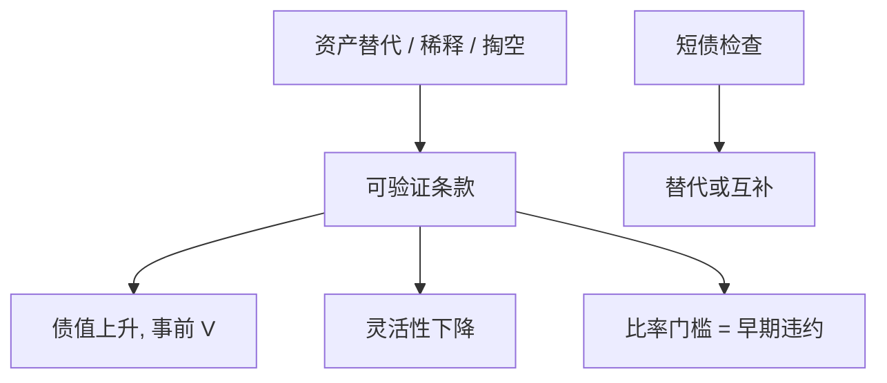

# 契约条款

    
债券契约把资产替代、稀释、股利掏空写成可验证的禁止项；它用状态依存的限制去替代把所有债务都做成短债。

    <footer>—— Smith and Warner, On Financial Contracting: An Analysis of Bond Covenants, Journal of Financial Economics 1979</footer>

[上一课](/econ/debt-maturity-rollover)用到期日做检查。本课缺口是合同文本：Smith–Warner（1979）把条款分类为投资、融资、股利限制，用来降低代理成本，同时承认条款有灵活性成本。不重写展期危机的扩散模型，不把破产法提前。

## 问题

[风险转移](/econ/risk-shifting)与积压来自优先级。短债用再定价来约束，但流动性代价高。条款用会计门槛（利息覆盖、杠杆上限）、资产出售限制、负向质押、股利限制，在长债内存入检查。缺口是：哪些扭曲可写成可验证条款，哪些只能靠控制权转移（违约）。Tirole：可验证的用契约，不可验证的用权威——与[控制权](/econ/control-rights)同一不完全合同分工。

松弛（slack）：企业与门槛的距离。松弛耗尽触发技术性违约，即使清偿力尚在。条款把「违约」从无力偿债提前到比率违规，是故意的早期检查。

## 方法

Smith–Warner 的清单：限制兼并与资产出售（防资产替代与担保稀释）；限制优先债与抵押（防索赔稀释）；限制股利与回购（防掏空）。收益：债值上升、股权的代理成本下降，事前 $V$ 可以升。成本：正 NPV 的重组、投资、派息被拦下——灵活性像卖掉实物期权。

松紧与价格：紧条款降低票息，但提高技术性违约与再谈判频率。动态权衡：条款是调整带之外的另一套边界。评级机构把条款包进评级，后课再写。

资本预算：项目可能撞上已有条款（capex 限制、杠杆测试）。NPV 要含再谈判或豁免的成本，不是只算经营 FCFF。这是 APV 的契约副作用。

## 机制

机制是把不可定价的道德风险改写成可验证的约束。条款越完整，越接近把企业变成「按合同经营」——灵活性损失正是实物期权价值。再谈判使条款不是硬约束：违约后可以豁免，于是条款的纪律取决于债权人协调（后课）与是否有银行牵头。

与 Jensen 债务纪律：还本是硬现金吐出；条款是行为限制。成熟 FCF 企业可能同时要两者；成长企业紧条款会加重积压。样本仍要匹配。

### 条款不是免费的状态依存债

把所有或有都写成条款，合同会不可执行或过度触发。最优是不完备：留下违约后的破产/重整来处理残差。这正是下一单元治理与第 11 章的接口，本课只在合同设计上点名。

Brealey–Myers：条款保护债权人，最终也保护股东——因为事前降低债务成本。事后股东会感觉被条款绑住，这是同一合同的两面，不是矛盾。

## 边界

不要把本课写成信托契约的法律注释。对象是代理成本与灵活性。下一课银行债对公开债：谁持有条款、谁能监督与豁免，决定条款的实际硬度。

后课默认：条款用可验证限制替代部分短债检查；代价是实物期权。项目 NPV 必须读已有契约。技术性违约 ≠ 经济破产。

## 小结

- 条款针对投资、融资、股利三类代理，用可验证门槛做早期检查。
- 收益是事前债值；成本是灵活性与再谈判。
- 与短债互补或替代；硬度取决于谁监督、能否协调豁免。
- 出处：Smith and Warner, *JFE* 1979；Tirole, *Theory of Corporate Finance*。
