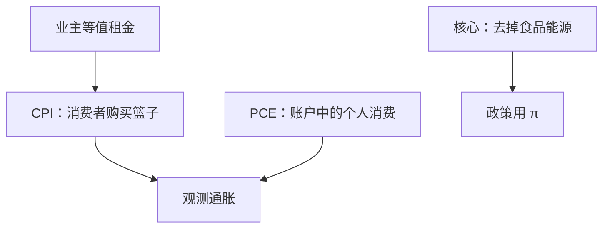

# CPI 与 PCE

消费者物价盯的是居民买什么；PCE 盯的是为居民消费了什么——谁付款、如何处理住房服务，两条通胀可以不是同一个数。

<footer>—— 据 BLS 的 CPI 手册；BEA 的个人消费支出平减</footer>

[上一课](/econ/price-index-real)已经把名义账户拆成选定的 $P$ 与物量 $y$，并声明 CPI 不是 GDP 平减。本课的缺口不是再推 Laspeyres / Paasche，而是：政策与菲利普斯常用的两条**消费通胀**——CPI 与 PCE——篮子、权重更新、住房与核心口径各差在哪。链式产出物量与 Boskin 的生活成本批评在此汇合到 CPI，不再写进 GDP 账户。自然率下一课用的 $\pi$，必须能说出是哪一个。

## 问题

GDP 平减覆盖国内生产，含投资与出口，不含进口消费品。居民生活成本不是这个篮子。[价格指数](/econ/price-index-real)只划了界。缺口是：BLS 的 CPI 用消费者购买的固定（或缓慢更新的）篮子；BEA 的 PCE 平减用国民账户里「为个人消费」的当期物量权，覆盖雇主代付的医疗等。同一年的 $\pi^{\mathrm{CPI}}$ 与 $\pi^{\mathrm{PCE}}$ 可以差几个百分点的十分位，不是统计错误。

住房：CPI 用业主等值租金（OER）代表自有住房服务，不直接把房价当消费价格。PCE 也用租金类服务，权数来源与范围不同。把房价涨跌直接叫「CPI 通胀」，会把资产重估价塞进生活成本。

Boskin 委员会（1996）论证美国 CPI 因替代、质量与新产品高估生活成本。那是对 Laspeyres 型生活成本的批评，不是对 GDP 链式物量的判决；上一课的产出替代偏差不要与这里混为一谈。

## 方法

CPI：跟踪城市消费者购买的一篮子货物与服务，权重来自支出调查，历史上长期接近 Laspeyres；后来引入几何均值与逐年权数，部分吸收替代。PCE：从生产与销售侧构造消费，权重随当期份额变，更接近 Paasche 或链式消费平减。进口消费品进 CPI 与 PCE，进不了 GDP 平减的同一位置。

核心通胀：从指数中拿掉食品与能源（或另做中位数、切尾）。这不是说食品能源「不是通胀」，而是要把暂时相对价格冲击与更持久的名义趋势分开，供菲利普斯与泰勒规则使用。本课给定义，不估计斜率。

公式上仍是 $Y=P\cdot y$ 那一套指数逻辑，只是 $P$ 换成消费篮子。费雪方程要用的 $\pi^e$ 必须声明来自 CPI 还是 PCE；本课不把 $i=r+\pi^e$ 提前写成货币需求。

### 谁付款、谁消费

医疗保险：雇主缴费进入 PCE 的消费，不一定按同样方式进入 CPI 的自付篮子。政府提供的消费服务，PCE 与 CPI 的处理也不同。于是「家庭感觉的物价」与「账户上的消费通胀」可以分叉，而不否定任何一条指数的内部定义。

## 机制

权重更新越慢，替代偏差越大：相对变贵的品种仍按旧份额进入 CPI，生活成本被高估——Boskin 的主通道。PCE 用当期份额，替代吸收得更快，长期往往低于 CPI 通胀。OER 使住房服务进入消费价格：租金市场松紧进入 $\pi$，房价水平只间接、滞后地进入。核心指标过滤相对价格，把能源税、歉收与名义锚分开；供给冲击月份里 headline 与核心会暂时分家。

BLS 与 BEA 的季节调整、口径修订会使同比与环比讲不同的故事。后课自然率与菲利普斯要固定一个 $\pi$ 序列再谈 $u^*$，不能一个月换一个指数。链式消费价格指数（若使用）同样会失去固定篮子的水平解释；那与产出链式是同一公式性质，只是篮子换成消费。

进口价格上升抬 CPI 与 PCE，对 GDP 平减的影响取决于进口是否进入国内生产。汇率变动先打到边境价格，再进入这两条消费通胀——开放宏观会用到，本课只要求声明指数，不把转嫁系数写成结构。

美联储长期跟踪 PCE、尤其核心 PCE；劳工合同与 TIPS 更常盯 CPI。本栏不选边，只要求写模型时声明。篮子选错，实际工资与实际利率跟着错。

## 边界

没有一种消费指数等于 Konüs 生活成本：那需要效用。本课不把 CPI 叫间接效用。房价、股价不是 PCE。也不要把核心通胀写成「真实通胀」而把 headline 当成错误——食品能源是居民支出。开放经济的进口价格进 CPI/PCE，进平减的路径不同；CIP 实证在[量化栏](/quant/irp)，不是本课的指数公式。

GDP 平减仍覆盖投资与出口，政策讨论里「通胀」若未声明，读者无法判断是生活成本、消费平减还是产出价格。后课自然率与菲利普斯把 $\pi$ 接进 $u-u^*$ 之前，必须先锁住本课的指数。链式产出物量已经处理过替代；Boskin 的替代、质量与新产品偏差针对的是 CPI 生活成本，两套偏差不要焊成一句。

几何均值与逐年权数使现代 CPI 不再是纯粹 Laspeyres，替代偏差小于 Boskin 时期，但 OER、医疗与质量调整仍使 CPI 与 PCE 分叉。本课不估偏差的基点，只要求后课引用通胀时写出指数名。

后课默认：谈消费通胀时能区分 CPI、PCE 与核心；OER 是住房服务不是资产价格。下一课把实际活动对照劳动力未使用的部分：自然率。

## 小结

- CPI 跟消费者购买；PCE 跟账户中为个人发生的消费，权重与范围不同。
- 业主等值租金度量住房服务，不是把房价计入生活成本。
- 核心通胀过滤相对价格，供政策与菲利普斯使用，不是唯一「真」通胀。
- Boskin 批评的是 CPI 生活成本，不是 GDP 链式物量。
- 写模型时声明 $\pi$ 是 CPI 还是 PCE，实际利率跟着变。
- 出处：BLS 的 CPI；BEA 的 PCE 平减；Boskin 委员会对 CPI 偏差的整理。
