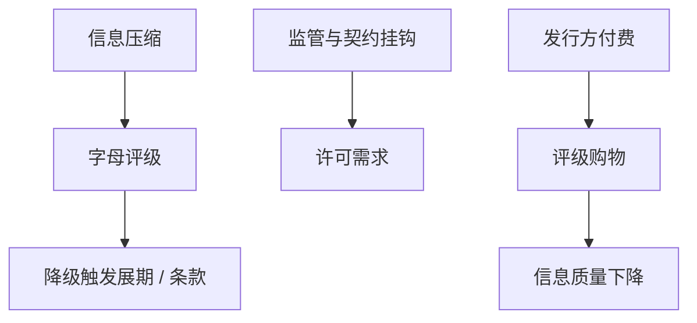

# 信用评级机构

    
评级把信用质量压缩成可验证的字母，供契约与监管使用；发行方付费与评级购物，使这个压缩过程本身成为代理问题。

    <footer>—— 据 Boot, Milbourn and Schmeits, Journal of Finance 2006；Bolton, Freixas and Shapiro, Journal of Finance 2012；对照 Partnoy 对监管许可的讨论</footer>

[上一课](/econ/relationship-lending)的软信息不可转卖。公开债需要标准化意见。本课缺口是评级机构：信息生产、监管许可、以及付费模式如何扭曲。不重写关系的跨期补贴，不把证券化结构提前展开。

## 问题

契约门槛、投资级资格、资本监管权重，都挂钩评级。机构出售的是可验证的公共信号，降低重复监测。缺口是激励：发行方付费时，发行人选择最宽松的机构（评级购物），机构为份额放松标准。Bolton–Freixas–Shapiro：竞争在购物环境下可以降低信息质量。Boot–Milbourn–Schmeits：评级还有协调功能——触发条款与滚动，使评级成为焦点，不仅仅是信息。

监管许可（regulatory license）：法规把评级写成准入，需求变成合规而不是信息。Partnoy 强调：此时评级更像法律地位，准确性的市场约束变弱。

## 方法

把评级写成契约的状态变量：降级触发加速、抵押加码、商业票据市场关闭——与短债展期同一扇门。信息角色：滞后、通过周期（through-the-cycle）使评级对周期不敏感，危机时突然跳。资本预算：依赖投资级资格的项目，APV 要含降级情景，不能只看承诺 $r_D$。

购物：结构复杂的证券（下一课 OTD）最容易选机构。企业债市场购物空间较小，但仍有。双评级要求减轻购物，不消除付费激励。

与 Miller 客户：投资级是免税机构与货币基金的准入门槛，需求在边界上不连续，企业愿意为保级牺牲税盾——动态权衡带被评级门槛切开。

## 机制

机制是公共信号的双重用途。作为信息，它应尽量准；作为契约焦点，它应稳定、少争议。通过周期是为契约稳定牺牲及时性。付费模式把卖方选成发行人，信号向发行人倾斜。危机中，焦点从稳定变成踩踏：集体降级触发条款，展期墙到来——He–Xiong 的到期风险被评级触发放大。

宏观课序的影子银行与批发融资已展示「合格资产」定义如何改变周期。本课企业侧：保级成为资本结构目标，有时压过 Leland 的税盾最优。

### 不是「去掉评级就信息充分」

分散债权人需要一个公共语言。问题是挂钩过紧与付费扭曲，不是字母本身。内部评级与市场信用利差是替代信号；利差更及时，但更噪、更循环——资本预算用哪一个，要看对象是契约触发还是期望损失。

Bolton, Freixas and Shapiro, *JF* 2012：购物加竞争可以降低信息质量。焦点功能见 Boot, Milbourn and Schmeits, *JF* 2006。

## 边界

不要把本课写成三大机构的沿革。下一课证券化：结构化产品把评级购物做到极致，发起–分销切断监测。企业主体评级仍是本课对象的中心。

后课默认：评级是信息加契约焦点；付费与挂钩造成购物与悬崖。保级可以扭曲 $D^\ast$。降级触发必须进展期情景。

## 小结

- 评级压缩信用质量，供契约与监管使用，也因此成为悬崖。
- 发行方付费加购物可降低信息质量；竞争未必改善。
- 通过周期稳定契约、牺牲及时性；资本预算要做降级情景。
- 出处：Boot, Milbourn and Schmeits, *JF* 2006；Bolton, Freixas and Shapiro, *JF* 2012。
